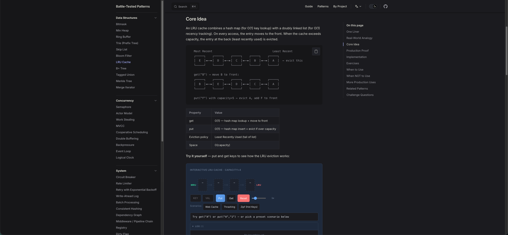

<div align="center">

# Battle-Tested Patterns

**Các pattern lập trình cấp độ code được trích xuất từ codebase production thực tế.**

Trực quan hoá tương tác · Liên kết nguồn chính xác · Đa ngôn ngữ · Bài tập chạy được

[📖 Tài liệu](https://github.hetsach.com/battle-tested-patterns/) · [📖 中文文档](https://github.hetsach.com/battle-tested-patterns/zh/)

Tiếng Việt | [English](README.md) | [简体中文](README.zh-CN.md)

[](https://github.com/Totoro-jam/battle-tested-patterns/actions/workflows/ci.yml)
[](https://github.com/Totoro-jam/battle-tested-patterns/actions/workflows/deploy.yml)
[](LICENSE)
[](.github/CONTRIBUTING.md)

</div>

<p align="center">
  
</p>

## Tổng quan 46 Pattern

<table>
<tr>
<td width="33%">

**🧠 Cấu trúc dữ liệu**
- [Bitmask](https://github.hetsach.com/battle-tested-patterns/patterns/bitmask/) — nhồi nhiều flag vào một số nguyên
- [Min Heap](https://github.hetsach.com/battle-tested-patterns/patterns/min-heap/) — hàng đợi ưu tiên
- [Ring Buffer](https://github.hetsach.com/battle-tested-patterns/patterns/ring-buffer/) — FIFO kích thước cố định
- [Trie](https://github.hetsach.com/battle-tested-patterns/patterns/trie/) — tìm kiếm theo tiền tố
- [Skip List](https://github.hetsach.com/battle-tested-patterns/patterns/skip-list/) — thứ tự theo xác suất
- [Bloom Filter](https://github.hetsach.com/battle-tested-patterns/patterns/bloom-filter/) — kiểm tra thành viên tập hợp
- [LRU Cache](https://github.hetsach.com/battle-tested-patterns/patterns/lru-cache/) — chính sách loại bỏ
- [B+ Tree](https://github.hetsach.com/battle-tested-patterns/patterns/b-plus-tree/) — chỉ mục tối ưu cho đĩa
- [Tagged Union](https://github.hetsach.com/battle-tested-patterns/patterns/tagged-union/) — dispatch an toàn kiểu
- [Merkle Tree](https://github.hetsach.com/battle-tested-patterns/patterns/merkle-tree/) — bằng chứng toàn vẹn
- [Merge Iterator](https://github.hetsach.com/battle-tested-patterns/patterns/merge-iterator/) — gộp k luồng

</td>
<td width="33%">

**⚡ Concurrency**
- [Semaphore](https://github.hetsach.com/battle-tested-patterns/patterns/semaphore/) — giới hạn truy cập
- [Actor Model](https://github.hetsach.com/battle-tested-patterns/patterns/actor-model/) — truyền thông điệp
- [Work Stealing](https://github.hetsach.com/battle-tested-patterns/patterns/work-stealing/) — cân bằng tải
- [MVCC](https://github.hetsach.com/battle-tested-patterns/patterns/mvcc/) — cô lập theo snapshot
- [Cooperative Scheduling](https://github.hetsach.com/battle-tested-patterns/patterns/cooperative-scheduling/) — nhường quyền điều khiển
- [Double Buffering](https://github.hetsach.com/battle-tested-patterns/patterns/double-buffering/) — hoán đổi nguyên tử
- [Backpressure](https://github.hetsach.com/battle-tested-patterns/patterns/backpressure/) — kiểm soát luồng
- [Event Loop](https://github.hetsach.com/battle-tested-patterns/patterns/event-loop/) — ghép kênh I/O
- [Logical Clock](https://github.hetsach.com/battle-tested-patterns/patterns/logical-clock/) — sắp xếp sự kiện

</td>
<td width="33%">

**🏗️ Systems**
- [Circuit Breaker](https://github.hetsach.com/battle-tested-patterns/patterns/circuit-breaker/) — chịu lỗi
- [Rate Limiter](https://github.hetsach.com/battle-tested-patterns/patterns/rate-limiter/) — điều tiết
- [Retry Backoff](https://github.hetsach.com/battle-tested-patterns/patterns/retry-backoff/) — phục hồi
- [Write-Ahead Log](https://github.hetsach.com/battle-tested-patterns/patterns/write-ahead-log/) — đảm bảo bền vững
- [Batch Processing](https://github.hetsach.com/battle-tested-patterns/patterns/batch-processing/) — tăng throughput
- [Consistent Hashing](https://github.hetsach.com/battle-tested-patterns/patterns/consistent-hashing/) — phân tán
- [Dependency Graph](https://github.hetsach.com/battle-tested-patterns/patterns/dependency-graph/) — xếp thứ tự
- [Middleware Chain](https://github.hetsach.com/battle-tested-patterns/patterns/middleware-chain/) — pipeline
- [Registry](https://github.hetsach.com/battle-tested-patterns/patterns/registry/) — tự đăng ký
- [Dirty Flag](https://github.hetsach.com/battle-tested-patterns/patterns/dirty-flag/) — hoãn tính toán lại
- [LSM Tree](https://github.hetsach.com/battle-tested-patterns/patterns/lsm-tree/) — kho lưu trữ tối ưu ghi
- [Checkpointing](https://github.hetsach.com/battle-tested-patterns/patterns/checkpointing/) — khôi phục từ snapshot

</td>
</tr>
<tr>
<td>

**♻️ Bộ nhớ**
- [Object Pool](https://github.hetsach.com/battle-tested-patterns/patterns/object-pool/) — tái sử dụng instance
- [Flyweight](https://github.hetsach.com/battle-tested-patterns/patterns/flyweight/) — chia sẻ đối tượng bất biến
- [Arena Allocator](https://github.hetsach.com/battle-tested-patterns/patterns/arena-allocator/) — cấp phát kiểu bump
- [Free List](https://github.hetsach.com/battle-tested-patterns/patterns/free-list/) — cấp/giải phóng O(1)
- [Copy-on-Write](https://github.hetsach.com/battle-tested-patterns/patterns/copy-on-write/) — hoãn copy
- [Reference Counting](https://github.hetsach.com/battle-tested-patterns/patterns/reference-counting/) — tự dọn dẹp
- [Tombstone](https://github.hetsach.com/battle-tested-patterns/patterns/tombstone/) — xoá trì hoãn
- [Interning](https://github.hetsach.com/battle-tested-patterns/patterns/interning/) — khử trùng lặp giá trị

</td>
<td>

**🔄 Hành vi**
- [State Machine](https://github.hetsach.com/battle-tested-patterns/patterns/state-machine/) — chuyển trạng thái
- [Observer](https://github.hetsach.com/battle-tested-patterns/patterns/observer/) — pub/sub
- [Iterator](https://github.hetsach.com/battle-tested-patterns/patterns/iterator/) — đánh giá lười
- [Diff / Patch](https://github.hetsach.com/battle-tested-patterns/patterns/diff-patch/) — chỉnh sửa tối thiểu
- [Vtable](https://github.hetsach.com/battle-tested-patterns/patterns/vtable/) — đa hình thủ công
- [Visitor](https://github.hetsach.com/battle-tested-patterns/patterns/visitor/) — dispatch khi duyệt cây

</td>
<td>

**📊 Đã chứng minh tại**
- React · Linux · Go
- Redis · PostgreSQL
- Kafka · Chromium
- Tokio · Erlang/OTP
- LevelDB · RocksDB · etcd
- Nginx · Akka
- LLVM · Vue · Godot
- PyTorch · CPython · ZFS

</td>
</tr>
</table>

## Khoảng trống mà dự án này lấp đầy

| Cái đang có | Cái còn thiếu |
|------------|----------------|
| Sách design pattern | Quá trừu tượng, quá thiên về OOP |
| Repo thuật toán | Tách rời khỏi kỹ thuật thực tế |
| Hướng dẫn system design | Cấp kiến trúc, không phải cấp code |

Dự án này: **các kỹ thuật cấp code lấy từ React, Linux, Go, Chromium — mỗi cái đều có liên kết nguồn có thể xác minh**.

## Các Pattern

| Pattern | Tác dụng | Đã chứng minh tại |
|---------|-------------|-----------|
| [**Bitmask**](https://github.hetsach.com/battle-tested-patterns/patterns/bitmask/) | Nhồi N flag vào một số nguyên, kiểm tra bất kỳ tổ hợp nào trong O(1) | [React Flags](https://github.com/facebook/react/blob/34b78a2897cc208260a88e6b62ecaf9ca2a9dfe4/packages/react-reconciler/src/ReactFiberFlags.js#L14-L36) · [Linux stat.h](https://github.com/torvalds/linux/blob/acb7500801e98639f6d8c2d796ed9f64cba83d3a/include/uapi/linux/stat.h#L25-L33)|
| [**Double Buffering**](https://github.hetsach.com/battle-tested-patterns/patterns/double-buffering/) | Hoán đổi nguyên tử hai bản sao, không cấp phát | [React Fiber](https://github.com/facebook/react/blob/34b78a2897cc208260a88e6b62ecaf9ca2a9dfe4/packages/react-reconciler/src/ReactFiber.js#L327-L355) · [SDL](https://github.com/libsdl-org/SDL/blob/14b0e9d922da78001223e563efd2f54f473a4115/src/render/SDL_render.c)|
| [**Cooperative Scheduling**](https://github.hetsach.com/battle-tested-patterns/patterns/cooperative-scheduling/) | Nhường quyền điều khiển giữa các khối công việc để giữ phản hồi nhanh | [React Scheduler](https://github.com/facebook/react/blob/34b78a2897cc208260a88e6b62ecaf9ca2a9dfe4/packages/scheduler/src/forks/Scheduler.js#L188-L258) · [Go Runtime](https://github.com/golang/go/blob/f5cdf4745455415c7a43cfc7d925214d4511489b/src/runtime/proc.go#L4143-L4200)|
| [**Min Heap**](https://github.hetsach.com/battle-tested-patterns/patterns/min-heap/) | Đọc phần tử ưu tiên cao nhất O(1), push/pop O(log n) | [React MinHeap](https://github.com/facebook/react/blob/34b78a2897cc208260a88e6b62ecaf9ca2a9dfe4/packages/scheduler/src/SchedulerMinHeap.js#L17-L90) · [Linux CFS](https://github.com/torvalds/linux/blob/acb7500801e98639f6d8c2d796ed9f64cba83d3a/kernel/sched/fair.c#L1407-L1460)|
| [**Diff / Patch**](https://github.hetsach.com/battle-tested-patterns/patterns/diff-patch/) | Tính toán chỉnh sửa tối thiểu giữa hai chuỗi | [React Reconciler](https://github.com/facebook/react/blob/34b78a2897cc208260a88e6b62ecaf9ca2a9dfe4/packages/react-reconciler/src/ReactChildFiber.js#L1169-L1340) · [Git](https://github.com/git/git/blob/1ff279f3404a482a83fb04c7457e41ab26884aea/diff.c#L5020-L5060)|
| [**Object Pool**](https://github.hetsach.com/battle-tested-patterns/patterns/object-pool/) | Cấp phát trước và tái sử dụng để tránh áp lực GC | [Go sync.Pool](https://github.com/golang/go/blob/f5cdf4745455415c7a43cfc7d925214d4511489b/src/sync/pool.go#L52-L97) · [Godot](https://github.com/godotengine/godot/blob/ec67cbe92628bdaf979b10594359ba6f02cf8838/core/templates/pooled_list.h#L35-L100)|
| [**Ring Buffer**](https://github.hetsach.com/battle-tested-patterns/patterns/ring-buffer/) | Hàng đợi vòng kích thước cố định, không cấp phát | [LMAX Disruptor](https://github.com/LMAX-Exchange/disruptor/blob/c871ca49826a6be7ada6957f6fbafcfecf7b1f87/src/main/java/com/lmax/disruptor/RingBuffer.java#L84-L130) · [Linux](https://github.com/torvalds/linux/blob/acb7500801e98639f6d8c2d796ed9f64cba83d3a/include/linux/ring_buffer.h#L12-L70)|
| [**State Machine**](https://github.hetsach.com/battle-tested-patterns/patterns/state-machine/) | Trạng thái rõ ràng, các chuyển trạng thái bất hợp lệ không thể biểu diễn được | [XState](https://github.com/statelyai/xstate/blob/9d9b9f1439b773979c5120a793215f5aa4568d8f/packages/core/src/StateMachine.ts#L58-L120) · [Linux TCP](https://github.com/torvalds/linux/blob/acb7500801e98639f6d8c2d796ed9f64cba83d3a/net/ipv4/tcp_input.c#L4865-L4920)|
| [**Copy-on-Write**](https://github.hetsach.com/battle-tested-patterns/patterns/copy-on-write/) | Chia sẻ qua tham chiếu, chỉ copy khi sửa đổi | [Git objects](https://github.com/git/git/blob/1ff279f3404a482a83fb04c7457e41ab26884aea/object-file.c#L719-L730) · [Rust Cow](https://github.com/rust-lang/rust/blob/ab26b175979ee7b2cb3302dce204b99df96f7efb/library/alloc/src/borrow.rs#L169-L220)|
| [**Observer**](https://github.hetsach.com/battle-tested-patterns/patterns/observer/) | Đăng ký sự kiện, tách rời producer khỏi consumer | [Node EventEmitter](https://github.com/nodejs/node/blob/19c46abbefdb8711b913d7237b3c1299367f87d7/lib/events.js#L456-L520) · [Redux](https://github.com/reduxjs/redux/blob/1d761f471cf58faabe88c50ea16645212d986cd0/src/createStore.ts#L211-L280)|
| [**Iterator**](https://github.hetsach.com/battle-tested-patterns/patterns/iterator/) | Chuỗi lười, không cấp phát trung gian | [Rust Iterator](https://github.com/rust-lang/rust/blob/ab26b175979ee7b2cb3302dce204b99df96f7efb/library/core/src/iter/traits/iterator.rs#L68-L112) · [Python gen](https://github.com/python/cpython/blob/7a014f44c393fda6d1c4bd135608ebcfc21d626c/Objects/genobject.c)|
| [**Semaphore**](https://github.hetsach.com/battle-tested-patterns/patterns/semaphore/) | Giới hạn concurrency bằng bộ đếm | [Linux](https://github.com/torvalds/linux/blob/acb7500801e98639f6d8c2d796ed9f64cba83d3a/include/linux/semaphore.h#L15-L55) · [Go x/sync](https://github.com/golang/sync/blob/5071ed6a9f1617117556b66384f765c934de3698/semaphore/semaphore.go)|
| [**Batch Processing**](https://github.hetsach.com/battle-tested-patterns/patterns/batch-processing/) | Gom thao tác, thực thi theo lô | [Kafka](https://github.com/apache/kafka/blob/ab53829feb7280a1d453ebdaad032c4b64bb0f4d/clients/src/main/java/org/apache/kafka/clients/producer/internals/RecordAccumulator.java#L69-L120)|
| [**Retry with Backoff**](https://github.hetsach.com/battle-tested-patterns/patterns/retry-backoff/) | Delay tăng theo cấp số nhân + jitter khi thất bại | [Kubernetes](https://github.com/kubernetes/kubernetes/blob/586cc904093af4fe7492e564908a796f0b107f97/staging/src/k8s.io/apimachinery/pkg/util/wait/backoff.go#L30-L50) · [gRPC](https://github.com/grpc/grpc/blob/19f781499b13a4890bc39d1a0e6a7909d3294de5/doc/connection-backoff.md)|
| [**Event Loop**](https://github.hetsach.com/battle-tested-patterns/patterns/event-loop/) | Vòng lặp đơn luồng ghép kênh I/O qua epoll/kqueue | [libuv](https://github.com/libuv/libuv/blob/f6b713398e464a9f166328765be1703fd860981f/src/unix/core.c#L427-L492) · [Redis ae](https://github.com/redis/redis/blob/df63a65d4d4ee33ae67e9f101885074febe0bccb/src/ae.c#L360-L468)|
| [**Flyweight**](https://github.hetsach.com/battle-tested-patterns/patterns/flyweight/) | Chia sẻ các đối tượng giống nhau, tránh trùng lặp | [Python int cache](https://github.com/python/cpython/blob/7a014f44c393fda6d1c4bd135608ebcfc21d626c/Objects/longobject.c#L61-L75)|
| [**Bloom Filter**](https://github.hetsach.com/battle-tested-patterns/patterns/bloom-filter/) | Kiểm tra thành viên tập hợp theo xác suất, không có âm tính giả | [LevelDB](https://github.com/google/leveldb/blob/7ee830d02b623e8ffe0b95d59a74db1e58da04c5/util/bloom.cc#L17-L80) · [Chromium](https://github.com/chromium/chromium/blob/92b3e1f66aa55921a0ab431b7c17b25ae1f3faef/third_party/blink/renderer/core/css/selector_filter.h#L149-L175)|
| [**Circuit Breaker**](https://github.hetsach.com/battle-tested-patterns/patterns/circuit-breaker/) | Ngừng gọi service đang lỗi, fail nhanh | [Hystrix](https://github.com/Netflix/Hystrix/blob/5ce3bc58c38e7ca60ef2fe0e516e390e294ad941/hystrix-core/src/main/java/com/netflix/hystrix/HystrixCircuitBreaker.java#L138-L289) · [gobreaker](https://github.com/sony/gobreaker/blob/fed8e9eb35f9cd3e5c2a67842c924346c3e1fbdd/gobreaker.go#L117-L131)|
| [**Arena Allocator**](https://github.hetsach.com/battle-tested-patterns/patterns/arena-allocator/) | Cấp phát bump, giải phóng tất cả một lần | [bumpalo](https://github.com/fitzgen/bumpalo/blob/d2cc4dd0b8830d5b05d44e9decc776823e6a70ea/src/lib.rs#L378-L383) · [Go arena](https://github.com/golang/go/blob/f5cdf4745455415c7a43cfc7d925214d4511489b/src/arena/arena.go#L44-L67)|
| [**B+ Tree**](https://github.hetsach.com/battle-tested-patterns/patterns/b-plus-tree/) | Cây cân bằng fanout cao — node nội hướng dẫn, node lá lưu trữ và liên kết để quét theo khoảng | [PostgreSQL](https://github.com/postgres/postgres/blob/e18b0cb7344cb4bd28468f6c0aeeb9b9241d30aa/src/backend/access/nbtree/nbtinsert.c#L22-L55) · [SQLite](https://github.com/sqlite/sqlite/blob/2cb57d9d4ac7eac3b1d15cfa71511f54817cb3e4/src/btreeInt.h#L190-L198)|
| [**Backpressure**](https://github.hetsach.com/battle-tested-patterns/patterns/backpressure/) | Làm chậm producer khi consumer không theo kịp | [Node.js Streams](https://github.com/nodejs/node/blob/19c46abbefdb8711b913d7237b3c1299367f87d7/lib/internal/streams/writable.js#L312-L370) · [Reactive Streams](https://github.com/reactive-streams/reactive-streams-jvm/blob/a625d3aba756e9842ad1291a5b73f5db280b6168/api/src/main/java/org/reactivestreams/Subscription.java#L14-L37)|
| [**Write-Ahead Log**](https://github.hetsach.com/battle-tested-patterns/patterns/write-ahead-log/) | Ghi log thay đổi trước khi áp dụng, khôi phục sau crash | [etcd](https://github.com/etcd-io/etcd/blob/e9b62f804766edf77cfa918d600cb6fb2c56b401/server/storage/wal/wal.go#L72-L95) · [PostgreSQL](https://github.com/postgres/postgres/blob/e18b0cb7344cb4bd28468f6c0aeeb9b9241d30aa/src/backend/access/transam/xlog.c)|
| [**Logical Clock**](https://github.hetsach.com/battle-tested-patterns/patterns/logical-clock/) | Bộ đếm tăng dần sắp xếp sự kiện mà không cần thời gian thực | [etcd](https://github.com/etcd-io/etcd/blob/e9b62f804766edf77cfa918d600cb6fb2c56b401/server/storage/mvcc/kvstore.go#L53-L72) · [LevelDB](https://github.com/google/leveldb/blob/7ee830d02b623e8ffe0b95d59a74db1e58da04c5/db/dbformat.h#L62-L66)|
| [**LRU Cache**](https://github.hetsach.com/battle-tested-patterns/patterns/lru-cache/) | Loại bỏ phần tử ít dùng gần nhất, get/put O(1) | [groupcache](https://github.com/golang/groupcache/blob/2c02b8208cf8c02a3e358cb1d9b60950647543fc/lru/lru.go#L28-L76) · [Linux](https://github.com/torvalds/linux/blob/acb7500801e98639f6d8c2d796ed9f64cba83d3a/include/linux/list_lru.h#L15-L55)|
| [**Consistent Hashing**](https://github.hetsach.com/battle-tested-patterns/patterns/consistent-hashing/) | Thêm/bớt node chỉ phải remap ~1/n key | [groupcache](https://github.com/golang/groupcache/blob/2c02b8208cf8c02a3e358cb1d9b60950647543fc/consistenthash/consistenthash.go#L28-L81) · [HAProxy](https://github.com/haproxy/haproxy/blob/fb38e40ad5751090992cde15d919866b1e91b8aa/src/lb_chash.c#L415-L491)|
| [**Trie**](https://github.hetsach.com/battle-tested-patterns/patterns/trie/) | Tra cứu O(k), các tiền tố chung dùng chung node | [Linux FIB](https://github.com/torvalds/linux/blob/acb7500801e98639f6d8c2d796ed9f64cba83d3a/net/ipv4/fib_trie.c#L80-L120) · [Redis rax](https://github.com/redis/redis/blob/df63a65d4d4ee33ae67e9f101885074febe0bccb/src/rax.h#L80-L130)|
| [**Skip List**](https://github.hetsach.com/battle-tested-patterns/patterns/skip-list/) | Cấu trúc sắp xếp O(log n) theo xác suất | [Redis](https://github.com/redis/redis/blob/df63a65d4d4ee33ae67e9f101885074febe0bccb/src/t_zset.c#L70-L130) · [LevelDB](https://github.com/google/leveldb/blob/7ee830d02b623e8ffe0b95d59a74db1e58da04c5/db/skiplist.h#L40-L90)|
| [**Rate Limiter**](https://github.hetsach.com/battle-tested-patterns/patterns/rate-limiter/) | Token bucket điều tiết throughput | [Go rate](https://github.com/golang/time/blob/812b343c8714c317b0dad633efa6d103e554c006/rate/rate.go#L57-L66) · [Nginx](https://github.com/nginx/nginx/blob/d994f5b8220847eb8f7e4400be5f7e6eb4538e46/src/http/modules/ngx_http_limit_req_module.c#L405-L532)|
| [**Reference Counting**](https://github.hetsach.com/battle-tested-patterns/patterns/reference-counting/) | Bộ đếm nguyên tử theo dõi chủ sở hữu, tự dọn dẹp khi về 0 | [CPython](https://github.com/python/cpython/blob/7a014f44c393fda6d1c4bd135608ebcfc21d626c/Include/refcount.h#L255-L310) · [Rust Arc](https://github.com/rust-lang/rust/blob/ab26b175979ee7b2cb3302dce204b99df96f7efb/library/alloc/src/sync.rs#L269-L276)|
| [**Registry**](https://github.hetsach.com/battle-tested-patterns/patterns/registry/) | Các thành phần tự đăng ký vào bảng tra cứu toàn cục theo tên | [TensorFlow](https://github.com/tensorflow/tensorflow/blob/b4c7e9a660badf8c8c81075fe9f781d23ed6f28a/tensorflow/core/framework/op.h#L258-L290) · [gRPC-Go](https://github.com/grpc/grpc-go/blob/f1864955bbb48efa131f6652933fa8b2189d9305/server.go#L154-L170)|
| [**Work Stealing**](https://github.hetsach.com/battle-tested-patterns/patterns/work-stealing/) | Thread rảnh "lấy trộm" việc từ queue của thread bận | [Go proc.go](https://github.com/golang/go/blob/f5cdf4745455415c7a43cfc7d925214d4511489b/src/runtime/proc.go#L3836-L3903) · [Tokio](https://github.com/tokio-rs/tokio/blob/bde89678532a8091d958268c0d36eac9362317d8/tokio/src/runtime/scheduler/multi_thread/worker.rs#L1136-L1175)|
| [**MVCC**](https://github.hetsach.com/battle-tested-patterns/patterns/mvcc/) | Phiên bản theo dấu thời gian, người đọc không bao giờ bị block | [PostgreSQL](https://github.com/postgres/postgres/blob/e18b0cb7344cb4bd28468f6c0aeeb9b9241d30aa/src/backend/access/heap/heapam_visibility.c#L917-L1096) · [etcd](https://github.com/etcd-io/etcd/blob/e9b62f804766edf77cfa918d600cb6fb2c56b401/server/storage/mvcc/kvstore.go#L53-L135)|
| [**Free List**](https://github.hetsach.com/battle-tested-patterns/patterns/free-list/) | Cấp/giải phóng O(1) qua các slot được liên kết | [Go mfixalloc](https://github.com/golang/go/blob/f5cdf4745455415c7a43cfc7d925214d4511489b/src/runtime/mfixalloc.go#L31-L109) · [Linux SLUB](https://github.com/torvalds/linux/blob/acb7500801e98639f6d8c2d796ed9f64cba83d3a/mm/slub.c#L530-L551)|
| [**Dependency Graph**](https://github.hetsach.com/battle-tested-patterns/patterns/dependency-graph/) | DAG + sắp xếp topo để xác định thứ tự thực thi | [Cargo](https://github.com/rust-lang/cargo/blob/b50aa179d3d1099b53548bc8693dd17ddd019ab4/src/cargo/core/resolver/dep_cache.rs#L1-L50) · [pnpm](https://github.com/pnpm/pnpm/blob/46fd26afc9926b4391636a851ae32493f9b2c9ff/workspace/projects-sorter/src/index.ts)|
| [**Dirty Flag**](https://github.hetsach.com/battle-tested-patterns/patterns/dirty-flag/) | Đánh dấu "dirty" khi sửa đổi, hoãn tính toán lại đến khi cần | [Chromium/Blink](https://github.com/chromium/chromium/blob/92b3e1f66aa55921a0ab431b7c17b25ae1f3faef/third_party/blink/renderer/core/layout/layout_object.h#L1425-L1430) · [React](https://github.com/facebook/react/blob/34b78a2897cc208260a88e6b62ecaf9ca2a9dfe4/packages/react-reconciler/src/ReactFiberFlags.js#L18-L22)|
| [**Actor Model**](https://github.hetsach.com/battle-tested-patterns/patterns/actor-model/) | Trạng thái riêng + hộp thư, không cần lock | [Akka](https://github.com/akka/akka/blob/aded7b67a9dafcb32b8a5dc95f6debce3a97c0e9/akka-actor/src/main/scala/akka/actor/Actor.scala#L476-L547) · [Erlang/OTP](https://github.com/erlang/otp/blob/1f1daf0b156853659106bbf64aa6f9b5b8400c6a/erts/emulator/beam/erl_process.h#L1043-L1205)|
| [**Tagged Union**](https://github.hetsach.com/battle-tested-patterns/patterns/tagged-union/) | Tag kiểu + union để dispatch an toàn | [Godot Variant](https://github.com/godotengine/godot/blob/ec67cbe92628bdaf979b10594359ba6f02cf8838/core/variant/variant.h#L78-L120) · [PyTorch IValue](https://github.com/pytorch/pytorch/blob/7469c0815567461107545b9cb5278846171ed828/aten/src/ATen/core/ivalue.h#L51-L96)|
| [**Interning**](https://github.hetsach.com/battle-tested-patterns/patterns/interning/) | Khử trùng lặp giá trị, so sánh bằng O(1) | [Rust Symbol](https://github.com/rust-lang/rust/blob/ab26b175979ee7b2cb3302dce204b99df96f7efb/compiler/rustc_span/src/symbol.rs#L24-L79) · [CPython](https://github.com/python/cpython/blob/7a014f44c393fda6d1c4bd135608ebcfc21d626c/Objects/unicodeobject.c#L14416-L14472)|
| [**Vtable**](https://github.hetsach.com/battle-tested-patterns/patterns/vtable/) | Struct chứa con trỏ hàm để đa hình | [Linux file_operations](https://github.com/torvalds/linux/blob/acb7500801e98639f6d8c2d796ed9f64cba83d3a/include/linux/fs.h#L2093-L2163) · [CPython PyTypeObject](https://github.com/python/cpython/blob/7a014f44c393fda6d1c4bd135608ebcfc21d626c/Include/cpython/object.h#L250-L340)|
| [**Visitor**](https://github.hetsach.com/battle-tested-patterns/patterns/visitor/) | Dispatch callback trên các node của cây | [LLVM InstVisitor](https://github.com/llvm/llvm-project/blob/7087ea37449027cc4c73a375b542cdc397c4474b/llvm/include/llvm/IR/InstVisitor.h#L45-L107) · [Vue transforms](https://github.com/vuejs/core/blob/48ad452dd61926a59e358da3c74c5ef750ae21c4/packages/compiler-core/src/transforms/vIf.ts#L35-L60)|
| [**Merkle Tree**](https://github.hetsach.com/battle-tested-patterns/patterns/merkle-tree/) | Hash đi lên gốc để đảm bảo toàn vẹn | [Git tree.c](https://github.com/git/git/blob/1ff279f3404a482a83fb04c7457e41ab26884aea/tree.c#L136-L171) · [ZFS blkptr](https://github.com/openzfs/zfs/blob/7e054b2e7ea80c7c838f7fd44b7d517eea5c9d18/module/zfs/blkptr.c#L30-L77)|
| [**Merge Iterator**](https://github.hetsach.com/battle-tested-patterns/patterns/merge-iterator/) | Gộp k luồng đã sắp xếp | [LevelDB merger](https://github.com/google/leveldb/blob/7ee830d02b623e8ffe0b95d59a74db1e58da04c5/table/merger.cc#L17-L100) · [RocksDB merge](https://github.com/facebook/rocksdb/blob/7affaee1c49ebc80cb213ad86fe7d2a3ad447da2/db/merge_helper.cc#L87-L156)|
| [**Middleware Chain**](https://github.hetsach.com/battle-tested-patterns/patterns/middleware-chain/) | Ghép các handler, mỗi cái bọc cái tiếp theo — pipeline hai chiều | [gRPC-Go](https://github.com/grpc/grpc-go/blob/f1864955bbb48efa131f6652933fa8b2189d9305/server.go#L1224-L1260) · [Koa.js](https://github.com/koajs/koa/blob/78efdc87df1f8d49a494f313d478814d67c3f00f/lib/application.js#L152-L204)|
| [**LSM Tree**](https://github.hetsach.com/battle-tested-patterns/patterns/lsm-tree/) | Đệm ghi, flush thành các file đã sắp xếp | [LevelDB DBImpl](https://github.com/google/leveldb/blob/7ee830d02b623e8ffe0b95d59a74db1e58da04c5/db/db_impl.cc#L1241-L1368) · [RocksDB MemTable](https://github.com/facebook/rocksdb/blob/7affaee1c49ebc80cb213ad86fe7d2a3ad447da2/db/memtable.cc#L458-L534)|
| [**Checkpointing**](https://github.hetsach.com/battle-tested-patterns/patterns/checkpointing/) | Chụp snapshot trạng thái, khôi phục từ checkpoint | [PostgreSQL](https://github.com/postgres/postgres/blob/e18b0cb7344cb4bd28468f6c0aeeb9b9241d30aa/src/backend/postmaster/checkpointer.c#L218-L360) · [Redis RDB](https://github.com/redis/redis/blob/df63a65d4d4ee33ae67e9f101885074febe0bccb/src/rdb.c#L1414-L1529)|
| [**Tombstone**](https://github.hetsach.com/battle-tested-patterns/patterns/tombstone/) | Đánh dấu đã xoá bằng tombstone, tiến trình nền thu dọn sau | [LevelDB](https://github.com/google/leveldb/blob/7ee830d02b623e8ffe0b95d59a74db1e58da04c5/db/dbformat.h#L39-L43) · [Cassandra](https://github.com/apache/cassandra/blob/3831d8265d748c21c0fef9d31d4777b134b20637/src/java/org/apache/cassandra/db/DeletionTime.java#L37-L99)|

> Mỗi liên kết "Đã chứng minh tại" trỏ tới **đúng các dòng cụ thể** trong source code. Không phải một thư mục. Không phải một file. Mà chính là các dòng.

## Hình thức của một Pattern

Mỗi pattern theo cấu trúc nhất quán — đây là một mẫu từ **Bitmask**:

```text
  Vị trí bit:     7    6    5    4    3    2    1    0
                ┌────┬────┬────┬────┬────┬────┬────┬────┐
  Flags:        │    │    │    │ SN │ CB │ RF │ UP │ PL │
                └────┴────┴────┴──┬─┴──┬─┴──┬─┴──┬─┴──┬─┘
                                  │    │    │    │    └── Placement  (1 << 0)
                                  │    │    │    └─────── Update     (1 << 1)
                                  │    │    └──────────── Ref        (1 << 2)
                                  │    └───────────────── Callback   (1 << 3)
                                  └────────────────────── Snapshot   (1 << 4)
```

Triển khai bằng 4 ngôn ngữ, mỗi cái theo idiom riêng:

```typescript
// TypeScript                          // Python
const READ  = 1 << 0;                  READ  = 1 << 0
const WRITE = 1 << 1;                  WRITE = 1 << 1
const perms = READ | WRITE;            perms = READ | WRITE
(perms & READ) !== 0;  // true         bool(perms & READ)  # True
```

Sau đó là bài tập ở 2 mức độ khó — tất cả đều có test bạn có thể chạy.

## Bên trong có gì

| Tính năng | Chi tiết |
|---------|---------|
| 46 pattern | Bitmask, LRU Cache, MVCC, Work Stealing, Actor Model và 41 cái khác |
| 46 trực quan hoá tương tác | Trực quan hoá SVG thực hành — click, kéo, thử nghiệm để xây dựng trực giác |
| 93 bài tập TS + 46 bài mỗi ngôn ngữ | 4 ngôn ngữ (TS/Rust/Go/Python), hơn 1.073 test cho nhiều kịch bản thực tế |
| 184 câu hỏi thử thách | Hỏi-đáp kiểu "đoán xem chuyện gì xảy ra" để kiểm tra mức hiểu |
| 9 case study hệ thống | Cách React, Linux, Go, Git, Node.js, Rust, game engine và hệ phân tán phối hợp pattern |
| 4 ngôn ngữ | TypeScript, Go, Python, Rust — triển khai theo idiom |
| Song ngữ | Tài liệu tiếng Anh + tiếng Trung đầy đủ |
| Hướng dẫn học | [Lộ trình học](https://github.hetsach.com/battle-tested-patterns/guide/learning-paths) · [Bảng tra độ phức tạp](https://github.hetsach.com/battle-tested-patterns/guide/complexity) · [So sánh pattern](https://github.hetsach.com/battle-tested-patterns/guide/pattern-comparison) · [Kế hoạch học](STUDY_PLAN.md) |

## Khởi động nhanh

### Điều kiện tiên quyết

| Công cụ | Phiên bản | Cần cho |
|------|---------|-------------|
| [Node.js](https://nodejs.org/) | ≥ 22 | Site tài liệu, bài tập TypeScript |
| [pnpm](https://pnpm.io/) | ≥ 9 | Trình quản lý package |
| [Rust](https://rustup.rs/) | stable | Bài tập Rust (tuỳ chọn) |
| [Go](https://go.dev/) | ≥ 1.23 | Bài tập Go (tuỳ chọn) |
| [Python](https://python.org/) | ≥ 3.10 | Bài tập Python (tuỳ chọn) |

```bash
git clone https://github.com/Totoro-jam/battle-tested-patterns.git
cd battle-tested-patterns && pnpm install

# Chạy bài tập ở bất kỳ ngôn ngữ nào
pnpm test:exercises               # TypeScript (491 test, Vitest)
cd exercises/rust && cargo test   # Rust (173 test)
cd exercises/go && go test ./...  # Go (176 test)
cd exercises/python && pytest     # Python (233 test)

pnpm test                         # Chạy TẤT CẢ test (bài tập + component tài liệu)

pnpm dev                          # Site tài liệu local
```

Xem [Hướng dẫn bài tập](https://github.hetsach.com/battle-tested-patterns/guide/exercises) để biết hướng dẫn cài đặt chi tiết cho từng ngôn ngữ.

## Đóng góp

Xem [CONTRIBUTING.md](.github/CONTRIBUTING.md). Tiêu chuẩn được đặt cao một cách có chủ ý:

1. **≥ 2 bằng chứng từ production** với liên kết nguồn đã xác minh, chính xác tới số dòng
2. **TypeScript + ≥ 1 ngôn ngữ khác** — viết theo idiom, không phải dịch
3. **File bài tập ở tất cả 4 ngôn ngữ** (TS/Rust/Go/Python) + file đáp án
4. **Bản dịch tiếng Trung** với khối code giống nhau
5. Toàn bộ test pass (`pnpm test` · `cargo test` · `go test ./...` · `pytest`), không có lỗi lint
6. Liên kết nguồn được CI kiểm tra hàng tuần — link gãy sẽ tự mở Issue

## Lịch sử Star

[](https://star-history.com/#Totoro-jam/battle-tested-patterns&Date)

## Giấy phép

[MIT](LICENSE) © Totoro-jam
