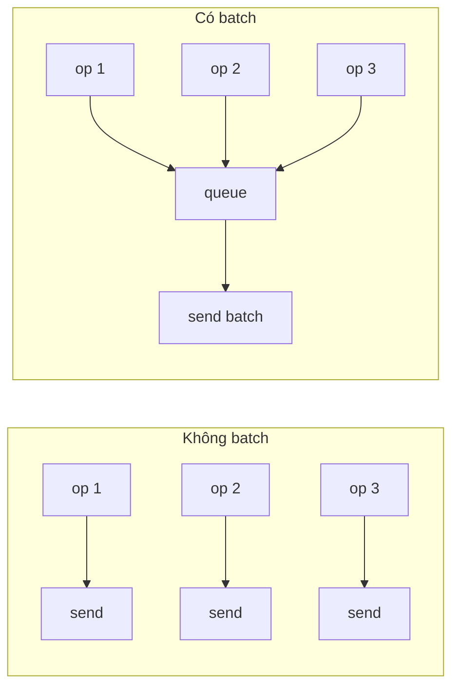

# Pattern: Batch Processing

<DifficultyBadge />

## Mô tả một câu

Tích luỹ thao tác riêng và thực thi chúng cùng nhau theo nhóm, phân bổ overhead mỗi thao tác qua cả lô.

<DemoBadge />

## Tương tự thực tế

Nạp máy rửa bát. Bạn không chạy nó sau mỗi đĩa — bạn tích luỹ bát đĩa cả ngày và chạy một chu trình đầy. Chi phí mỗi đĩa nước, nhiệt và thời gian được phân bổ qua cả tải.

## Ý tưởng cốt lõi

Thay vì xử lý mỗi item riêng (N round-trip, N context switch), batch processing thu item và xử lý cùng một lượt. Đánh đổi: độ trễ nhỉnh hơn cho item riêng, throughput cao hơn đáng kể tổng thể.



| Thuộc tính | Giá trị |
|----------|-------|
| Throughput | Phân bổ overhead mỗi item — N item với chi phí gần-1-item |
| Độ trễ | Tăng mỗi item (chờ batch đầy hoặc timer bắn) |
| Trigger flush | Ngưỡng size, deadline thời gian hoặc flush tường minh |
| Bộ nhớ | O(kích thước batch) — buffer giới hạn cho item pending |

**Thử ngay** — thêm item và xem chúng batch lại, rồi flush cùng nhau:

<BatchProcessingViz />

## Bằng chứng production

| Dự án | Nguồn | Cách dùng |
|---------|--------|-------|
| Apache Kafka | [RecordAccumulator.java#L69-L120](https://github.com/apache/kafka/blob/b7b1c0a83d856766390ee0c05e33b63711eee80e/clients/src/main/java/org/apache/kafka/clients/producer/internals/RecordAccumulator.java#L69-L120) | Kafka producer tích luỹ record thành batch theo partition. `append()` (dòng 280) thêm record vào batch hiện tại; thread sender rút batch sẵn sàng. Đây là cách Kafka đạt hàng triệu message/giây. |
| Nhân Linux | [blk-merge.c#L350-L395](https://github.com/torvalds/linux/blob/acb7500801e98639f6d8c2d796ed9f64cba83d3a/block/blk-merge.c#L350-L395) | `blk_attempt_req_merge` — lớp block gộp request I/O kề thành thao tác batched, phân bổ thời gian seek. Check hai request có sector liên tục và cờ tương thích trước khi gộp. |

::: info Lưu ý
Batching `setState` của React là ví dụ nổi tiếng khác — nhiều cuộc gọi `setState` trong cùng event handler được batch thành một re-render.
:::

## Triển khai

::: code-group

```typescript [TypeScript]
class BatchProcessor<T, R> {
  private queue: Array<{ item: T; resolve: (r: R) => void }> = [];
  private timer: ReturnType<typeof setTimeout> | null = null;

  constructor(
    private processBatch: (items: T[]) => Promise<R[]>,
    private maxSize: number = 10,
    private maxWaitMs: number = 50,
  ) {}

  async add(item: T): Promise<R> {
    return new Promise<R>((resolve) => {
      this.queue.push({ item, resolve });
      if (this.queue.length >= this.maxSize) {
        this.flush();
      } else if (!this.timer) {
        this.timer = setTimeout(() => this.flush(), this.maxWaitMs);
      }
    });
  }

  private async flush(): Promise<void> {
    if (this.timer) { clearTimeout(this.timer); this.timer = null; }
    const batch = this.queue.splice(0);
    if (batch.length === 0) return;
    const results = await this.processBatch(batch.map((b) => b.item));
    batch.forEach((b, i) => b.resolve(results[i]!));
  }
}
```

```rust [Rust]
use std::sync::{Arc, Mutex};

struct BatchProcessor<T, R> {
    queue: Mutex<Vec<T>>,
    process: Box<dyn Fn(Vec<T>) -> Vec<R> + Send + Sync>,
    max_size: usize,
}

impl<T, R> BatchProcessor<T, R> {
    fn new(
        process: impl Fn(Vec<T>) -> Vec<R> + Send + Sync + 'static,
        max_size: usize,
    ) -> Arc<Self> {
        Arc::new(Self {
            queue: Mutex::new(Vec::new()),
            process: Box::new(process),
            max_size,
        })
    }

    fn add(&self, item: T) -> Option<Vec<R>> {
        let mut queue = self.queue.lock().unwrap();
        queue.push(item);
        if queue.len() >= self.max_size {
            let batch: Vec<T> = queue.drain(..).collect();
            Some((self.process)(batch))
        } else {
            None
        }
    }

    fn flush(&self) -> Vec<R> {
        let mut queue = self.queue.lock().unwrap();
        let batch: Vec<T> = queue.drain(..).collect();
        if batch.is_empty() { return Vec::new(); }
        (self.process)(batch)
    }
}
```

```go [Go]
type BatchProcessor[T any, R any] struct {
	queue   []batchEntry[T, R]
	process func([]T) []R
	maxSize int
	mu      sync.Mutex
}

type batchEntry[T any, R any] struct {
	item T
	ch   chan R
}

func (bp *BatchProcessor[T, R]) Add(item T) R {
	bp.mu.Lock()
	ch := make(chan R, 1)
	bp.queue = append(bp.queue, batchEntry[T, R]{item, ch})
	if len(bp.queue) >= bp.maxSize {
		bp.flush()
	}
	bp.mu.Unlock()
	return <-ch
}

func (bp *BatchProcessor[T, R]) flush() {
	items := make([]T, len(bp.queue))
	for i, e := range bp.queue { items[i] = e.item }
	results := bp.process(items)
	for i, e := range bp.queue { e.ch <- results[i] }
	bp.queue = bp.queue[:0]
}
```

```python [Python]
import asyncio
from typing import TypeVar, Callable, Awaitable

T = TypeVar("T")
R = TypeVar("R")

class BatchProcessor:
    def __init__(self, process_batch, max_size=10, max_wait=0.05):
        self._process = process_batch
        self._max_size = max_size
        self._max_wait = max_wait
        self._queue = []
        self._timer = None

    async def add(self, item):
        future = asyncio.get_event_loop().create_future()
        self._queue.append((item, future))
        if len(self._queue) >= self._max_size:
            await self._flush()
        elif not self._timer:
            self._timer = asyncio.get_event_loop().call_later(
                self._max_wait, lambda: asyncio.ensure_future(self._flush()))
        return await future

    async def _flush(self):
        if self._timer: self._timer.cancel(); self._timer = None
        batch = self._queue[:]; self._queue.clear()
        results = await self._process([item for item, _ in batch])
        for (_, future), result in zip(batch, results):
            future.set_result(result)
```

:::

## Bài tập

| Cấp độ | Bài tập | File |
|-------|----------|------|
| Cơ bản | Triển khai batch processor với flush theo size | `exercises/typescript/batch-processing/01-basic.test.ts` |
| Trung bình | Flush timeout — flush theo size HOẶC thời gian, cái nào đến trước | `exercises/typescript/batch-processing/02-intermediate.test.ts` |

Chạy bài tập: `pnpm test:exercises` (TypeScript) · `cargo test` (Rust) · `go test ./...` (Go) · `pytest` (Python)

File bài tập: Rust `exercises/rust/src/batch_processing/mod.rs` · Go `exercises/go/batch_processing/batch_processing_test.go` · Python `exercises/python/batch_processing/test_batch_processing.py`

## Khi nào nên dùng

- **Ghi database** — batch INSERT thay vì N INSERT riêng
- **Cuộc gọi API** — batch request GraphQL/REST để giảm round-trip
- **Message queue** — batch send/receive Kafka, SQS
- **Update UI** — setState batch React, batch layout trình duyệt
- **I/O mạng** — thuật toán Nagle TCP, ghép kênh HTTP/2

## Khi nào KHÔNG nên dùng

- **Độ trễ then chốt** — batching thêm delay; nếu mỗi millisecond quan trọng, xử lý ngay
- **Khối lượng nhỏ** — nếu hiếm khi có hơn 1 item, batching thêm phức tạp không lợi
- **Cô lập lỗi một phần** — nếu một item batch fail, bạn cần logic retry/dead-letter cho cả batch; xử lý riêng đơn giản hơn khi cô lập lỗi quan trọng
- **Bộ nhớ không giới hạn** — không có giới hạn size, batch có thể tăng khi traffic đỉnh và OOM process

## Thêm các ứng dụng production

- [React tự động batch](https://github.com/facebook/react/blob/34b78a2897cc208260a88e6b62ecaf9ca2a9dfe4/packages/react-reconciler/src/ReactFiberWorkLoop.js#L588-L600) — React 18+ batch mọi update state mặc định
- [DataLoader](https://github.com/graphql/dataloader) — GraphQL N+1
- [Redis](https://github.com/redis/redis) — Pipeline
- [Elasticsearch](https://github.com/elastic/elasticsearch) — Bulk API

## Pattern liên quan

| Pattern | Quan hệ |
|---------|-------------|
| [Ring Buffer (Buffer vòng)](/patterns/ring-buffer/) | Ring buffer tích luỹ item cho tiêu thụ batch |
| [Backpressure](/patterns/backpressure/) | Batching làm mịn input bursty và hoạt động với cơ chế backpressure |
| [Retry với Exponential Backoff](/patterns/retry-backoff/) | Item batch riêng có thể retry với backoff cấp số nhân khi lỗi |

## Câu hỏi thử thách

::: details Câu 1: Batch processor của bạn dùng maxSize=100 và maxWaitMs=50ms. Traffic giảm còn 1 request/giây. Chuyện gì, và bạn sửa thế nào?
**Trả lời:** Mỗi request chờ đủ 50ms timeout trước khi flush batch 1 item, thêm độ trễ không cần.

Timeout kích hoạt chỉ với một item trong queue vì batch không bao giờ đạt 100 item. Cách sửa là làm size batch và/hoặc timeout thích nghi — ví dụ flush ngay khi queue đã idle, hoặc dùng timeout ngắn hơn khi độ sâu queue thấp. `linger.ms` của Kafka hoạt động vậy: chỉ delay nếu có thêm record được kỳ vọng.
:::

::: details Câu 2: Batch 100 insert database fail vì row 57 vi phạm ràng buộc unique. Chuyện gì xảy ra với 99 row khác?
**Trả lời:** Tuỳ bạn có cần atomicity không. Nếu batch chạy trong một transaction, cả 100 row rollback. Nếu không, bạn cần xử lý lỗi mỗi item.

Cách production phổ biến là trả mảng kết quả với status thành công/lỗi mỗi item (như Bulk API Elasticsearch). Điều này cho caller retry chỉ item lỗi. Nếu bạn bọc cả batch trong một transaction để atomicity, một row xấu giết cả batch — đơn giản hơn nhưng lãng phí công.
:::

::: details Câu 3: Bạn có cả trigger size (maxSize=50) và trigger thời gian (maxWaitMs=100ms). Burst 200 item đến trong 10ms. Bao nhiêu batch bắn, và khi nào?
**Trả lời:** Bốn batch 50 item bắn ngay, tất cả trong burst 10ms. Trigger thời gian không bao giờ kích hoạt.

Trigger size ưu tiên khi queue đạt maxSize. Khi item ào vào, queue chạm 50, flush, chạm 50 lại, flush, v.v. Timer chỉ liên quan khi queue có item nhưng chưa đạt maxSize — đó là an toàn "đừng chờ mãi", không phải trigger chính dưới tải.
:::

::: details Câu 4: Sao Kafka batch theo partition thay vì dùng một batch toàn cục qua mọi partition?
**Trả lời:** Vì mỗi partition là log append-only độc lập trên broker cụ thể. Một batch xuyên partition đơn sẽ phải tách lúc gửi.

Batching theo partition nghĩa mỗi batch nhắm broker cụ thể (leader partition). Sender sau đó gom nhiều batch partition đến cùng broker thành một `ProduceRequest`, giảm round-trip mạng. Cũng bảo toàn đảm bảo thứ tự per-partition. Batch toàn cục sẽ mất ánh xạ partition→broker tự nhiên, thêm phức tạp không lợi throughput.
:::
