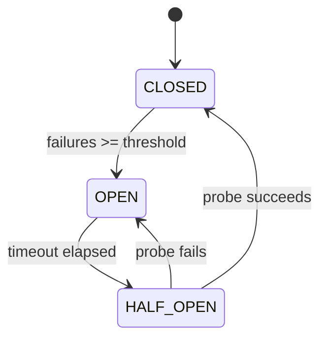

# Pattern: Circuit Breaker

<DifficultyBadge />

## Mô tả một câu

Ngừng gọi service đang lỗi bằng cách theo dõi lỗi và mở mạch — fail nhanh thay vì chồng chất timeout.

<DemoBadge />

## Tương tự thực tế

Cầu chì điện trong nhà bạn. Nếu dòng quá lớn (lỗi lặp lại), cầu chì cháy và cắt mạch ngay — bảo vệ dây. Sau khi nguội (timeout), bạn có thể reset và thử lại.

## Ý tưởng cốt lõi

Circuit breaker bọc các cuộc gọi từ xa bằng state machine có ba trạng thái. Ở trạng thái **closed**, cuộc gọi đi qua bình thường. Sau khi đạt ngưỡng lỗi liên tiếp, mạch **mở** và mọi cuộc gọi fail ngay không thử thao tác. Sau khoảng nguội, mạch vào trạng thái **half-open**, cho phép một cuộc gọi probe kiểm tra service downstream đã phục hồi chưa.



| Trạng thái | Hành vi |
|-------|----------|
| CLOSED | Cuộc gọi đi qua. Đếm lỗi liên tiếp. |
| OPEN | Cuộc gọi fail ngay (`CircuitOpenError`). Timer chạy. |
| HALF_OPEN | Cho phép một cuộc gọi probe. Thành công → CLOSED. Lỗi → OPEN. |

| Thuộc tính | Giá trị |
|----------|-------|
| Kiểm tra gọi | O(1) — so state + bộ đếm lỗi |
| Chuyển state | O(1) — thay đổi state atomic |
| Trạng thái | 3 — Closed, Open, Half-Open |
| Bộ nhớ | O(1) — bộ đếm + timer + enum state |

**Thử ngay** — gửi thành công và lỗi để xem chuyển state machine:

<CircuitBreakerViz />

## Bằng chứng production

| Dự án | Nguồn | Cách dùng |
|---------|--------|-------|
| Netflix Hystrix | [HystrixCircuitBreaker.java#L138-L289](https://github.com/Netflix/Hystrix/blob/5ce3bc58c38e7ca60ef2fe0e516e390e294ad941/hystrix-core/src/main/java/com/netflix/hystrix/HystrixCircuitBreaker.java#L138-L289) | `HystrixCircuitBreakerImpl` — circuit breaker chuẩn. Enum 3 trạng thái (L142), `markSuccess`/`markNonSuccess` cho chuyển HALF_OPEN (L204-L224), `attemptExecution` cho OPEN→HALF_OPEN qua `compareAndSet` sau cửa sổ ngủ (L264-L289). Dùng trên toàn bộ microservice của Netflix. |
| Sony gobreaker | [gobreaker.go#L117-L131](https://github.com/sony/gobreaker/blob/fed8e9eb35f9cd3e5c2a67842c924346c3e1fbdd/gobreaker.go#L117-L131) | Struct `CircuitBreaker` với state, bộ đếm generation, count và mutex. `onSuccess`/`onFailure` (L310-L332) thúc chuyển; phát hiện state cũ dựa trên generation (L334-L380) ngăn hành động trên đọc state cũ. Dùng production tại Sony. |

## Triển khai

::: code-group

```typescript [TypeScript]
type State = 'CLOSED' | 'OPEN' | 'HALF_OPEN';

class CircuitBreaker {
  private state: State = 'CLOSED';
  private failureCount = 0;
  private lastFailureTime = 0;

  constructor(
    private threshold: number,
    private resetTimeout: number,
  ) {}

  getState(): State {
    if (this.state === 'OPEN' && Date.now() - this.lastFailureTime >= this.resetTimeout) {
      this.state = 'HALF_OPEN';
    }
    return this.state;
  }

  async call<T>(fn: () => Promise<T>): Promise<T> {
    if (this.getState() === 'OPEN') throw new Error('Circuit is OPEN');
    try {
      const result = await fn();
      this.failureCount = 0;
      this.state = 'CLOSED';
      return result;
    } catch (err) {
      this.failureCount++;
      this.lastFailureTime = Date.now();
      if (this.failureCount >= this.threshold) this.state = 'OPEN';
      throw err;
    }
  }
}
```

```rust [Rust]
use std::time::Instant;

pub enum State { Closed, Open, HalfOpen }

pub struct CircuitBreaker {
    threshold: u32,
    reset_timeout_ms: u128,
    state: State,
    failure_count: u32,
    last_failure: Option<Instant>,
}

impl CircuitBreaker {
    pub fn new(threshold: u32, reset_timeout_ms: u128) -> Self {
        CircuitBreaker {
            threshold, reset_timeout_ms,
            state: State::Closed, failure_count: 0, last_failure: None,
        }
    }

    pub fn get_state(&mut self) -> &State {
        if let State::Open = self.state {
            if let Some(t) = self.last_failure {
                if t.elapsed().as_millis() >= self.reset_timeout_ms {
                    self.state = State::HalfOpen;
                }
            }
        }
        &self.state
    }

    pub fn call<T, E>(&mut self, f: impl FnOnce() -> Result<T, E>) -> Result<T, String>
    where E: std::fmt::Display {
        if matches!(self.get_state(), State::Open) {
            return Err("Circuit is OPEN".into());
        }
        match f() {
            Ok(v) => { self.failure_count = 0; self.state = State::Closed; Ok(v) }
            Err(e) => {
                self.failure_count += 1;
                self.last_failure = Some(Instant::now());
                if self.failure_count >= self.threshold { self.state = State::Open; }
                Err(e.to_string())
            }
        }
    }
}
```

```go [Go]
type State int

const (
	StateClosed   State = iota
	StateOpen
	StateHalfOpen
)

type CircuitBreaker struct {
	threshold    int
	resetTimeout int64
	state        State
	failureCount int
	lastFailure  int64
}

func NewCircuitBreaker(threshold int, resetTimeoutMs int64) *CircuitBreaker {
	return &CircuitBreaker{threshold: threshold, resetTimeout: resetTimeoutMs}
}

func now() int64 { return time.Now().UnixMilli() }

func (cb *CircuitBreaker) GetState() State {
	if cb.state == StateOpen && now()-cb.lastFailure >= cb.resetTimeout {
		cb.state = StateHalfOpen
	}
	return cb.state
}

func (cb *CircuitBreaker) Call(fn func() error) error {
	if cb.GetState() == StateOpen {
		return fmt.Errorf("circuit is OPEN")
	}
	if err := fn(); err != nil {
		cb.failureCount++
		cb.lastFailure = now()
		if cb.failureCount >= cb.threshold {
			cb.state = StateOpen
		}
		return err
	}
	cb.failureCount = 0
	cb.state = StateClosed
	return nil
}
```

```python [Python]
import time

class CircuitBreaker:
    def __init__(self, threshold: int = 5, reset_timeout: float = 30.0):
        self.threshold = threshold
        self.reset_timeout = reset_timeout
        self.state = "CLOSED"
        self.failure_count = 0
        self.last_failure_time = 0.0

    def get_state(self) -> str:
        if self.state == "OPEN" and time.time() - self.last_failure_time >= self.reset_timeout:
            self.state = "HALF_OPEN"
        return self.state

    def call(self, fn):
        if self.get_state() == "OPEN":
            raise RuntimeError("Circuit is OPEN")
        try:
            result = fn()
            self.failure_count = 0
            self.state = "CLOSED"
            return result
        except Exception:
            self.failure_count += 1
            self.last_failure_time = time.time()
            if self.failure_count >= self.threshold:
                self.state = "OPEN"
            raise
```

:::

## Bài tập

| Cấp độ | Bài tập | File |
|-------|----------|------|
| Cơ bản | Triển khai circuit breaker với 3 trạng thái | `exercises/typescript/circuit-breaker/01-basic.test.ts` |
| Trung bình | Circuit breaker với tỉ lệ lỗi và cửa sổ trượt | `exercises/typescript/circuit-breaker/02-intermediate.test.ts` |

Chạy bài tập: `pnpm test:exercises` (TypeScript) · `cargo test` (Rust) · `go test ./...` (Go) · `pytest` (Python)

File bài tập: Rust `exercises/rust/src/circuit_breaker/mod.rs` · Go `exercises/go/circuit_breaker/circuit_breaker_test.go` · Python `exercises/python/circuit_breaker/test_circuit_breaker.py`

## Khi nào nên dùng

- **Cuộc gọi microservice** — chặn lỗi lan truyền khi service downstream sập
- **Kết nối database** — ngừng đập database đang quá tải
- **API bên ngoài** — xử lý mất kết nối service bên thứ ba một cách mượt mà
- **Tài nguyên chia sẻ** — bảo vệ tài nguyên chia sẻ nào có thể tạm thời không khả dụng

## Khi nào KHÔNG nên dùng

- **Cuộc gọi trong process** — circuit breaker thêm overhead; dùng xử lý lỗi cho cuộc gọi hàm cục bộ
- **Không đảm bảo idempotency** — nếu retry sau half-open có thể gây trùng, thêm khử trùng lặp trước
- **Hệ một consumer** — nếu chỉ một caller, backoff/retry đơn giản hơn state machine đầy đủ
- **Fire-and-forget** — nếu không đợi response, không có gì để circuit-break

## Thêm các ứng dụng production

- [resilience4j](https://github.com/resilience4j/resilience4j) — circuit breaker Java cho Spring/Micronaut
- [Polly](https://github.com/App-vNext/Polly) — thư viện phục hồi .NET với chính sách circuit breaker
- [Envoy Proxy](https://github.com/envoyproxy/envoy) — outlier detection hoạt động như circuit breaker phân tán
- [AWS SDK](https://github.com/aws/aws-sdk-js-v3) — retry với circuit-breaking cho endpoint service

## Pattern liên quan

| Pattern | Quan hệ |
|---------|-------------|
| [Retry với Exponential Backoff](/patterns/retry-backoff/) | Circuit breaker chặn retry khi service biết đã sập |
| [State Machine](/patterns/state-machine/) | Circuit breaker là state machine: closed -> open -> half-open |
| [Rate Limiter (Token Bucket)](/patterns/rate-limiter/) | Cả hai bảo vệ service — rate limiter kiểm soát throughput, circuit breaker chặn lỗi |

## Câu hỏi thử thách

::: details Câu 1: Circuit breaker của bạn có reset timeout 30 giây. Service downstream có thời gian phục hồi trung bình 5 giây. Đồng nghiệp đề nghị hạ timeout xuống 5 giây để request tiếp tục nhanh hơn. Đánh đổi là gì?
**Trả lời:** Timeout ngắn hơn nghĩa là bạn probe service sớm hơn, nhưng nếu chưa phục hồi, mỗi probe lỗi reset timer và sinh thêm tải lên service đang vật lộn.

Reset timeout là đánh đổi giữa tốc độ phục hồi và bảo vệ. Nếu probe quá sớm và fail, bạn mở lại mạch và chờ thêm timeout đầy đủ. Trong khi đó, probe lỗi thêm tải lên service không khoẻ. Timeout tốt nên dài hơn thời gian phục hồi điển hình — 2-3x phổ biến — để cho service downstream thở. Một số triển khai dùng exponential backoff trên chính timeout.
:::

::: details Câu 2: Service A gọi Service B, gọi Service C. Service C sập. Không có circuit breaker, chuyện gì với Service A dù không trực tiếp phụ thuộc C?
**Trả lời:** Thread của Service A chồng chất chờ Service B, mà tự B bị block chờ Service C — đây là lỗi lan truyền.

Mỗi cuộc gọi từ A tới B chiếm một thread (hoặc kết nối) khi B chờ timeout của C. Khi thread của B cạn, B bắt đầu timeout, làm thread của A chồng chất. Sớm A có vẻ sập với caller của chính nó. Đây chính xác lý do Netflix xây Hystrix: circuit breaker trên mỗi ranh giới service sẽ cho B fail nhanh trên cuộc gọi C và trả lỗi cho A ngay, giữ thread của A trống. Không có nó, một lỗi downstream có thể đổ cả chuỗi cuộc gọi.
:::

::: details Câu 3: Circuit breaker của bạn vào HALF_OPEN và cho phép một request probe. Nhưng trong hệ traffic cao, 200 request đồng thời đến cùng millisecond. Cả 200 thấy state là HALF_OPEN và gửi probe đồng thời. Bạn ngăn thundering herd này thế nào?
**Trả lời:** Dùng compare-and-swap (CAS) atomic để chuyển từ OPEN sang HALF_OPEN, đảm bảo chỉ một request thành probe trong khi tất cả khác fail nhanh.

Netflix Hystrix giải bằng `compareAndSet` trên cờ state — chính xác một thread thắng CAS và gửi probe. gobreaker của Sony dùng mutex với bộ đếm generation cho đảm bảo probe đơn tương tự. Insight then chốt là HALF_OPEN không phải state bạn "đọc" thụ động — chuyển sang nó nên là thao tác atomic cấp quyền probe cho chính xác một caller.
:::

::: details Câu 4: Team bạn dùng circuit breaker cho cuộc gọi database. Một dev nhận thấy breaker mở khi migration database thường gây 5 giây độ trễ tăng nhưng không lỗi thực sự. Circuit breaker có nên theo dõi độ trễ, không chỉ lỗi?
**Trả lời:** Có, nhưng cẩn thận. Mở dựa trên độ trễ bảo vệ caller khỏi response chậm, nhưng bạn cần ngưỡng riêng cho "chậm" vs "lỗi" để tránh mở sai khi biến động bình thường.

Request mất 10 giây và cuối cùng thành công vẫn giữ một thread 10 giây. Trong mô hình thread-pool, response chậm tương đương lỗi vì chúng vắt kiệt capacity. Hystrix theo dõi cả lỗi và timeout như lỗi. Sắc thái là chọn ngưỡng độ trễ: đặt quá thấp và biến động P99 bình thường mở breaker; đặt quá cao và nó không bảo vệ gì.
:::
