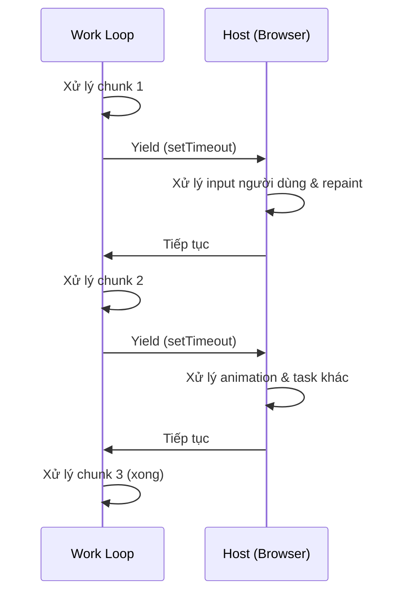

# Pattern: Cooperative Scheduling

<DifficultyBadge />

## Mô tả một câu

Chia việc chạy lâu thành đoạn nhỏ, yield quyền điều khiển về host giữa mỗi đoạn để giữ hệ thống phản hồi nhanh.

<DemoBadge />

## Tương tự thực tế

Người điều phối cuộc họp yêu cầu người nói tạm dừng sau 5 phút để người khác phát biểu. Không ai bị cắt cứng — mỗi người nói tự nguyện nhường. Người điều phối giữ cuộc họp phản hồi bằng cách đảm bảo không ai độc chiếm sàn.

## Ý tưởng cốt lõi

Trong cooperative scheduling, task tự nguyện kiểm tra có nên tạm dừng và để việc khác chạy. Khác preemptive scheduling (OS cắt ép), cooperative scheduling dựa vào task tự yield ở điểm an toàn.



**Không yield**: một task lâu chặn mọi thứ. **Có yield**: chunk nhỏ xen kẽ với update UI.

Pattern: chạy vòng lặp, check deadline sau mỗi đơn vị công việc và `yield` nếu hết giờ.

| Thuộc tính | Giá trị |
|----------|-------|
| Mô hình lập lịch | Non-preemptive — task phải yield tự nguyện |
| Check yield | O(1) — so thời gian hiện tại với deadline |
| Rủi ro bỏ đói | Một task không bao giờ yield chặn mọi thứ |
| Ngân sách chunk điển hình | 5–16 ms (một frame ở 60 fps) |

**Thử ngay** — bắt đầu task và xem cooperative round-robin scheduling với yield:

<CooperativeSchedulingViz />

## Bằng chứng production

| Dự án | Nguồn | Cách dùng |
|---------|--------|-------|
| React | [Scheduler.js#L188-L258](https://github.com/facebook/react/blob/34b78a2897cc208260a88e6b62ecaf9ca2a9dfe4/packages/scheduler/src/forks/Scheduler.js#L188-L258) | Hàm `workLoop` xử lý task từ min-heap. Mỗi vòng lặp gọi `shouldYieldToHost()` (dòng ~447) để check time slice 5ms đã trôi qua chưa — nếu rồi, break và lập lịch tiếp qua `MessageChannel`. |
| Go Runtime | [proc.go#L4143-L4200](https://github.com/golang/go/blob/f5cdf4745455415c7a43cfc7d925214d4511489b/src/runtime/proc.go#L4143-L4200) | Hàm `schedule()` là vòng lặp chính của scheduler goroutine. `Gosched()` (dòng 394) là điểm yield tự nguyện, và `goschedImpl` (dòng 4315) xử lý context switch thực tế. |

## Triển khai

::: code-group

```typescript [TypeScript]
type Task = () => boolean; // trả true nếu còn việc

interface Scheduler {
  scheduleTask(task: Task): void;
  flush(): void;
}

function createScheduler(yieldInterval: number = 5): Scheduler {
  const queue: Task[] = [];
  let isRunning = false;

  function shouldYield(startTime: number): boolean {
    return performance.now() - startTime >= yieldInterval;
  }

  function workLoop(): void {
    const startTime = performance.now();

    while (queue.length > 0) {
      if (shouldYield(startTime)) {
        // Yield về host — lập lịch tiếp tục
        setTimeout(workLoop, 0);
        return;
      }

      const task = queue[0]!;
      const hasMoreWork = task();

      if (!hasMoreWork) {
        queue.shift();
      }
    }

    isRunning = false;
  }

  return {
    scheduleTask(task: Task) {
      queue.push(task);
      if (!isRunning) {
        isRunning = true;
        setTimeout(workLoop, 0);
      }
    },
    flush() {
      while (queue.length > 0) {
        const task = queue[0]!;
        if (!task()) queue.shift();
      }
      isRunning = false;
    },
  };
}
```

```rust [Rust]
use std::time::{Duration, Instant};

pub struct CooperativeScheduler {
    yield_interval: Duration,
}

impl CooperativeScheduler {
    pub fn new(yield_ms: u64) -> Self {
        CooperativeScheduler {
            yield_interval: Duration::from_millis(yield_ms),
        }
    }

    pub fn run<F>(&self, mut work_units: Vec<F>) -> Vec<F>
    where
        F: FnMut() -> bool,
    {
        let start = Instant::now();

        while !work_units.is_empty() {
            if start.elapsed() >= self.yield_interval {
                // Yield: trả công việc còn lại về caller
                return work_units;
            }

            let done = (work_units[0])();
            if done {
                work_units.remove(0);
            }
        }

        work_units // rỗng = xong tất cả
    }
}
```

```go [Go]
package scheduling

import "time"

type Task func() bool // trả true khi xong

type Scheduler struct {
	YieldInterval time.Duration
	queue         []Task
}

func New(yieldInterval time.Duration) *Scheduler {
	return &Scheduler{YieldInterval: yieldInterval}
}

func (s *Scheduler) Schedule(task Task) {
	s.queue = append(s.queue, task)
}

// WorkLoop xử lý task, yield khi time slice hết.
// Trả true nếu mọi việc xong, false nếu yield.
func (s *Scheduler) WorkLoop() bool {
	start := time.Now()

	for len(s.queue) > 0 {
		if time.Since(start) >= s.YieldInterval {
			return false // yield
		}

		done := s.queue[0]()
		if done {
			s.queue = s.queue[1:]
		}
	}

	return true // xong tất cả
}
```

```python [Python]
import time

def work_loop(items, process_item, yield_ms=5):
    """Xử lý item, yield khi vượt ngân sách thời gian."""
    start = time.monotonic()
    completed = 0

    while completed < len(items):
        elapsed_ms = (time.monotonic() - start) * 1000
        if elapsed_ms >= yield_ms:
            return items[completed:]  # trả công việc còn lại

        process_item(items[completed])
        completed += 1

    return []  # xong tất cả

# Cách dùng
results = []
remaining = work_loop(
    list(range(100)),
    lambda x: results.append(x * 2),
    yield_ms=5
)
# remaining chứa item chưa xử lý (nếu có)
```

:::

## Bài tập

| Cấp độ | Bài tập | File |
|-------|----------|------|
| Cơ bản | Triển khai vòng lặp work cắt thời gian với check yield | `exercises/typescript/cooperative-scheduling/01-basic.test.ts` |
| Trung bình | Xây scheduler ưu tiên yield giữa các task | `exercises/typescript/cooperative-scheduling/02-priority-scheduler.test.ts` |

Chạy bài tập: `pnpm test:exercises` (TypeScript) · `cargo test` (Rust) · `go test ./...` (Go) · `pytest` (Python)

File bài tập: Rust `exercises/rust/src/cooperative_scheduling/mod.rs` · Go `exercises/go/cooperative_scheduling/cooperative_scheduling_test.go` · Python `exercises/python/cooperative_scheduling/test_cooperative_scheduling.py`

## Khi nào nên dùng

- **Việc trên UI thread** — giữ animation và input phản hồi trong khi xử lý tập dữ liệu lớn
- **Xử lý batch** — xử lý item theo chunk với tạm dừng cho việc hệ thống khác
- **Tính toán lâu** — chia duyệt cây đệ quy hoặc thao tác list thành chunk có thể nối tiếp
- **Runtime đồng thời** — triển khai green thread hoặc lập lịch coroutine

## Khi nào KHÔNG nên dùng

- **Task ngắn** — nếu việc xong trong < 1ms, overhead yield không đáng
- **Đảm bảo realtime** — cooperative scheduling không đảm bảo deadline; dùng preemptive
- **CPU-bound không tương tác** — nếu không gì khác cần thread, yield phí thời gian
- **Khi `requestIdleCallback` đủ** — cho việc không gấp, API tích hợp trình duyệt có thể đủ

## Thêm các ứng dụng production

- [Lua](https://github.com/lua/lua) — coroutine
- Python [asyncio](https://github.com/python/cpython/blob/ff64d8de66ab7f8e56b5d410796a7d76c955280c/Lib/asyncio/tasks.py#L1-L50) — `Task` bọc coroutine, `__step` thúc chúng mỗi `send()` một lần
- [Erlang/BEAM VM](https://github.com/erlang/otp/blob/c75602432b4eff922bcaf4a175144dc61adbd6d6/erts/emulator/beam/emu/beam_emu.c#L305-L350) — đếm reduction (yield sau ~4000 reduction)
- [Unity](https://github.com/Unity-Technologies/UnityCsReference/blob/59b03b8a0f179c0b7e038178c90b6c80b340aa9f/Runtime/Export/Scripting/Coroutines.cs) — coroutine với `yield return`

## Pattern liên quan

| Pattern | Quan hệ |
|---------|-------------|
| [Event Loop](/patterns/event-loop/) | Event loop dựa vào cooperative scheduling — task lâu phải yield để giữ I/O chảy |
| [Work Stealing](/patterns/work-stealing/) | Cooperative scheduling hoạt động trong một thread; work stealing phân tán qua thread |
| [Min Heap](/patterns/min-heap/) | Scheduler React dùng min-heap để chọn task cooperative nào chạy tiếp |

## Câu hỏi thử thách

::: details Câu 1: React yield mỗi 5ms. Chuyện gì nếu tăng thành 50ms? Nếu giảm xuống 0,5ms thì sao?
**Trả lời:** 50ms gây jank UI thấy được (3 frame rớt ở 60fps); 0,5ms phí hầu hết thời gian cho overhead yield thay vì việc hữu ích.

Mục tiêu 5ms là điểm ngọt: đủ ngắn để ngân sách 16ms một frame còn chỗ cho paint trình duyệt và xử lý input, nhưng đủ dài để scheduler làm việc có ý nghĩa mỗi slice. Ở 50ms, input và animation đông cứng thấy rõ. Ở 0,5ms, overhead check đồng hồ, lập lịch callback `MessageChannel` và vào lại vòng lặp work lấn át — bạn dành nhiều thời gian lập lịch hơn làm việc.
:::

::: details Câu 2: Task được lập lịch cooperative có bug không bao giờ trả `true` (không bao giờ báo hiệu xong). Chuyện gì với hệ thống?
**Trả lời:** Task độc chiếm mọi time slice mãi, bỏ đói mọi task khác xếp hàng.

Khác preemptive scheduling, scheduler không thể cưỡng xoá task hành xử xấu. Vòng lặp work cho task buggy thời gian CPU mỗi slice, chạy 5ms, yield, được chọn lại — vô tận. Task khác trong queue không bao giờ thực thi. Đây là điểm yếu cơ bản của cooperative scheduling: nó tin task hành xử. Scheduler production giảm nhẹ bằng timeout hoặc phát hiện bỏ đói có thể huỷ hoặc giảm ưu tiên task kẹt.
:::

::: details Câu 3: Sao React dùng `MessageChannel` thay vì `setTimeout(fn, 0)` để yield?
**Trả lời:** `setTimeout(fn, 0)` có delay tối thiểu 4ms được trình duyệt thi hành sau nhiều cuộc gọi lồng, làm quá chậm cho time slice 5ms.

Sau khoảng 5 cuộc gọi `setTimeout` lồng, trình duyệt cap delay ít nhất 4ms (spec HTML). Điều này nghĩa time slice 5ms theo sau bởi khoảng yield 4ms phí gần nửa thời gian. `MessageChannel` post macrotask không có cap 4ms — trình duyệt có thể xen paint và xử lý input giữa macrotask, rồi dispatch callback thường dưới 1ms. Điều này giữ scheduler phản hồi không phí thời gian idle vào delay nhân tạo.
:::

::: details Câu 4: Đồng nghiệp nói "chỉ cần dùng Web Worker thay vì cooperative scheduling — chúng chạy song song." Sao không thay thế được?
**Trả lời:** Web Worker không truy cập DOM, nên không thể thực hiện việc render UI như reconciliation của React.

Cooperative scheduling của React tồn tại đặc biệt vì reconciliation phải đọc và ghi state DOM, chỉ có sẵn trên main thread. Worker tuyệt cho tính toán thuần (parse, nén, xử lý ảnh), nhưng bất kỳ task nào chạm DOM, đo layout hoặc update UI phải chạy trên main thread. Cooperative scheduling là cách bạn chia sẻ thread đó công bằng giữa render, xử lý input và logic ứng dụng.
:::
