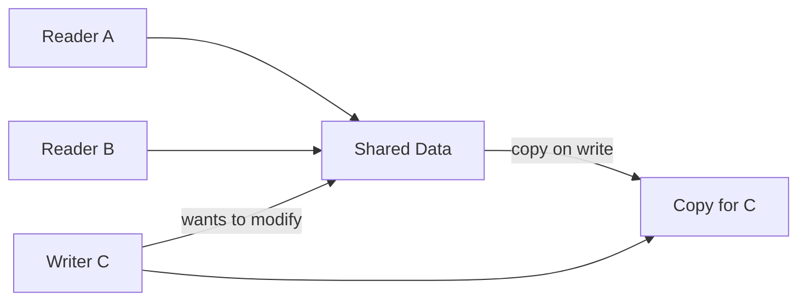

# Pattern: Copy-on-Write (CoW)

<DifficultyBadge />

## Mô tả một câu

Chia sẻ dữ liệu qua tham chiếu cho đến khi ai đó sửa — chỉ khi đó mới tạo bản copy riêng, tiết kiệm bộ nhớ và chi phí cấp phát cho tải nặng đọc.

<DemoBadge />

## Tương tự thực tế

Một link Google Doc được chia sẻ ở chế độ 'chỉ xem'. Mọi người đọc cùng một tài liệu. Khi ai đó muốn sửa, hệ thống tạo bản riêng cho họ. Cho tới khi việc ghi xảy ra, chỉ có một bản tồn tại.

## Ý tưởng cốt lõi

Copy-on-Write hoãn chi phí copy cho tới khi một mutation thực sự xảy ra. Nhiều reader có thể chia sẻ cùng dữ liệu. Khi một writer cần sửa, hệ thống tạo bản copy cho writer đó, để mọi tham chiếu khác không bị động.



Insight then chốt: **dữ liệu được đọc nhiều hơn được ghi rất nhiều**. CoW tận dụng sự bất đối xứng này — chia sẻ miễn phí cho đọc, trả-tiền-theo-ghi cho mutation.

| Thuộc tính | Giá trị |
|----------|-------|
| Đọc (chia sẻ) | O(1) — tham chiếu trực tiếp, không copy |
| Ghi (lần đầu) | O(n) — copy toàn bộ dữ liệu |
| Ghi (đã sở hữu) | O(1) — sửa tại chỗ |
| Bộ nhớ (không ghi) | O(1) — mọi reader chia sẻ một bản |

**Thử ngay** — click "Write" trên reader bất kỳ để kích hoạt copy-on-write và xem reference count đổi:

<CopyOnWriteViz />

## Bằng chứng production

| Dự án | Nguồn | Cách dùng |
|---------|--------|-------|
| Git | [object-file.c#L719-L730](https://github.com/git/git/blob/1ff279f3404a482a83fb04c7457e41ab26884aea/object-file.c#L719-L730) | Object Git là blob bất biến địa chỉ-theo-nội-dung. Khi bạn branch, Git không copy file — chia sẻ cùng object. Commit mới chỉ tạo object mới cho file đã đổi, tái dùng cái không đổi. Đây là CoW cấp mô hình dữ liệu. |
| Stdlib Rust | [borrow.rs#L169-L220](https://github.com/rust-lang/rust/blob/d56483a91d6cf5041351a3208b8d08f98f0c8b56/library/alloc/src/borrow.rs#L169-L220) | `Cow<'a, B>` (Clone on Write) — enum giữ hoặc tham chiếu `Borrowed` hoặc giá trị `Owned`. `to_mut()` (dòng 283) clone dữ liệu chỉ khi đang borrow, biến nó thành owned cho mutation. Dùng khắp hệ sinh thái Rust cho parse zero-copy. |

## Triển khai

::: code-group

```typescript [TypeScript]
class Cow<T extends object> {
  private data: T;
  private shared: boolean;

  constructor(data: T) {
    this.data = data;
    this.shared = false;
  }

  static from<T extends object>(data: T): Cow<T> {
    const cow = new Cow(data);
    cow.shared = true;
    return cow;
  }

  read(): Readonly<T> {
    return this.data;
  }

  write(): T {
    if (this.shared) {
      this.data = structuredClone(this.data);
      this.shared = false;
    }
    return this.data;
  }

  isOwned(): boolean {
    return !this.shared;
  }
}
```

```rust [Rust]
use std::borrow::Cow;

fn process(input: &str) -> Cow<'_, str> {
    if input.contains("bad") {
        // Chỉ cấp phát khi cần sửa đổi
        Cow::Owned(input.replace("bad", "good"))
    } else {
        // Zero-copy: chỉ borrow nguyên bản
        Cow::Borrowed(input)
    }
}

// Cách dùng
let clean = process("hello world");     // Borrowed, không cấp phát
let fixed = process("hello bad world"); // Owned, có cấp phát
```

```go [Go]
type CowSlice[T any] struct {
	data   []T
	shared bool
}

func Share[T any](data []T) *CowSlice[T] {
	return &CowSlice[T]{data: data, shared: true}
}

func (c *CowSlice[T]) Read() []T {
	return c.data
}

func (c *CowSlice[T]) Write() []T {
	if c.shared {
		copied := make([]T, len(c.data))
		copy(copied, c.data)
		c.data = copied
		c.shared = false
	}
	return c.data
}
```

```python [Python]
import copy

class Cow:
    """Wrapper Copy-on-Write."""
    def __init__(self, data, shared=False):
        self._data = data
        self._shared = shared

    @classmethod
    def share(cls, data):
        return cls(data, shared=True)

    def read(self):
        return self._data

    def write(self):
        if self._shared:
            self._data = copy.deepcopy(self._data)
            self._shared = False
        return self._data

# Cách dùng
original = {"users": ["alice", "bob"]}
view = Cow.share(original)
print(view.read() is original)  # True — cùng object, không copy

mutable = view.write()          # GIỜ mới copy
mutable["users"].append("charlie")
print(original["users"])        # ["alice", "bob"] — không đổi
```

:::

## Bài tập

| Cấp độ | Bài tập | File |
|-------|----------|------|
| Cơ bản | Triển khai Cow wrapper hoãn copy cho tới khi ghi | `exercises/typescript/copy-on-write/01-basic.test.ts` |
| Trung bình | Kho config có phiên bản với CoW fork | `exercises/typescript/copy-on-write/02-intermediate.test.ts` |

Chạy bài tập: `pnpm test:exercises` (TypeScript) · `cargo test` (Rust) · `go test ./...` (Go) · `pytest` (Python)

File bài tập: Rust `exercises/rust/src/copy_on_write/mod.rs` · Go `exercises/go/copy_on_write/copy_on_write_test.go` · Python `exercises/python/copy_on_write/test_copy_on_write.py`

## Khi nào nên dùng

- **Dữ liệu nặng đọc** — object config, AST đã parse, response cache
- **Branching / versioning** — mô hình object Git, snapshot database
- **Parse zero-copy** — `Cow<str>` của Rust tránh cấp phát khi input đã hợp lệ
- **Hệ thống undo** — chia sẻ snapshot state, copy chỉ khi mutation
- **Kiến trúc bất biến mặc định** — state React, reducer Redux

## Khi nào KHÔNG nên dùng

- **Tải nặng ghi** — mỗi ghi kích hoạt copy, mất lợi ích
- **Dữ liệu nhỏ** — copy struct nhỏ rẻ hơn bookkeeping CoW
- **Ghi đồng thời** — CoW không giải mutation đồng thời; dùng khoá hoặc atomic
- **Cấu trúc sâu** — CoW nông có thể dẫn tới sub-object mutable chia sẻ

## Thêm các ứng dụng production

- [Linux fork()](https://github.com/torvalds/linux/blob/acb7500801e98639f6d8c2d796ed9f64cba83d3a/kernel/fork.c#L580-L620) — CoW bảng trang qua `copy_page_range`
- [Swift](https://github.com/swiftlang/swift) — value type
- [Redis](https://github.com/redis/redis) — `BGSAVE`
- [ZFS](https://github.com/openzfs/zfs) / Btrfs — snapshot filesystem

## Pattern liên quan

| Pattern | Quan hệ |
|---------|-------------|
| [Double Buffering](/patterns/double-buffering/) | Cả hai hoãn chi phí — CoW copy khi ghi, double buffering chuẩn bị bản hai |
| [Flyweight](/patterns/flyweight/) | Flyweight chia sẻ dữ liệu bất biến; CoW chia sẻ dữ liệu mutable cho tới khi sửa |
| [Merkle Tree](/patterns/merkle-tree/) | Merkle tree giúp CoW hiệu quả — chỉ re-hash đường đi từ node đổi tới root |
| [Reference Counting](/patterns/reference-counting/) | Reference counting theo dõi chia sẻ CoW — copy khi ref count > 1 và ghi |
| [Checkpointing](/patterns/checkpointing/) | Checkpoint chụp snapshot CoW — CoW làm tạo snapshot O(1) |
| [Diff & Patch](/patterns/diff-patch/) | Diff-patch tính thay đổi giữa các snapshot CoW cho update tăng dần |
| [MVCC](/patterns/mvcc/) | MVCC dùng CoW để tạo snapshot phiên bản cho reader đồng thời |

## Câu hỏi thử thách

::: details Câu 1: CoW wrapper của bạn copy nông khi ghi. Một reader và writer chia sẻ object lồng `{ users: [{ name: "alice" }] }`. Writer gọi `write()` và sửa `users[0].name`. Reader có thấy sửa đổi không?
**Trả lời:** Có — copy nông chỉ nhân đôi object cấp trên, nên mảng `users` lồng và phần tử vẫn là tham chiếu chung.

Đây là "cạm bẫy CoW nông". Sau `write()`, writer có object cấp trên mới, nhưng `writer.users === reader.users` vẫn đúng. Sửa `users[0].name` ảnh hưởng cả hai. Để cô lập thật, bạn cần copy sâu (đắt), structural sharing (copy xương sống của đường tới mutation, như immutable.js), hoặc quy tắc object CoW chỉ chứa primitive. React và Redux giải bằng cách yêu cầu mẫu update bất biến: `{ ...state, users: [...state.users] }`.
:::

::: details Câu 2: Linux `fork()` dùng CoW cho page bộ nhớ process. Process con ngay lập tức gọi `exec()` để thay bộ nhớ. Tại sao CoW thiết yếu ở đây?
**Trả lời:** Không có CoW, `fork()` sẽ copy toàn bộ address space của parent chỉ để bỏ ngay khi `exec()` nạp chương trình mới — lãng phí khủng khiếp.

Pattern `fork()` + `exec()` là một trong những thao tác phổ biến nhất Unix. Parent có thể có gigabyte bộ nhớ. CoW nghĩa là `fork()` gần như tức thì: chỉ nhân đôi entry bảng trang và đánh dấu mọi page read-only. Khi `exec()` chạy, nó thay mọi mapping, nên không page nào cần copy. Không có CoW, spawn process từ ứng dụng lớn (như web server fork worker) sẽ chậm và tốn bộ nhớ không chấp nhận được.
:::

::: details Câu 3: Một hệ thống dùng CoW cho object config. 100 reader chia sẻ config; writer cập nhật mỗi giây. Với pattern tải nào, CoW lãng phí bộ nhớ hơn so với object chia sẻ đơn được bảo vệ bởi mutex?
**Trả lời:** Khi mỗi đọc đi kèm một ghi (100% ghi), CoW tạo bản copy đầy đủ mỗi lần truy cập, dùng nhiều bộ nhớ hơn một object chia sẻ duy nhất bảo vệ bởi lock.

Lợi thế CoW tỉ lệ với tỉ lệ đọc/ghi. Ở 99% đọc, 100 reader chia sẻ một bản và chỉ writer hiếm trả tiền clone — xuất sắc. Ở 50% đọc, nửa truy cập kích hoạt copy — lợi ích biên. Ở 100% ghi, mỗi truy cập copy — bạn biến object chia sẻ duy nhất thành N bản độc lập không có lợi ích chia sẻ, cộng overhead theo dõi state chia sẻ. Điểm hoà vốn phụ thuộc kích thước object, nhưng nguyên tắc giữ: CoW cho tải nặng đọc.
:::

::: details Câu 4: `Cow<'a, str>` của Rust là enum với `Borrowed(&'a str)` và `Owned(String)`. Tại sao điều này hữu ích hơn việc luôn clone chuỗi?
**Trả lời:** Nó cho phép hàm nhận và trả dữ liệu chuỗi mà không cấp phát khi input đã ở dạng đúng, đạt zero-copy trong trường hợp phổ biến.

Xét một URL decoder: phần lớn URL không có ký tự percent-encoded và có thể trả về nguyên (`Borrowed`). Chỉ URL có `%20` v.v. cần `String` mới (`Owned`). Với `Cow`, chữ ký hàm là `fn decode(input: &str) -> Cow<str>` — caller nhận tham chiếu nguyên 90% thời gian với không cấp phát. Không có `Cow`, bạn hoặc luôn clone (lãng phí) hoặc trả enum thủ công (đó chính là `Cow` đã, với tích hợp thư viện chuẩn).
:::
