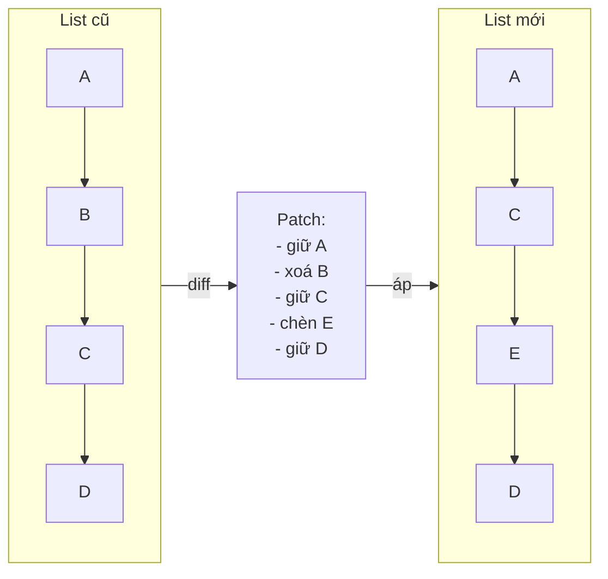

# Pattern: Diff / Patch

<DifficultyBadge />

## Mô tả một câu

So sánh hai chuỗi để tính tập thao tác tối thiểu (chèn, xoá, di chuyển) cần để biến cái này thành cái kia.

<DemoBadge />

## Tương tự thực tế

Tài liệu Word có theo dõi thay đổi. Thay vì gửi cả tài liệu, bạn chỉ gửi các thay đổi đỏ: 'xoá đoạn 3, chèn câu này sau đoạn 5.' Người nhận áp patch lên bản của họ.

## Ý tưởng cốt lõi

Cho danh sách cũ và mới, thuật toán diff xác định item nào được thêm, xoá hoặc di chuyển. Kết quả là một "patch" — tập mutation tối thiểu để áp.



Reconciler React dùng để xác định node DOM nào tạo, update hoặc xoá. Git dùng để hiển thị cái gì đổi giữa commit.

| Thuộc tính | Giá trị |
|----------|-------|
| Diff (Myers') | O(n·d) trong đó d = khoảng cách chỉnh sửa; O(n) khi tương tự |
| Diff (list với key) | O(n) — match theo key tránh tìm bậc hai |
| Áp patch | O(kích thước patch) — mỗi thao tác O(1) |
| Bộ nhớ | O(n) — cho script chỉnh sửa / patch |

**Thử ngay** — sửa text cũ và mới, rồi tính và áp diff:

<DiffPatchViz />

## Bằng chứng production

| Dự án | Nguồn | Cách dùng |
|---------|--------|-------|
| React | [ReactChildFiber.js#L1169-L1340](https://github.com/facebook/react/blob/34b78a2897cc208260a88e6b62ecaf9ca2a9dfe4/packages/react-reconciler/src/ReactChildFiber.js#L1169-L1340) | `reconcileChildrenArray` diff children cũ và mới. Dòng ~1294 gọi `mapRemainingChildren` để xây map key→fiber, rồi lặp children mới qua `updateFromMap` để phát hiện di chuyển, chèn và xoá. |
| Git | [diff.c#L5020-L5060](https://github.com/git/git/blob/1ff279f3404a482a83fb04c7457e41ab26884aea/diff.c#L5020-L5060) | `run_diff` dispatch so sánh cặp file. `builtin_diff` (dòng 3839) xử lý diff thực tế, sinh output patch quen thuộc `+`/`-`. Git dùng thuật toán Myers' tối ưu nội bộ (trong `xdiff/`). |

## Triển khai

::: info Lưu ý thuật toán
Triển khai bên dưới dùng **quét tham lam tới**  — đơn giản và rõ ràng cho việc học. Hệ thống production như Git dùng [thuật toán diff Myers'](https://blog.jcoglan.com/2017/02/12/the-myers-diff-algorithm-part-1/) đảm bảo chuỗi chỉnh sửa tối thiểu. React dùng cách tiếp cận dựa trên key tối ưu cho reconciliation list UI, không phải diff tổng quát.
:::

::: code-group

```typescript [TypeScript]
type Op<T> =
  | { type: 'keep'; value: T }
  | { type: 'insert'; value: T }
  | { type: 'delete'; value: T };

function diff<T>(oldList: T[], newList: T[], eq: (a: T, b: T) => boolean = (a, b) => a === b): Op<T>[] {
  const ops: Op<T>[] = [];
  let oldIdx = 0;
  let newIdx = 0;

  // Xây map item cũ theo giá trị cho tra cứu O(1)
  const oldMap = new Map<string, number>();
  oldList.forEach((item, i) => oldMap.set(String(item), i));

  while (oldIdx < oldList.length && newIdx < newList.length) {
    if (eq(oldList[oldIdx]!, newList[newIdx]!)) {
      ops.push({ type: 'keep', value: oldList[oldIdx]! });
      oldIdx++;
      newIdx++;
    } else if (!newList.some((n, ni) => ni >= newIdx && eq(n, oldList[oldIdx]!))) {
      ops.push({ type: 'delete', value: oldList[oldIdx]! });
      oldIdx++;
    } else {
      ops.push({ type: 'insert', value: newList[newIdx]! });
      newIdx++;
    }
  }

  while (oldIdx < oldList.length) {
    ops.push({ type: 'delete', value: oldList[oldIdx]! });
    oldIdx++;
  }

  while (newIdx < newList.length) {
    ops.push({ type: 'insert', value: newList[newIdx]! });
    newIdx++;
  }

  return ops;
}

function patch<T>(oldList: T[], ops: Op<T>[]): T[] {
  const result: T[] = [];
  for (const op of ops) {
    if (op.type === 'keep' || op.type === 'insert') result.push(op.value);
  }
  return result;
}
```

```rust [Rust]
#[derive(Debug, PartialEq)]
pub enum Op<T> {
    Keep(T),
    Insert(T),
    Delete(T),
}

pub fn diff<T: PartialEq + Clone>(old: &[T], new: &[T]) -> Vec<Op<T>> {
    let mut ops = Vec::new();
    let (mut oi, mut ni) = (0, 0);

    while oi < old.len() && ni < new.len() {
        if old[oi] == new[ni] {
            ops.push(Op::Keep(old[oi].clone()));
            oi += 1;
            ni += 1;
        } else if !new[ni..].contains(&old[oi]) {
            ops.push(Op::Delete(old[oi].clone()));
            oi += 1;
        } else {
            ops.push(Op::Insert(new[ni].clone()));
            ni += 1;
        }
    }

    while oi < old.len() { ops.push(Op::Delete(old[oi].clone())); oi += 1; }
    while ni < new.len() { ops.push(Op::Insert(new[ni].clone())); ni += 1; }

    ops
}

pub fn patch<T: Clone>(ops: &[Op<T>]) -> Vec<T> {
    ops.iter().filter_map(|op| match op {
        Op::Keep(v) | Op::Insert(v) => Some(v.clone()),
        Op::Delete(_) => None,
    }).collect()
}
```

```go [Go]
type OpType int

const (
	Keep OpType = iota
	Insert
	Delete
)

type Op struct {
	Type  OpType
	Value string
}

func contains(slice []string, val string) bool {
	for _, s := range slice {
		if s == val {
			return true
		}
	}
	return false
}

func Diff(old, new []string) []Op {
	var ops []Op
	oi, ni := 0, 0

	for oi < len(old) && ni < len(new) {
		if old[oi] == new[ni] {
			ops = append(ops, Op{Keep, old[oi]})
			oi++
			ni++
		} else if !contains(new[ni:], old[oi]) {
			ops = append(ops, Op{Delete, old[oi]})
			oi++
		} else {
			ops = append(ops, Op{Insert, new[ni]})
			ni++
		}
	}

	for oi < len(old) {
		ops = append(ops, Op{Delete, old[oi]})
		oi++
	}
	for ni < len(new) {
		ops = append(ops, Op{Insert, new[ni]})
		ni++
	}
	return ops
}

func Patch(ops []Op) []string {
	var result []string
	for _, op := range ops {
		if op.Type != Delete {
			result = append(result, op.Value)
		}
	}
	return result
}
```

```python [Python]
from typing import TypeVar, List, Tuple, Literal

T = TypeVar("T")
Op = Tuple[Literal["keep", "insert", "delete"], T]

def diff(old: List[T], new: List[T]) -> List[Op]:
    ops: List[Op] = []
    oi, ni = 0, 0

    while oi < len(old) and ni < len(new):
        if old[oi] == new[ni]:
            ops.append(("keep", old[oi]))
            oi += 1; ni += 1
        elif old[oi] not in new[ni:]:
            ops.append(("delete", old[oi]))
            oi += 1
        else:
            ops.append(("insert", new[ni]))
            ni += 1

    while oi < len(old): ops.append(("delete", old[oi])); oi += 1
    while ni < len(new): ops.append(("insert", new[ni])); ni += 1
    return ops

def patch(ops: List[Op]) -> List[T]:
    return [val for op_type, val in ops if op_type != "delete"]

# Cách dùng
ops = diff(["a", "b", "c", "d"], ["a", "c", "e", "d"])
assert patch(ops) == ["a", "c", "e", "d"]
```

:::

## Bài tập

| Cấp độ | Bài tập | File |
|-------|----------|------|
| Cơ bản | Triển khai diff list đơn giản sinh ops keep/insert/delete | `exercises/typescript/diff-patch/01-basic.test.ts` |
| Trung bình | Áp patch để dựng lại list mới từ cũ | `exercises/typescript/diff-patch/02-patch-apply.test.ts` |

Chạy bài tập: `pnpm test:exercises` (TypeScript) · `cargo test` (Rust) · `go test ./...` (Go) · `pytest` (Python)

File bài tập: Rust `exercises/rust/src/diff_patch/mod.rs` · Go `exercises/go/diff_patch/diff_patch_test.go` · Python `exercises/python/diff_patch/test_diff_patch.py`

## Khi nào nên dùng

- **Reconciliation UI** — giảm tối đa mutation DOM bằng cách diff cây ảo
- **Quản lý phiên bản** — tính thay đổi file giữa commit
- **Chỉnh sửa cộng tác** — gộp chỉnh sửa đồng thời qua operational transform hoặc CRDT diff
- **Đồng bộ state** — gửi chỉ delta thay vì state đầy đủ qua mạng
- **Undo/redo** — lưu diff như entry undo gọn thay vì snapshot đầy đủ

## Khi nào KHÔNG nên dùng

- **List hoàn toàn khác** — nếu > 80% item đổi, chỉ cần thay cả list
- **Set không thứ tự** — diff giả định thứ tự quan trọng; cho set, dùng giao/hiệu set
- **Streaming realtime** — nếu item đến từng cái, cách tăng dần tốt hơn diff batch
- **List lớn không có key** — không có định danh ổn định, diff thoái hoá thành O(n²)

## Thêm các ứng dụng production

- [VS Code](https://github.com/microsoft/vscode) — diff buffer text
- [jsdiff](https://github.com/kpdecker/jsdiff)
- [Vue 3](https://github.com/vuejs/core) — diff template
- [Git](https://github.com/git/git/blob/1ff279f3404a482a83fb04c7457e41ab26884aea/diff.c) — engine diff cốt lõi cho commit, merge và patch

## Pattern liên quan

| Pattern | Quan hệ |
|---------|-------------|
| [Copy-on-Write (CoW)](/patterns/copy-on-write/) | Diff/patch tính cái gì đổi; CoW hoãn copy thực sự tới khi cần |
| [Merkle Tree](/patterns/merkle-tree/) | Merkle tree xác định subtree nào đã đổi, thu hẹp nơi cần diff |
| [Double Buffering](/patterns/double-buffering/) | React diff cây current với cây work-in-progress double-buffer |

## Câu hỏi thử thách

::: details Câu 1: Diff React sinh ops insert/delete/update nhưng không có "move." Xử lý list chỉ được sắp lại thế nào?
**Trả lời:** React không phát thao tác "move" tường minh. Thay vào đó, nó tái dùng node DOM hiện có và đặt lại vị trí qua `insertBefore`.

Không có key, React so children theo vị trí — sắp lại trông như mọi phần tử đổi. Có key, React xây map `key -> fiber`, match children cũ và mới theo key, và tái dùng node DOM hiện có. Theo dõi `lastPlacedIndex` và đánh dấu fiber cần đặt lại — trình duyệt di chuyển node DOM thay vì huỷ và tạo lại. Đây đơn giản hơn tính chuỗi di chuyển khoảng cách chỉnh sửa tối thiểu nhưng sinh mutation DOM gần tối ưu cho list UI điển hình.
:::

::: details Câu 2: Thuật toán diff tham lam trong pattern này O(n*m) worst case. Cái gì gây ra, và Myers' cải thiện thế nào?
**Trả lời:** Cuộc gọi `some()` của thuật toán tham lam quét list mới còn lại cho mỗi item cũ, tạo O(n*m) so sánh. Thuật toán Myers' chạy trong O((n+m) * d) với d là khoảng cách chỉnh sửa.

Insight then chốt của Myers' là tìm script chỉnh sửa ngắn nhất bằng cách khám phá đường chéo trong đồ thị chỉnh sửa. Khi hai list tương tự (d nhỏ), chạy gần O(n+m). Cách tham lam không tối ưu vậy — không tối thiểu hoá chuỗi chỉnh sửa và thoái hoá tệ khi list có nhiều khác biệt rải rác.
:::

::: details Câu 3: Hai dev độc lập sửa cùng file. Dev A xoá dòng 5; Dev B sửa dòng 5. Merge dựa trên diff xử lý xung đột này thế nào?
**Trả lời:** Đây là xung đột thực không thể auto-resolve — công cụ merge phải đánh dấu cho người xem.

Merge ba bên tính hai diff: (base -> A) và (base -> B). Nếu cả hai diff chạm cùng vùng, chúng xung đột. Diff của A nói "xoá dòng 5," diff của B nói "thay dòng 5." Đây là thao tác loại trừ trên cùng hunk. Công cụ merge chèn marker xung đột (`<<<<<<<`, `=======`, `>>>>>>>`) và dev quyết định. Thay đổi không chồng lên ở vùng khác merge sạch.
:::

::: details Câu 4: Bạn cần đồng bộ state giữa server và 10.000 client kết nối. Nên diff state đầy đủ và gửi patch, hay dùng cách khác?
**Trả lời:** Diff state đầy đủ mỗi client không scale. Dùng event sourcing hoặc operational transform để gửi mutation riêng khi chúng xảy ra.

Tính diff cần giữ cả state cũ và mới, và chi phí diff tỉ lệ với kích thước state. Với 10.000 client, bạn sẽ tính 10.000 diff mỗi update. Thay vào đó, bắt mỗi mutation thành thao tác nhỏ (ví dụ "set user.name = X") và broadcast. Client áp thao tác tăng dần. Diff-patch phù hợp hơn cho reconciliation định kỳ (như chu kỳ render React) hoặc đồng bộ offline, không phải phân tán realtime fan-out cao.
:::
