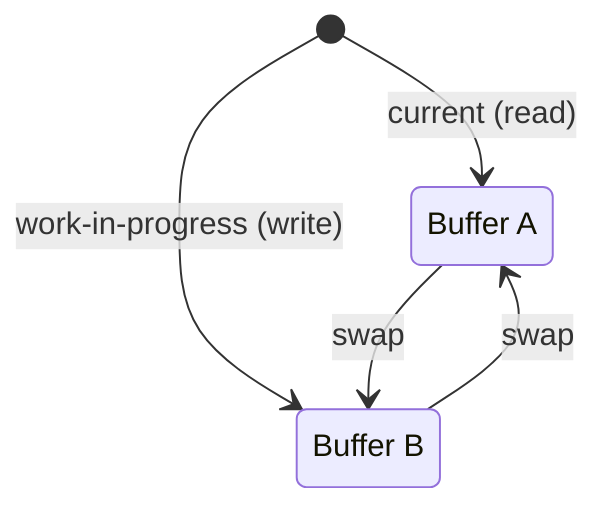

# Pattern: Double Buffering

<DifficultyBadge />

## Mô tả một câu

Duy trì hai bản sao state và hoán đổi nguyên tử giữa chúng để reader luôn thấy snapshot nhất quán.

<DemoBadge />

## Tương tự thực tế

Bếp nhà hàng có hai cửa sổ phục vụ. Đầu bếp chuẩn bị order tiếp theo trên một quầy trong khi bồi bàn lấy order hiện tại từ quầy kia. Khi order mới sẵn, họ hoán đổi — khách không bao giờ thấy thức ăn nửa chừng.

## Ý tưởng cốt lõi

Double buffering giữ hai phiên bản của cấu trúc dữ liệu: một "current" (đang đọc) và một "work-in-progress" (đang ghi). Khi ghi xong, hai cái được hoán đổi nguyên tử. Điều này tránh tearing — reader không bao giờ thấy state cập nhật nửa chừng.



Sau swap: "current" cũ trở thành "work-in-progress" mới (tái dùng, không GC). Cùng hai object được tái chế mãi — **không cấp phát** trên hot path.

| Thuộc tính | Giá trị |
|----------|-------|
| Swap | O(1) — hoán đổi con trỏ/reference |
| Cấp phát trên hot path | Không — cả hai buffer cấp phát trước và tái chế |
| Bộ nhớ | 2× một buffer — chính xác hai bản sao |
| Tearing | Không thể — reader thấy snapshot nhất quán |

**Thử ngay** — vẽ frame và hoán đổi buffer để xem double buffering chặn tearing:

<DoubleBufferingViz />

## Bằng chứng production

| Dự án | Nguồn | Cách dùng |
|---------|--------|-------|
| React | [ReactFiber.js#L327-L355](https://github.com/facebook/react/blob/34b78a2897cc208260a88e6b62ecaf9ca2a9dfe4/packages/react-reconciler/src/ReactFiber.js#L327-L355) | `createWorkInProgress` — tạo hoặc tái dùng fiber alternate. Comment nói: *"Chúng tôi dùng kỹ thuật pool double buffering vì biết sẽ chỉ cần tối đa hai phiên bản cây."* `current.alternate = workInProgress` và `workInProgress.alternate = current` thiết lập liên kết qua lại. |
| SDL | [SDL_render.c#L5535-L5570](https://github.com/libsdl-org/SDL/blob/14b0e9d922da78001223e563efd2f54f473a4115/src/render/SDL_render.c#L5535-L5570) | `SDL_RenderPresent` — flush các lệnh render đã queue, gọi `RenderPresent` của backend để hoán đổi buffer front/back cho trình bày frame không tearing và xử lý mô phỏng vsync. |

## Triển khai

::: code-group

```typescript [TypeScript]
class DoubleBuffer<T> {
  private buffers: [T, T];
  private currentIndex: 0 | 1 = 0;

  constructor(createBuffer: () => T) {
    this.buffers = [createBuffer(), createBuffer()];
  }

  current(): T {
    return this.buffers[this.currentIndex];
  }

  next(): T {
    return this.buffers[this.currentIndex === 0 ? 1 : 0];
  }

  swap(): void {
    this.currentIndex = this.currentIndex === 0 ? 1 : 0;
  }
}

// Double buffering fiber kiểu React
interface Fiber {
  tag: string;
  pendingProps: Record<string, unknown>;
  memoizedState: unknown;
  alternate: Fiber | null;
}

function createWorkInProgress(current: Fiber, pendingProps: Record<string, unknown>): Fiber {
  let wip = current.alternate;

  if (wip === null) {
    // Lần render đầu: tạo alternate
    wip = {
      tag: current.tag,
      pendingProps,
      memoizedState: current.memoizedState,
      alternate: current,
    };
    current.alternate = wip;
  } else {
    // Render tiếp: tái dùng alternate (không cấp phát)
    wip.pendingProps = pendingProps;
    wip.memoizedState = current.memoizedState;
  }

  return wip;
}
```

```rust [Rust]
pub struct DoubleBuffer<T> {
    buffers: [T; 2],
    current: usize,
}

impl<T: Default + Clone> DoubleBuffer<T> {
    pub fn new(init: T) -> Self {
        DoubleBuffer {
            buffers: [init.clone(), init],
            current: 0,
        }
    }

    pub fn current(&self) -> &T {
        &self.buffers[self.current]
    }

    pub fn next(&mut self) -> &mut T {
        &mut self.buffers[1 - self.current]
    }

    pub fn swap(&mut self) {
        self.current = 1 - self.current;
    }
}
```

```go [Go]
type DoubleBuffer[T any] struct {
	buffers [2]T
	current int
}

func NewDoubleBuffer[T any](init T, clone func(T) T) *DoubleBuffer[T] {
	return &DoubleBuffer[T]{
		buffers: [2]T{clone(init), init},
		current: 0,
	}
}

func (db *DoubleBuffer[T]) Current() *T {
	return &db.buffers[db.current]
}

func (db *DoubleBuffer[T]) Next() *T {
	return &db.buffers[1-db.current]
}

func (db *DoubleBuffer[T]) Swap() {
	db.current = 1 - db.current
}
```

```python [Python]
class DoubleBuffer:
    def __init__(self, create_buffer):
        self._buffers = [create_buffer(), create_buffer()]
        self._current = 0

    def current(self):
        return self._buffers[self._current]

    def next(self):
        return self._buffers[1 - self._current]

    def swap(self):
        self._current = 1 - self._current

# Cách dùng
buf = DoubleBuffer(lambda: {"pixels": [0, 0]})
buf.next()["pixels"] = [255, 128]  # ghi vào back buffer
assert buf.current()["pixels"] == [0, 0]  # front không đổi
buf.swap()
assert buf.current()["pixels"] == [255, 128]  # giờ hiển thị
```

:::

## Bài tập

| Cấp độ | Bài tập | File |
|-------|----------|------|
| Cơ bản | Triển khai double buffer tổng quát với swap | `exercises/typescript/double-buffering/01-basic.test.ts` |
| Trung bình | Xây fiber alternate kiểu React | `exercises/typescript/double-buffering/02-fiber-alternate.test.ts` |

Chạy bài tập: `pnpm test:exercises` (TypeScript) · `cargo test` (Rust) · `go test ./...` (Go) · `pytest` (Python)

File bài tập: Rust `exercises/rust/src/double_buffering/mod.rs` · Go `exercises/go/double_buffering/double_buffering_test.go` · Python `exercises/python/double_buffering/test_double_buffering.py`

## Khi nào nên dùng

- **Pipeline render** — buffer front/back GPU, render frame game
- **Đọc và ghi đồng thời** — reader thấy state nhất quán trong khi writer chuẩn bị phiên bản tiếp
- **Reconciliation cây** — kiến trúc fiber React dùng để diff cây cũ và mới
- **Hot path không cấp phát** — tái dùng hai buffer mãi thay vì cấp phát mới
- **MVCC database** — reader thấy snapshot trong khi writer chuẩn bị phiên bản mới

## Khi nào KHÔNG nên dùng

- **Update state đơn giản** — nếu state là giá trị đơn và update nguyên tử, double buffering thêm phức tạp không cần
- **Môi trường eo hẹp bộ nhớ** — bạn trả 2x chi phí bộ nhớ
- **Đọc một phần thường xuyên** — nếu reader cần truy cập realtime vào ghi đang dang dở, double buffering ẩn update tới khi swap

## Thêm các ứng dụng production

- [OpenGL](https://www.khronos.org/opengl/) / Vulkan — swap chain
- [PostgreSQL](https://github.com/postgres/postgres) — cô lập snapshot MVCC
- [Godot Engine](https://github.com/godotengine/godot/blob/ec67cbe92628bdaf979b10594359ba6f02cf8838/servers/rendering/renderer_rd/renderer_scene_render_rd.cpp) — render frame double-buffer
- [Linux fbdev](https://github.com/torvalds/linux/blob/acb7500801e98639f6d8c2d796ed9f64cba83d3a/drivers/video/fbdev/core/fbmem.c) — double buffer framebuffer cho output console và display

## Pattern liên quan

| Pattern | Quan hệ |
|---------|-------------|
| [Copy-on-Write (CoW)](/patterns/copy-on-write/) | Cả hai hoãn chi phí sửa — double buffering hoán đổi bản sao toàn bộ, CoW copy khi ghi |
| [Ring Buffer (Buffer vòng)](/patterns/ring-buffer/) | Ring buffer có thể xem như tổng quát hoá đa-slot của double buffering |
| [Dirty Flag](/patterns/dirty-flag/) | Dirty flag theo dõi buffer nào đã đổi và cần hoán đổi |
| [Bitmask](/patterns/bitmask/) | Bitmask có thể theo dõi buffer nào active trong scheme double-buffer |
| [Diff & Patch](/patterns/diff-patch/) | Diff-patch có thể tính delta giữa buffer front và back |

## Câu hỏi thử thách

::: details Câu 1: Nếu double buffering loại bỏ tearing, sao GPU dùng triple buffering?
**Trả lời:** Triple buffering tách thời điểm swap khỏi vsync, giảm input latency mà không tái nhập tearing.

Với double buffering và vsync bật, nếu GPU xong frame sớm, phải chờ khoảng vsync tiếp theo trước khi swap — pipeline CPU/GPU dừng. Buffer thứ ba cho GPU tiếp tục render vào back buffer dự phòng trong khi front buffer chờ vsync. Display luôn nhận frame mới nhất, nên latency giảm còn tearing vẫn loại bỏ.
:::

::: details Câu 2: Dev junior đề nghị gọi `swap()` giữa lúc đang ghi vào back buffer để "publish tiến độ một phần." Có gì sai?
**Trả lời:** Điều này tái nhập đúng vấn đề tearing mà double buffering được thiết kế để chặn.

Toàn bộ ý của double buffering là swap chỉ xảy ra sau khi back buffer được ghi đầy đủ. Nếu swap giữa chừng ghi, reader giờ thấy buffer cập nhật nửa chừng — vài pixel từ frame cũ, vài từ frame mới. Invariant là: back buffer riêng tư cho writer cho tới khi swap làm nó công khai nguyên tử.
:::

::: details Câu 3: Cây fiber React dùng double buffering, nhưng thực tế không bao giờ swap hai buffer màn hình. Cái gì đang được "swap" và sao vẫn đủ điều kiện?
**Trả lời:** React swap cây fiber nào là "current" và cái nào là "work-in-progress" bằng cách gán lại một con trỏ duy nhất (`root.current = finishedWork`).

Pattern là cấu trúc, không phải hình ảnh. React duy trì hai cây fiber liên kết qua `.alternate`. Khi render, xây cây work-in-progress mà không ảnh hưởng cái đang hiển thị. Khi commit, nguyên tử chỉ định cây WIP là "current." Current cũ trở thành WIP tiếp (tái chế, không GC). Đây là cùng nguyên tắc với swap buffer GPU: chuẩn bị riêng tư, publish nguyên tử, tái chế phiên bản cũ.
:::

::: details Câu 4: Double buffering dùng 2x bộ nhớ. Điều kiện nào làm chi phí này thành overhead hiệu quả bằng 0?
**Trả lời:** Khi dù sao bạn cũng cần một buffer "tạm" riêng để chuẩn bị state tiếp theo.

Nếu lựa chọn thay double buffering là cấp phát buffer mới mỗi frame và bỏ cái cũ, double buffering thực sự tiết kiệm bộ nhớ bằng cách tái dùng hai buffer cố định mãi. Chi phí 2x chỉ đau khi so với kịch bản update in-place — và update in-place có nguy cơ tearing. Vậy so sánh chi phí thực: 2 buffer bền vững vs N cấp phát ngắn cộng áp lực GC.
:::
