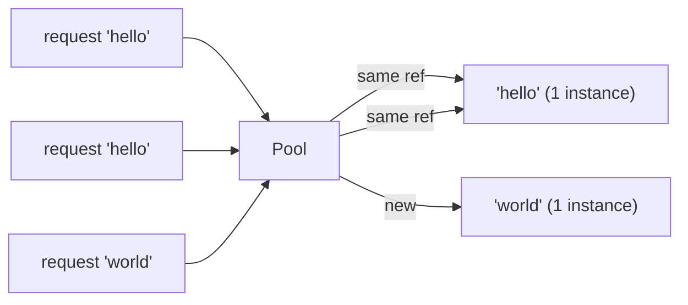

# Pattern: Flyweight / Interning

<DifficultyBadge />

## Mô tả một câu

Chia sẻ các object bất biến giống nhau thay vì tạo bản sao, đánh đổi chi phí tra cứu lấy tiết kiệm bộ nhớ khổng lồ khi nhiều instance có cùng giá trị.

<DemoBadge />

## Tương tự thực tế

Tủ trang phục của một đoàn kịch. Chỉ có một bộ đồ cướp biển, một bộ áo choàng hoàng gia và một bộ trang phục nông dân. Mỗi diễn viên đóng vai đó đều mặc chung bộ đồ thay vì làm bản riêng.

## Ý tưởng cốt lõi

Khi hàng nghìn object có cùng giá trị (chuỗi, số nguyên nhỏ, màu), cấp phát từng cái riêng lãng phí bộ nhớ. Flyweight/interning duy trì pool các instance chính tắc và trả về cùng một reference cho các giá trị bằng nhau.



Hai yêu cầu cho `"hello"` nhận **cùng object** — không phải bản sao. Đây là vì sao `"hello" === "hello"` trong nhiều ngôn ngữ (string interning).

| Thuộc tính | Giá trị |
|----------|-------|
| Tra cứu/intern | O(1) phân bổ — tra hash table |
| Tiết kiệm bộ nhớ | O(số duy nhất) thay vì O(tổng instance) |
| Kiểm tra bằng | O(1) — so con trỏ thay vì so giá trị |
| Đánh đổi | Bộ nhớ pool + chi phí tra cứu vs chi phí cấp phát mỗi object |

**Thử ngay** — thêm ký tự và xem cách các object flyweight được chia sẻ:

<FlyweightViz />

## Bằng chứng production

| Dự án | Nguồn | Cách dùng |
|---------|--------|-------|
| Python (CPython) | [longobject.c#L61-L75](https://github.com/python/cpython/blob/ff64d8de66ab7f8e56b5d410796a7d76c955280c/Objects/longobject.c#L61-L75) | `get_small_int` trả các object integer đã cache trước cho -5 đến 256. `a = 42; b = 42; a is b` là `True` vì cả hai tham chiếu cùng object cache. Tránh hàng triệu cấp phát integer trong chương trình điển hình. |
| Stdlib Go | [pool.go#L52-L97](https://github.com/golang/go/blob/f5cdf4745455415c7a43cfc7d925214d4511489b/src/sync/pool.go#L52-L97) | `sync.Pool` là flyweight áp dụng cho object tạm — `Get()` trả instance đã cache thay vì cấp phát, `Put()` trả về để tái dùng. Dùng trong `fmt.Fprintf`, `encoding/json` và HTTP handler để chia sẻ buffer. |

::: info Lưu ý
`String.intern()` của Java, bảng chuỗi engine JavaScript (V8) và `&'static str` của Rust đều triển khai biến thể của pattern này. JVM tự intern mọi string literal.
:::

## Triển khai

::: code-group

```typescript [TypeScript]
class Interner<T> {
  private pool = new Map<string, T>();

  intern(key: string, create: () => T): T {
    if (this.pool.has(key)) {
      return this.pool.get(key)!;
    }
    const value = create();
    this.pool.set(key, value);
    return value;
  }

  has(key: string): boolean {
    return this.pool.has(key);
  }

  get size(): number {
    return this.pool.size;
  }
}
```

```rust [Rust]
use std::collections::HashMap;

pub struct Interner {
    pool: HashMap<String, usize>,
    strings: Vec<String>,
}

impl Interner {
    pub fn new() -> Self {
        Interner { pool: HashMap::new(), strings: Vec::new() }
    }

    pub fn intern(&mut self, s: &str) -> usize {
        if let Some(&id) = self.pool.get(s) {
            return id;
        }
        let id = self.strings.len();
        self.strings.push(s.to_string());
        self.pool.insert(s.to_string(), id);
        id
    }

    pub fn resolve(&self, id: usize) -> &str {
        &self.strings[id]
    }
}
```

```go [Go]
type Interner struct {
	pool map[string]int
	data []string
}

func NewInterner() *Interner {
	return &Interner{pool: make(map[string]int)}
}

func (in *Interner) Intern(s string) int {
	if id, ok := in.pool[s]; ok {
		return id
	}
	id := len(in.data)
	in.data = append(in.data, s)
	in.pool[s] = id
	return id
}

func (in *Interner) Resolve(id int) string {
	return in.data[id]
}
```

```python [Python]
import sys

class Interner:
    def __init__(self):
        self._pool: dict[str, object] = {}

    def intern(self, key: str, factory=None):
        if key in self._pool:
            return self._pool[key]
        value = factory() if factory else key
        self._pool[key] = value
        return value

    @property
    def size(self) -> int:
        return len(self._pool)

# Python đã intern các integer nhỏ:
a = 256
b = 256
print(a is b)  # True — cùng object, flyweight!
print(sys.getrefcount(256))  # nhiều tham chiếu tới cùng một int
```

:::

## Bài tập

| Cấp độ | Bài tập | File |
|-------|----------|------|
| Cơ bản | Triển khai string interner với intern/resolve | `exercises/typescript/flyweight/01-basic.test.ts` |
| Trung bình | Icon registry khử trùng lặp object theo tên | `exercises/typescript/flyweight/02-intermediate.test.ts` |

Chạy bài tập: `pnpm test:exercises` (TypeScript) · `cargo test` (Rust) · `go test ./...` (Go) · `pytest` (Python)

File bài tập: Rust `exercises/rust/src/flyweight/mod.rs` · Go `exercises/go/flyweight/flyweight_test.go` · Python `exercises/python/flyweight/test_flyweight.py`

## Khi nào nên dùng

- **Giá trị giống nhau lặp lại** — chuỗi, màu, icon, type tag
- **Môi trường eo hẹp bộ nhớ** — hệ thống nhúng, mobile, tab trình duyệt
- **Compiler và interpreter** — bảng symbol, interning chuỗi
- **Game engine** — mesh, texture, material dùng chung
- **Kết quả truy vấn database** — khử trùng lặp giá trị cột lặp lại

## Khi nào KHÔNG nên dùng

- **Giá trị duy nhất** — nếu mọi instance đều khác, pool thêm overhead
- **Object mutable** — flyweight giả định object chia sẻ là bất biến
- **Dữ liệu sống ngắn** — nếu object được tạo và bỏ nhanh, interning thêm chi phí tra cứu
- **Thread safety** — intern đồng thời cần đồng bộ

## Thêm các ứng dụng production

- [Java String.intern()](https://github.com/openjdk/jdk/blob/4b3ec455c85314d051800a8f46dd8f5c93881e3a/src/java.base/share/classes/java/lang/String.java) — string pool của JVM khử trùng lặp string literal giống nhau
- [Cache int nhỏ Python](https://github.com/python/cpython/blob/ff64d8de66ab7f8e56b5d410796a7d76c955280c/Objects/longobject.c) — CPython cấp phát trước integer -5 đến 256
- Crate [Rust string_cache](https://crates.io/crates/string_cache)
- [Interning chuỗi .NET](https://github.com/dotnet/runtime/blob/bee7953796edc09e516e847e3c9006b486ab0f6d/src/libraries/System.Private.CoreLib/src/System/String.cs) — `String.Intern()` duy trì pool intern toàn CLR
- [Chromium CSS](https://github.com/chromium/chromium/blob/5cffea3f665b7762369a0fa84d2f208875e7225e/third_party/blink/renderer/core/css/) — khử trùng lặp giá trị CSS trong engine render Blink

## Pattern liên quan

| Pattern | Quan hệ |
|---------|-------------|
| [Interning](/patterns/interning/) | Interning là cơ chế triển khai flyweight — khử trùng lặp giá trị giống nhau |
| [Copy-on-Write (CoW)](/patterns/copy-on-write/) | Cả hai chia sẻ dữ liệu — flyweight chia sẻ object bất biến, CoW chia sẻ cho tới khi sửa |
| [LRU Cache](/patterns/lru-cache/) | LRU cache có thể lưu instance flyweight, loại bỏ object chia sẻ ít dùng nhất |

## Câu hỏi thử thách

::: details Câu 1: Ai đó intern một object mutable (chẳng hạn map config) rồi sau đó sửa nó. Hư hỏng gì?
**Trả lời:** Mọi consumer chia sẻ tham chiếu đó đều thấy sự sửa đổi, gây hành vi khó đoán ở các phần không liên quan trong hệ thống.

Tiền đề toàn bộ của flyweight là instance chia sẻ giống nhau và có thể thay thế cho nhau. Nếu một caller sửa object chia sẻ, mọi caller khác âm thầm nhận giá trị thay đổi. Đó là lý do object intern/flyweight phải bất biến. Nếu cần sửa, clone-on-write hoặc không intern.
:::

::: details Câu 2: Python cache integer -5 đến 256 làm flyweight. Tại sao không cache tất cả integer?
**Trả lời:** Vì chi phí bộ nhớ cấp phát trước mọi integer khả dĩ vượt xa tiết kiệm từ chia sẻ. Cache chỉ có lợi cho giá trị xuất hiện thường xuyên.

Khoảng -5 đến 256 được chọn theo kinh nghiệm — chúng bao loop counter, index mảng, giá trị giống boolean và hằng phổ biến. Cache `1_000_000` lãng phí bộ nhớ vì hầu hết integer lớn chỉ xuất hiện một lần. Flyweight chỉ tiết kiệm bộ nhớ khi trùng lặp phổ biến.
:::

::: details Câu 3: Bạn xây string interner cho compiler. Sau khi xử lý 10.000 file nguồn, interner giữ 2 triệu chuỗi và dùng 500MB. Có gì sai?
**Trả lời:** Interner không bao giờ loại bỏ entry, nên nó tích luỹ mọi chuỗi từng thấy — kể cả identifier dùng một lần và string literal không bao giờ được tham chiếu lại.

Interner production cần chiến lược cho phạm vi: hoặc xoá theo mỗi đơn vị biên dịch, dùng weak reference để chuỗi không tham chiếu được thu, hoặc giới hạn interning vào identifier (vốn lặp thường xuyên) và bỏ qua string literal tuỳ ý. Tăng không giới hạn là cạm bẫy kinh điển của flyweight.
:::

::: details Câu 4: Hai thread đồng thời gọi `intern("hello")` và cả hai thấy nó thiếu trong pool. Có thể sai gì?
**Trả lời:** Cả hai thread tạo instance mới và chèn vào, kết quả là hai object khác nhau cho cùng key — phá vỡ đảm bảo "cùng reference cho cùng giá trị".

Không có đồng bộ, bạn gặp race: thread A kiểm tra pool, không thấy, tạo object; thread B làm tương tự trước khi A chèn. Giờ consumer ở các thread khác nhau giữ reference khác nhau cho `"hello"`, phá so sánh identity (`===` / `is`). Cách sửa là khoá quanh check-and-insert, hoặc concurrent map với ngữ nghĩa `putIfAbsent`.
:::
