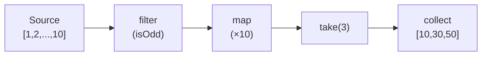

# Pattern: Iterator / Đánh giá lười

<DifficultyBadge />

## Mô tả một câu

Xử lý chuỗi từng phần tử mà không vật chất hoá toàn bộ collection, cho phép biến đổi có thể ghép với không cấp phát trung gian.

<DemoBadge />

## Tương tự thực tế

Một bộ bài úp mặt. Bạn rút từng lá một mà không biết bên dưới có gì. Bạn không cần xoè cả bộ — chỉ rút tới khi xong hoặc quyết định dừng.

## Ý tưởng cốt lõi

Iterator là object sinh giá trị từng cái qua method `next()`. Các biến đổi (map, filter, fold) được ghép lười — không gì chạy cho tới khi một thao tác đầu cuối (collect, for-each) thúc chain.



Không có mảng trung gian được tạo. Mỗi phần tử chảy qua toàn chain trước khi cái tiếp theo bắt đầu. `take(3)` dừng sau 3 kết quả — phần tử 6-10 không bao giờ bị chạm.

| Thuộc tính | Giá trị |
|----------|-------|
| next() | O(1) mỗi phần tử — một bước qua pipeline |
| Bộ nhớ | O(1) — không collection trung gian, mỗi phần tử một lúc |
| Short-circuit | `take(k)` dừng sớm — chỉ k phần tử được xử lý |
| Khả năng ghép | Chain map/filter/fold không cấp phát mảng trung gian |

**Thử ngay** — đi qua iterator mảng và cây, xem các phần tử được thăm từng cái:

<IteratorViz />

## Bằng chứng production

| Dự án | Nguồn | Cách dùng |
|---------|--------|-------|
| Stdlib Rust | [iterator.rs#L68-L112](https://github.com/rust-lang/rust/blob/d56483a91d6cf5041351a3208b8d08f98f0c8b56/library/core/src/iter/traits/iterator.rs#L68-L112) | Trait `Iterator` — `next()` (dòng 78) là method bắt buộc duy nhất. `map` (dòng 831), `filter` (dòng 952), `fold`, `collect` đều xây trên đó. Nền tảng của zero-cost abstraction cho chuỗi của Rust. |
| Python | [genobject.c#L259-L374](https://github.com/python/cpython/blob/ff64d8de66ab7f8e56b5d410796a7d76c955280c/Objects/genobject.c#L259-L374) | `gen_send_ex2` (L259-L324) — send generator cốt lõi: push arg lên stack frame, gọi `_PyEval_EvalFrame`, phân biệt yield với return. `gen_send_ex` (L329-L374) kiểm tra state generator (CREATED/EXECUTING/FINISHED) trước khi uỷ thác. |

## Triển khai

::: code-group

```typescript [TypeScript]
class Iter<T> {
  constructor(private source: () => Generator<T>) {}

  static from<T>(items: T[]): Iter<T> {
    return new Iter(function* () { yield* items; });
  }

  map<U>(fn: (x: T) => U): Iter<U> {
    const source = this.source;
    return new Iter(function* () {
      for (const item of source()) yield fn(item);
    });
  }

  filter(pred: (x: T) => boolean): Iter<T> {
    const source = this.source;
    return new Iter(function* () {
      for (const item of source()) if (pred(item)) yield item;
    });
  }

  take(n: number): Iter<T> {
    const source = this.source;
    return new Iter(function* () {
      let i = 0;
      for (const item of source()) {
        if (i++ >= n) break;
        yield item;
      }
    });
  }

  collect(): T[] {
    return [...this.source()];
  }

  fold<U>(init: U, fn: (acc: U, x: T) => U): U {
    let acc = init;
    for (const item of this.source()) acc = fn(acc, item);
    return acc;
  }
}
```

```rust [Rust]
// Trait Iterator của Rust đã có sẵn. Cách dùng:
fn example() {
    let result: Vec<i32> = (1..=10)
        .filter(|x| x % 2 == 0)
        .map(|x| x * x)
        .collect();
    // [4, 16, 36, 64, 100] — không có Vec trung gian được cấp phát
}
```

```go [Go]
// Go 1.23+ iter.Seq cho lặp lười
package iterator

import "iter"

func Filter[T any](seq iter.Seq[T], pred func(T) bool) iter.Seq[T] {
	return func(yield func(T) bool) {
		for v := range seq {
			if pred(v) && !yield(v) {
				return
			}
		}
	}
}

func Map[T, U any](seq iter.Seq[T], fn func(T) U) iter.Seq[U] {
	return func(yield func(U) bool) {
		for v := range seq {
			if !yield(fn(v)) {
				return
			}
		}
	}
}

func Take[T any](seq iter.Seq[T], n int) iter.Seq[T] {
	return func(yield func(T) bool) {
		i := 0
		for v := range seq {
			if i >= n || !yield(v) {
				return
			}
			i++
		}
	}
}

func Collect[T any](seq iter.Seq[T]) []T {
	var out []T
	for v := range seq {
		out = append(out, v)
	}
	return out
}

// Cách dùng: pipeline lười — chỉ xử lý 5 phần tử để tìm 3 số lẻ
// source := slices.Values([]int{1,2,3,4,5,6,7,8,9,10})
// result := Collect(Take(Map(Filter(source, isOdd), times10), 3))
// → [10, 30, 50]
```

```python [Python]
# Generator Python là iterator lười tự nhiên
def fibonacci():
    a, b = 0, 1
    while True:
        yield a
        a, b = b, a + b

# Lấy 10 số Fibonacci chẵn đầu — lười, an toàn với vô hạn
evens = (x for x in fibonacci() if x % 2 == 0)
first_10 = [next(evens) for _ in range(10)]
```

:::

## Bài tập

| Cấp độ | Bài tập | File |
|-------|----------|------|
| Cơ bản | Triển khai iterator lười với map, filter, collect | `exercises/typescript/iterator/01-basic.test.ts` |
| Trung bình | Pipeline lười với flatMap, take và reduce | `exercises/typescript/iterator/02-intermediate.test.ts` |

Chạy bài tập: `pnpm test:exercises` (TypeScript) · `cargo test` (Rust) · `go test ./...` (Go) · `pytest` (Python)

File bài tập: Rust `exercises/rust/src/iterator/mod.rs` · Go `exercises/go/iterator/iterator_test.go` · Python `exercises/python/iterator/test_iterator.py`

## Khi nào nên dùng

- **Chuỗi lớn/vô hạn** — xử lý hàng triệu dòng không nạp tất cả vào bộ nhớ
- **Pipeline có thể ghép** — chain biến đổi không cấp phát trung gian
- **Kết thúc sớm** — `take(5)` trên nguồn tỉ phần tử chỉ xử lý 5
- **Xử lý stream** — file, dữ liệu mạng, luồng event

## Khi nào KHÔNG nên dùng

- **Truy cập ngẫu nhiên** — iterator tuần tự; dùng mảng/vector cho truy cập theo index
- **Nhiều pass** — phần lớn iterator dùng một lần; dùng collection nếu cần duyệt hai lần
- **Vòng lặp đơn giản** — `for` thường rõ hơn chain iterator một bước

## Thêm các ứng dụng production

- [Java Streams](https://github.com/openjdk/jdk/blob/4b3ec455c85314d051800a8f46dd8f5c93881e3a/src/java.base/share/classes/java/util/stream/Stream.java) — pipeline lười với thao tác trung gian/đầu cuối
- [C# LINQ](https://github.com/dotnet/runtime/blob/bee7953796edc09e516e847e3c9006b486ab0f6d/src/libraries/System.Linq/src/System/Linq/Enumerable.cs) — thực thi truy vấn hoãn trên `IEnumerable<T>`
- [GHC Haskell](https://github.com/ghc/ghc) — danh sách lười là mặc định; mỗi `[a]` là iterator
- [Kotlin Sequences](https://github.com/JetBrains/kotlin/blob/9a0a74253fc6720b322756ca3a20febf2b266a1e/libraries/stdlib/src/kotlin/collections/Sequences.kt) — đánh giá lười tương tự Java Stream
- [Swift LazySequence](https://github.com/swiftlang/swift/blob/626f109a4614c6482adc3b2326adb49718c3aef0/stdlib/public/core/LazySequence.swift) — adapter `.lazy` cho tính toán hoãn

## Pattern liên quan

| Pattern | Quan hệ |
|---------|-------------|
| [Merge Iterator (K-Way Merge)](/patterns/merge-iterator/) | Merge iterator ghép nhiều iterator thành một output đã sắp xếp |
| [Visitor](/patterns/visitor/) | Cả hai duyệt cấu trúc dữ liệu — iterator yield phần tử, visitor dispatch callback |
| [Middleware](/patterns/middleware-chain/) | Middleware chain lặp qua chuỗi handler |
| [Dependency Graph](/patterns/dependency-graph/) | Lặp topo trên đồ thị dependency dùng pattern iterator để duyệt |

## Câu hỏi thử thách

::: details Câu 1: Bạn tạo iterator vô hạn `fibonacci()` và gọi `.collect()` lên nó. Chuyện gì xảy ra?
**Trả lời:** Chương trình chạy cho tới khi cạn bộ nhớ và crash — `collect()` cố vật chất hoá chuỗi vô hạn thành mảng hữu hạn.

Iterator vô hạn chỉ an toàn với thao tác tiêu thụ số phần tử có giới hạn: `take(n)`, `find()`, `any()`, `first()`. Thao tác đầu cuối như `collect()`, `count()` hoặc `fold()` cố tiêu mọi phần tử và sẽ không bao giờ kết thúc trên nguồn vô hạn. Đó là lý do đánh giá lười cần kỷ luật: chain phải có combinator giới hạn trước thao tác đầu cuối vật chất hoá. Hệ kiểu Rust không ngăn điều này — đây là vấn đề runtime.
:::

::: details Câu 2: Bạn có `iter.filter(expensiveCheck).take(5).collect()`. `expensiveCheck` chạy trên mọi phần tử hay chỉ tới khi 5 cái pass?
**Trả lời:** `expensiveCheck` chạy chỉ tới khi 5 phần tử pass filter — rồi `take` dừng pull từ nguồn.

Đây là sức mạnh của đánh giá lười: `take(5)` pull từ `filter`, mà pull từ nguồn, từng phần tử. Khi `take` đã tích luỹ 5 phần tử pass, nó dừng yêu cầu thêm. Nếu chỉ 1 trên 10 phần tử pass filter, `expensiveCheck` chạy trên khoảng 50 phần tử (để tìm 5 pass), không phải 1 triệu. Thực thi hướng cầu này là lý do iterator lười xuất sắc trong kết thúc sớm — không lãng phí công.
:::

::: details Câu 3: Bạn cố lặp cùng iterator hai lần. Vòng lặp thứ hai không sinh phần tử nào. Vì sao và sửa thế nào?
**Trả lời:** Phần lớn iterator dùng một lần — khi tiêu xong, con trỏ nội bộ ở cuối và `next()` trả `None`/`done` mãi.

Iterator là con trỏ có state, không phải collection. Sau vòng đầu cạn nó, state vĩnh viễn "đã xong". Để lặp hai lần, bạn cần: (1) tạo iterator mới từ nguồn gốc (`source.iter()` gọi hai lần), (2) collect vào collection trước rồi lặp collection, hoặc (3) dùng trừu tượng "có thể replay" như `Sequence` của Kotlin hoặc `IntoIterator` của Rust trên collection (tạo iterator tươi mỗi lần). Generator Python có cùng ràng buộc dùng một lần.
:::

::: details Câu 4: Hai consumer cần xử lý cùng stream event — một filter lỗi, cái khác đếm tổng. Họ có thể chia sẻ một iterator không?
**Trả lời:** Không, một iterator có một con trỏ. Bạn cần hoặc `tee` (clone iterator) hoặc pattern broadcast (observer) để cấp cho nhiều consumer.

`itertools.tee` của Python tạo N iterator độc lập từ một nguồn bằng cách buffer phần tử mà một consumer đã đọc nhưng cái khác chưa. Vấn đề: nếu một consumer nhanh hơn nhiều cái khác, buffer tăng không giới hạn. Cho tiêu thụ thực sự độc lập một stream sống, pattern observer/pub-sub phù hợp hơn — nguồn push tới mọi subscriber thay vì subscriber pull từ con trỏ chung. Iterator về cơ bản là một-consumer; nhiều consumer cần cơ chế fan-out.
:::
