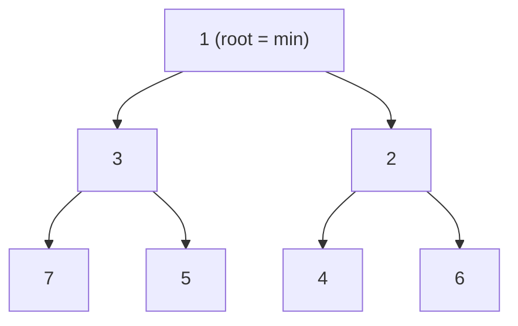

# Pattern: Min Heap / Priority Queue

<DifficultyBadge />

## Mô tả một câu

Cây nhị phân lưu trong mảng nơi phần tử nhỏ nhất luôn ở gốc, cho peek O(1) và insert/remove O(log n).

<DemoBadge />

## Tương tự thực tế

Quầy phân loại cấp cứu trong bệnh viện. Bệnh nhân không được khám theo thứ tự đến — ca nghiêm trọng nhất luôn được khám tiếp theo. Bệnh nhân mới được xếp vào hàng theo mức độ nặng, và hệ thống luôn biết ai gấp nhất mà không cần quét tất cả.

## Ý tưởng cốt lõi

Min heap là cây nhị phân đầy đủ nơi mỗi cha nhỏ hơn các con của nó. Bằng cách lưu phẳng trong mảng (cha ở `i`, con ở `2i+1` và `2i+2`), bạn tránh overhead con trỏ và có truy cập thân thiện với cache.



Hai thao tác duy trì invariant:

- **sift up** — sau khi chèn ở cuối, đẩy phần tử lên cho đến khi cha nhỏ hơn
- **sift down** — sau khi xoá root (đổi với phần tử cuối), đẩy root mới xuống cho tới khi cả hai con đều lớn hơn

Bố cục mảng: `[1, 3, 2, 7, 5, 4, 6]` — cây trên lưu phẳng.

| Thuộc tính | Giá trị |
|----------|-------|
| peek (lấy min) | O(1) — luôn ở index 0 |
| push (chèn) | O(log n) — sift up từ dưới |
| pop (trích min) | O(log n) — đổi root với cuối, sift down |
| Bộ nhớ | O(n) — mảng phẳng, không con trỏ |

**Thử ngay** — chèn giá trị và trích minimum để xem sift-up và sift-down hoạt động:

<MinHeapViz />

## Bằng chứng production

| Dự án | Nguồn | Cách dùng |
|---------|--------|-------|
| React | [SchedulerMinHeap.js#L17-L90](https://github.com/facebook/react/blob/34b78a2897cc208260a88e6b62ecaf9ca2a9dfe4/packages/scheduler/src/SchedulerMinHeap.js#L17-L90) | Scheduler React lưu task đã lên lịch trong min heap sắp xếp theo `sortIndex` (thời gian hết hạn). `peek()` trả task ưu tiên cao nhất O(1). Toàn bộ triển khai ~75 dòng. |
| Nhân Linux | [fair.c#L1407-L1460](https://github.com/torvalds/linux/blob/acb7500801e98639f6d8c2d796ed9f64cba83d3a/kernel/sched/fair.c#L1407-L1460) | `update_curr` của CFS cập nhật vruntime mỗi task. `pick_next_task_fair` (dòng 9234) chọn task có vruntime nhỏ nhất từ red-black tree — cùng nguyên tắc "luôn truy cập minimum" như min heap. |

## Triển khai

::: code-group

```typescript [TypeScript]
interface HeapNode {
  sortIndex: number;
  id: number;
}

class MinHeap<T extends HeapNode> {
  private heap: T[] = [];

  peek(): T | null {
    return this.heap[0] ?? null;
  }

  push(node: T): void {
    this.heap.push(node);
    this.siftUp(this.heap.length - 1);
  }

  pop(): T | null {
    if (this.heap.length === 0) return null;
    const first = this.heap[0]!;
    const last = this.heap.pop()!;
    if (this.heap.length > 0) {
      this.heap[0] = last;
      this.siftDown(0);
    }
    return first;
  }

  get size(): number {
    return this.heap.length;
  }

  private siftUp(i: number): void {
    while (i > 0) {
      const parent = (i - 1) >>> 1;
      if (this.compare(this.heap[i]!, this.heap[parent]!) < 0) {
        this.swap(i, parent);
        i = parent;
      } else break;
    }
  }

  private siftDown(i: number): void {
    const len = this.heap.length;
    const half = len >>> 1;
    while (i < half) {
      let smallest = i;
      const left = 2 * i + 1;
      const right = 2 * i + 2;
      if (left < len && this.compare(this.heap[left]!, this.heap[smallest]!) < 0) smallest = left;
      if (right < len && this.compare(this.heap[right]!, this.heap[smallest]!) < 0) smallest = right;
      if (smallest !== i) {
        this.swap(i, smallest);
        i = smallest;
      } else break;
    }
  }

  private compare(a: T, b: T): number {
    const diff = a.sortIndex - b.sortIndex;
    return diff !== 0 ? diff : a.id - b.id;
  }

  private swap(i: number, j: number): void {
    [this.heap[i], this.heap[j]] = [this.heap[j]!, this.heap[i]!];
  }
}
```

```rust [Rust]
pub struct MinHeap<T: Ord> {
    data: Vec<T>,
}

impl<T: Ord> MinHeap<T> {
    pub fn new() -> Self { MinHeap { data: Vec::new() } }

    pub fn peek(&self) -> Option<&T> { self.data.first() }

    pub fn push(&mut self, val: T) {
        self.data.push(val);
        self.sift_up(self.data.len() - 1);
    }

    pub fn pop(&mut self) -> Option<T> {
        if self.data.is_empty() { return None; }
        let last = self.data.len() - 1;
        self.data.swap(0, last);
        let val = self.data.pop();
        if !self.data.is_empty() { self.sift_down(0); }
        val
    }

    fn sift_up(&mut self, mut i: usize) {
        while i > 0 {
            let parent = (i - 1) / 2;
            if self.data[i] < self.data[parent] {
                self.data.swap(i, parent);
                i = parent;
            } else { break; }
        }
    }

    fn sift_down(&mut self, mut i: usize) {
        let len = self.data.len();
        loop {
            let (left, right) = (2 * i + 1, 2 * i + 2);
            let mut smallest = i;
            if left < len && self.data[left] < self.data[smallest] { smallest = left; }
            if right < len && self.data[right] < self.data[smallest] { smallest = right; }
            if smallest != i { self.data.swap(i, smallest); i = smallest; }
            else { break; }
        }
    }
}
```

```go [Go]
type HeapNode struct {
	SortIndex int
	ID        int
}

type MinHeap struct {
	data []HeapNode
}

func (h *MinHeap) Peek() (HeapNode, bool) {
	if len(h.data) == 0 { return HeapNode{}, false }
	return h.data[0], true
}

func (h *MinHeap) Push(node HeapNode) {
	h.data = append(h.data, node)
	h.siftUp(len(h.data) - 1)
}

func (h *MinHeap) Pop() (HeapNode, bool) {
	if len(h.data) == 0 { return HeapNode{}, false }
	val := h.data[0]
	last := len(h.data) - 1
	h.data[0] = h.data[last]
	h.data = h.data[:last]
	if len(h.data) > 0 { h.siftDown(0) }
	return val, true
}

func (h *MinHeap) siftUp(i int) {
	for i > 0 {
		parent := (i - 1) / 2
		if h.less(i, parent) { h.data[i], h.data[parent] = h.data[parent], h.data[i]; i = parent } else { break }
	}
}

func (h *MinHeap) siftDown(i int) {
	n := len(h.data)
	for {
		left, right, smallest := 2*i+1, 2*i+2, i
		if left < n && h.less(left, smallest) { smallest = left }
		if right < n && h.less(right, smallest) { smallest = right }
		if smallest != i { h.data[i], h.data[smallest] = h.data[smallest], h.data[i]; i = smallest } else { break }
	}
}

func (h *MinHeap) less(i, j int) bool {
	if h.data[i].SortIndex != h.data[j].SortIndex { return h.data[i].SortIndex < h.data[j].SortIndex }
	return h.data[i].ID < h.data[j].ID
}
```

```python [Python]
import heapq

# Module heapq của Python triển khai min heap trên list
heap = []

heapq.heappush(heap, (10, "low-priority"))
heapq.heappush(heap, (1, "urgent"))
heapq.heappush(heap, (5, "medium"))

# peek: heap[0] luôn là minimum
assert heap[0] == (1, "urgent")

# pop theo thứ tự ưu tiên
assert heapq.heappop(heap) == (1, "urgent")
assert heapq.heappop(heap) == (5, "medium")
assert heapq.heappop(heap) == (10, "low-priority")

# Tự viết: triển khai từ đầu
class MinHeap:
    def __init__(self):
        self._data = []

    def push(self, val):
        self._data.append(val)
        self._sift_up(len(self._data) - 1)

    def pop(self):
        if not self._data:
            return None
        self._data[0], self._data[-1] = self._data[-1], self._data[0]
        val = self._data.pop()
        if self._data:
            self._sift_down(0)
        return val

    def peek(self):
        return self._data[0] if self._data else None

    def _sift_up(self, i):
        while i > 0:
            parent = (i - 1) // 2
            if self._data[i] < self._data[parent]:
                self._data[i], self._data[parent] = self._data[parent], self._data[i]
                i = parent
            else:
                break

    def _sift_down(self, i):
        n = len(self._data)
        while True:
            smallest, left, right = i, 2*i+1, 2*i+2
            if left < n and self._data[left] < self._data[smallest]:
                smallest = left
            if right < n and self._data[right] < self._data[smallest]:
                smallest = right
            if smallest != i:
                self._data[i], self._data[smallest] = self._data[smallest], self._data[i]
                i = smallest
            else:
                break
```

:::

## Bài tập

| Cấp độ | Bài tập | File |
|-------|----------|------|
| Cơ bản | Triển khai push, pop, peek với thao tác sift | `exercises/typescript/min-heap/01-basic.test.ts` |
| Trung bình | Xây task scheduler kiểu React dùng min heap | `exercises/typescript/min-heap/02-task-scheduler.test.ts` |

Chạy bài tập: `pnpm test:exercises` (TypeScript) · `cargo test` (Rust) · `go test ./...` (Go) · `pytest` (Python)

File bài tập: Rust `exercises/rust/src/min_heap/mod.rs` · Go `exercises/go/min_heap/min_heap_test.go` · Python `exercises/python/min_heap/test_min_heap.py`

## Khi nào nên dùng

- **Lập lịch task** — luôn xử lý task ưu tiên cao nhất (deadline thấp nhất) trước
- **Hệ thống hướng sự kiện** — timer heap để lên lịch callback ở thời điểm cụ thể
- **Thuật toán đồ thị** — Dijkstra đường đi ngắn nhất, Prim MST
- **Top-K streaming** — duy trì K phần tử nhỏ/lớn nhất từ stream
- **Scheduler OS** — CFS dùng cây với tính chất min-heap để chia CPU công bằng

## Khi nào KHÔNG nên dùng

- **Cần tra cứu tuỳ ý O(1)** — heap chỉ đảm bảo O(1) cho minimum; dùng hash map cho tra cứu
- **Lặp đã sắp xếp** — nếu cần mọi phần tử theo thứ tự, sort một lần; pop lặp lại là O(n log n)
- **Tập nhỏ cố định** — với < 10 phần tử, quét tuyến tính đơn giản hơn và thường nhanh hơn
- **Cần thứ tự ổn định** — item cùng ưu tiên có thể đổi thứ tự qua các thao tác

## Thêm các ứng dụng production

- [Node.js libuv](https://github.com/libuv/libuv) — queue timer
- [Java PriorityQueue](https://github.com/openjdk/jdk/blob/4b3ec455c85314d051800a8f46dd8f5c93881e3a/src/java.base/share/classes/java/util/PriorityQueue.java) — priority queue nền binary heap
- [Python heapq](https://github.com/python/cpython/blob/ff64d8de66ab7f8e56b5d410796a7d76c955280c/Lib/heapq.py)
- [Rust BinaryHeap](https://github.com/rust-lang/rust/blob/d56483a91d6cf5041351a3208b8d08f98f0c8b56/library/alloc/src/collections/binary_heap/mod.rs) — max-heap trong std, có thể bọc làm min-heap qua `Reverse`

## Pattern liên quan

| Pattern | Quan hệ |
|---------|-------------|
| [Merge Iterator (K-Way Merge)](/patterns/merge-iterator/) | K-way merge dùng min-heap để chọn phần tử nhỏ nhất qua các stream |
| [Cooperative Scheduling](/patterns/cooperative-scheduling/) | Scheduler React dùng min-heap để chọn task ưu tiên cao nhất |
| [Event Loop](/patterns/event-loop/) | Queue timer trong event loop thường dùng min-heap để lập lịch deadline gần nhất |
| [B+ Tree](/patterns/b-plus-tree/) | Cấu trúc sắp xếp thay thế — B+ tree tối ưu cho đĩa, heap cho truy cập ưu tiên |

## Câu hỏi thử thách

::: details Câu 1: Làm sao chuyển min heap thành max heap mà không đổi cấu trúc dữ liệu?
**Trả lời:** Đảo dấu key sắp xếp khi chèn và đảo lại khi trích.

Push `-priority` thay vì `priority`. Min heap đặt giá trị âm nhất (ưu tiên gốc cao nhất) ở root. Khi pop, đảo key lần nữa để khôi phục giá trị gốc. Hoạt động được vì min heap trên giá trị đảo dấu tương đương max heap trên giá trị gốc. Cộng đồng `heapq` Python dùng thủ thuật này vì stdlib chỉ cung cấp min heap.
:::

::: details Câu 2: Vì sao React dùng min heap để lập lịch thay vì mảng đã sắp xếp?
**Trả lời:** Mảng đã sắp xếp có chèn O(n) (dịch phần tử), trong khi min heap có chèn O(log n) và peek O(1).

Scheduler React thường xuyên chèn task mới với thời gian hết hạn khác nhau và luôn cần task hết hạn sớm nhất. Mảng đã sắp xếp cho truy cập O(1) tới minimum nhưng tốn O(n) để chèn (tìm nhị phân + dịch). Min heap cho peek O(1) và insert/remove O(log n) — đánh đổi tốt hơn cho queue động nơi task liên tục thêm và xoá. Cho sort một lần tĩnh, mảng đã sắp xếp thắng.
:::

::: details Câu 3: Một BST cân bằng (như red-black tree) cũng cho chèn O(log n) và find-min O(log n). Vì sao Linux CFS dùng red-black tree nhưng React dùng min heap?
**Trả lời:** CFS cần xoá task tuỳ ý (không chỉ minimum) khi process thoát, mà BST xử lý O(log n) còn heap xử lý O(n).

Min heap chỉ xoá hiệu quả root. Xoá phần tử tuỳ ý cần tìm O(n) + sift O(log n). Red-black tree hỗ trợ xoá O(log n) node bất kỳ. CFS thường xuyên xoá process thoát hoặc đổi ưu tiên, nên BST hợp lý. Scheduler React gần như chỉ pop task ưu tiên cao nhất từ đầu, làm min heap đơn giản (với hệ số hằng nhỏ hơn và bố cục mảng thân thiện cache) là lựa chọn tốt hơn.
:::

::: details Câu 4: Bạn có 1 tỉ entry log và cần 10 cái gần nhất. Nên dùng min heap hay max heap, và kích thước bao nhiêu?
**Trả lời:** Dùng min heap kích thước 10. Với mỗi entry, nếu nó lớn hơn minimum của heap, pop minimum và push entry mới.

Đây là pattern "top-K". Min heap kích thước K giữ K phần tử lớn nhất đã thấy, với nhỏ nhất của K đó ở root như gác cổng. Mỗi phần tử mới được so với root O(1) — nếu nhỏ hơn, bỏ; nếu lớn hơn, thay root O(log K). Tổng chi phí: O(n log K) với bộ nhớ O(K), không phải O(n log n) cho sort đầy đủ.
:::
