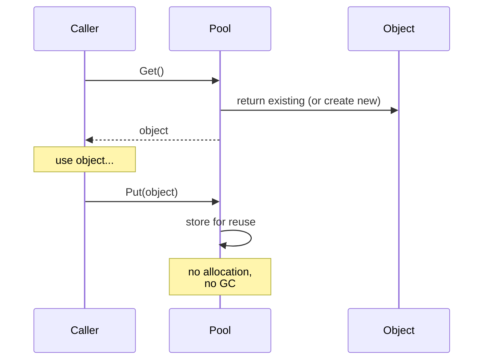

# Pattern: Object Pool

<DifficultyBadge />

## Mô tả một câu

Cấp phát trước một tập object có thể tái dùng để tránh chi phí cấp phát lặp lại và garbage collection trên hot path.

<DemoBadge />

## Tương tự thực tế

Một trạm chia sẻ xe đạp. Thay vì mua xe mới mỗi lần cần, bạn lấy một chiếc từ dock, đạp đi, rồi trả lại. Xe đã được mua sẵn và tái dùng bởi nhiều người đi xe.

## Ý tưởng cốt lõi

Tạo và huỷ object là tốn kém — cấp phát bộ nhớ, logic constructor, áp lực GC. Object pool duy trì một tập object đã khởi tạo sẵn. Khi cần một cái, bạn "lấy" từ pool; khi xong, bạn "trả" lại thay vì vứt đi.



Pool đóng vai cache các object đã cấp phát. Đánh đổi chính: sử dụng bộ nhớ (object nhàn rỗi nằm trong pool) đổi lấy tiết kiệm CPU/GC (không cấp phát trên hot path).

| Thuộc tính | Giá trị |
|----------|-------|
| Get (pool có sẵn) | O(1) — trả object đã có |
| Get (pool rỗng) | O(alloc) — tạo object mới |
| Put (trả lại) | O(1) — push vào free list + reset |
| Bộ nhớ | O(kích thước pool) — object nhàn rỗi dự trữ |

**Thử ngay** — acquire kết nối từ pool và xem chuyện gì khi cạn:

<ObjectPoolViz />

## Bằng chứng production

| Dự án | Nguồn | Cách dùng |
|---------|--------|-------|
| Stdlib Go | [pool.go#L52-L97](https://github.com/golang/go/blob/f5cdf4745455415c7a43cfc7d925214d4511489b/src/sync/pool.go#L52-L97) | `sync.Pool` — pool thư viện chuẩn của Go cho object tạm. `Get()` (dòng 132) lấy từ pool cục bộ mỗi P trước (lock-free), rồi steal từ P khác. `Put()` (dòng 100) trả object để tái dùng. Được dùng rộng trong `fmt`, `encoding/json` và HTTP handler. |
| Godot Engine | [pooled_list.h#L35-L100](https://github.com/godotengine/godot/blob/ec67cbe92628bdaf979b10594359ba6f02cf8838/core/templates/pooled_list.h#L35-L100) | `PooledList` — pool dựa trên freelist cho object game engine. Phần tử cấp phát trong các page liền kề và tái chế qua freelist, tránh cấp phát mỗi frame cho entity, particle và physics body. |

## Triển khai

::: code-group

```typescript [TypeScript]
class ObjectPool<T> {
  private pool: T[] = [];
  private factory: () => T;
  private reset: (obj: T) => void;

  constructor(factory: () => T, reset: (obj: T) => void, initialSize = 0) {
    this.factory = factory;
    this.reset = reset;
    for (let i = 0; i < initialSize; i++) {
      this.pool.push(factory());
    }
  }

  get(): T {
    if (this.pool.length > 0) {
      return this.pool.pop()!;
    }
    return this.factory();
  }

  release(obj: T): void {
    this.reset(obj);
    this.pool.push(obj);
  }

  get size(): number {
    return this.pool.length;
  }
}
```

```rust [Rust]
pub struct ObjectPool<T> {
    pool: Vec<T>,
    factory: Box<dyn Fn() -> T>,
}

impl<T> ObjectPool<T> {
    pub fn new(factory: impl Fn() -> T + 'static, initial: usize) -> Self {
        let factory = Box::new(factory);
        let pool = (0..initial).map(|_| (factory)()).collect();
        ObjectPool { pool, factory }
    }

    pub fn get(&mut self) -> T {
        self.pool.pop().unwrap_or_else(|| (self.factory)())
    }

    pub fn release(&mut self, obj: T) {
        self.pool.push(obj);
    }
}
```

```go [Go]
package pool

import "sync"

// Trong production, dùng sync.Pool trực tiếp:
var bufPool = sync.Pool{
	New: func() any {
		return make([]byte, 0, 4096)
	},
}

func ProcessRequest(data []byte) []byte {
	buf := bufPool.Get().([]byte)
	buf = buf[:0] // reset độ dài, giữ capacity
	buf = append(buf, data...)
	// ... xử lý ...
	result := make([]byte, len(buf))
	copy(result, buf)
	bufPool.Put(buf) // trả về pool
	return result
}
```

```python [Python]
from typing import TypeVar, Callable, List

T = TypeVar("T")

class ObjectPool:
    def __init__(self, factory: Callable[[], T], reset: Callable[[T], None], initial: int = 0):
        self._factory = factory
        self._reset = reset
        self._pool: List[T] = [factory() for _ in range(initial)]

    def get(self) -> T:
        if self._pool:
            return self._pool.pop()
        return self._factory()

    def release(self, obj: T) -> None:
        self._reset(obj)
        self._pool.append(obj)
```

:::

## Bài tập

| Cấp độ | Bài tập | File |
|-------|----------|------|
| Cơ bản | Triển khai object pool tổng quát với get/release | `exercises/typescript/object-pool/01-basic.test.ts` |
| Trung bình | Xây connection pool với max-size và timeout | `exercises/typescript/object-pool/02-connection-pool.test.ts` |

Chạy bài tập: `pnpm test:exercises` (TypeScript) · `cargo test` (Rust) · `go test ./...` (Go) · `pytest` (Python)

File bài tập: Rust `exercises/rust/src/object_pool/mod.rs` · Go `exercises/go/object_pool/object_pool_test.go` · Python `exercises/python/object_pool/test_object_pool.py`

## Khi nào nên dùng

- **Cấp phát tần suất cao** — vòng lặp game, handler request, hệ particle
- **Constructor tốn kém** — kết nối database, context thread, buffer lớn
- **Môi trường nhạy với GC** — hệ thời gian thực, game engine, dịch vụ độ trễ thấp
- **Giới hạn tài nguyên cố định** — pool kết nối, pool thread, pool file descriptor

## Khi nào KHÔNG nên dùng

- **Object rẻ** — nếu cấp phát nhanh và GC không phải vấn đề, pool thêm độ phức tạp
- **Vòng đời thay đổi** — nếu object bị giữ lâu, thời gian khó đoán, pool không giúp
- **Quy mô nhỏ** — với một nhúm object, overhead pool vượt tiết kiệm
- **Object bất biến** — pool chỉ hợp với object mutable cần reset

## Thêm các ứng dụng production

- [Java ThreadPoolExecutor](https://github.com/openjdk/jdk/blob/4b3ec455c85314d051800a8f46dd8f5c93881e3a/src/java.base/share/classes/java/util/concurrent/ThreadPoolExecutor.java) — thread pool với kích thước core/max và chính sách từ chối tuỳ chỉnh
- [.NET ArrayPool\<T\>](https://github.com/dotnet/runtime/blob/bee7953796edc09e516e847e3c9006b486ab0f6d/src/libraries/System.Private.CoreLib/src/System/Buffers/ArrayPool.cs) — pool chung các mảng tái dùng
- [HikariCP](https://github.com/brettwooldridge/HikariCP) — pool kết nối JDBC
- [Unity ObjectPool](https://github.com/Unity-Technologies/UnityCsReference) — `ObjectPool<T>` cho game object tái dùng

## Pattern liên quan

| Pattern | Quan hệ |
|---------|-------------|
| [Free List](/patterns/free-list/) | Free list quản lý cấp phát slot nội bộ của pool |
| [Arena Allocator](/patterns/arena-allocator/) | Arena allocator cấp phát hàng loạt cho object pool; cả hai tránh malloc mỗi object |
| [Semaphore](/patterns/semaphore/) | Kích thước pool hoạt động như semaphore giới hạn số object dùng đồng thời |
| [Reference Counting](/patterns/reference-counting/) | Reference counting theo dõi khi nào object trong pool có thể trả về pool |
| [Work Stealing](/patterns/work-stealing/) | Queue work-stealing có thể pool object task để giảm overhead cấp phát |

## Câu hỏi thử thách

::: details Câu 1: Pool khởi tạo với 10 object, nhưng tải đỉnh cần 100. Pool nên tăng động hay từ chối yêu cầu vượt 10?
**Trả lời:** Tuỳ loại tài nguyên. Tăng động cho object rẻ (buffer); thi hành cap cứng cho tài nguyên đắt/giới hạn (kết nối database).

Buffer pool nên tăng theo nhu cầu và có thể co lại khi rảnh — chi phí cấp phát thêm buffer là thấp. Pool kết nối database nên thi hành `maxSize` vì mỗi kết nối tốn bộ nhớ server, file descriptor và state auth. Yêu cầu vượt cap nên xếp hàng chờ (có timeout) thay vì tạo kết nối không giới hạn làm crash database. HikariCP mặc định max 10 kết nối vì lý do này.
:::

::: details Câu 2: Một dev gọi `pool.get()` nhưng không bao giờ gọi `pool.release()`. "Object leak" này biểu hiện thế nào và làm sao phát hiện?
**Trả lời:** Pool cạn dần và bắt đầu cấp phát object mới mỗi lần, phá vỡ mục đích và có thể vắt kiệt tài nguyên.

Chiến lược phát hiện: (1) theo dõi object đang phát hành bằng một Set và cảnh báo khi vượt ngưỡng, (2) dùng weak reference và finalizer để phát hiện object bị GC mà chưa được trả lại, (3) bọc object pool trong proxy tự release sau timeout. `sync.Pool` của Go tránh hoàn toàn — không đảm bảo gì về giữ object và để GC thu hồi entry pool nhàn rỗi, làm leak ít thảm hoạ hơn nhưng pool kém dự đoán hơn.
:::

::: details Câu 3: Hai goroutine gọi `pool.Get()` đồng thời. Điều gì làm `sync.Pool` của Go an toàn ở đây mà không cần mutex tường minh quanh mỗi get/put?
**Trả lời:** `sync.Pool` dùng pool cục bộ mỗi P (mỗi processor) với truy cập lock-free, chỉ rơi xuống pool chung với mutex khi pool cục bộ rỗng.

Mỗi P (processor logic trong scheduler Go, khác M là thread OS) có slot pool riêng. `Get()` đầu tiên kiểm tra slot cục bộ (không cần lock — chỉ một goroutine chạy trên P tại mỗi thời điểm). Nếu rỗng, nó lấy trộm từ pool của P khác dưới khoá. `Put()` đi vào slot cục bộ trước. Mẫu sharding mỗi P này giảm thiểu tranh chấp. Với pool tự viết trong môi trường đa luồng, bạn cần mutex hoặc cấu trúc lock-free như concurrent stack.
:::

::: details Câu 4: Bạn xây object pool cho object HTTP request trong server Node.js. Sau khi profiling, bạn thấy nó chậm hơn chỉ dùng `new Request()`. Có gì sai?
**Trả lời:** Trong GC thế hệ của V8, object nhỏ sống ngắn được cấp phát và thu gần như miễn phí — logic reset và bookkeeping của pool tốn hơn cả cấp phát mà nó tránh.

GC thế hệ trẻ của V8 dùng cấp phát bump-pointer (gần như miễn phí) và thu object sống ngắn bằng cách copy survivor, không quét rác. Nếu object `Request` của bạn nhỏ, tạo mỗi request và bỏ ngay, GC xử lý hiệu quả. Pool thêm overhead: duy trì free list, reset state object, ngăn V8 tối ưu hình dáng object. Object pool toả sáng cho constructor tốn kém (kết nối DB, regex đã compile) hoặc bối cảnh nhạy pause GC (vòng lặp game), không phải cho object rẻ trong runtime GC hiện đại.
:::
