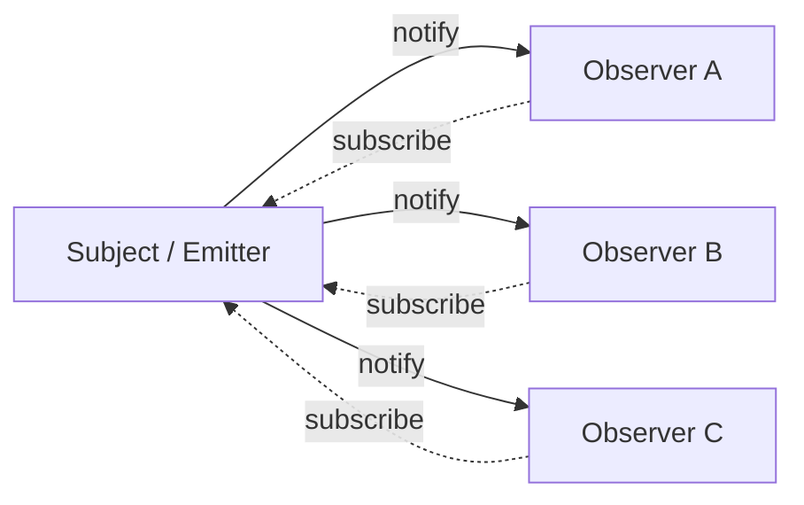

# Pattern: Observer / Pub-Sub

<DifficultyBadge />

## Mô tả một câu

Tách producer khỏi consumer bằng cách cho object đăng ký event và được thông báo khi có gì xảy ra, mà nguồn không biết ai đang nghe.

<DemoBadge />

## Tương tự thực tế

Đăng ký báo giấy. Bạn đăng ký một lần, và mỗi sáng tờ báo đến cửa nhà bạn. Bạn không phải kiểm tra sạp báo — nhà xuất bản đẩy cập nhật tới mọi subscriber. Huỷ bất cứ lúc nào.

## Ý tưởng cốt lõi

Pattern Observer tạo phụ thuộc một-tới-nhiều: khi subject đổi state, mọi observer đăng ký được thông báo. Subject không biết observer làm gì — chỉ gọi chúng.



Sự tách rời này là lý do pattern có mặt khắp nơi: từ DOM `addEventListener` tới `store.subscribe` của Redux tới `EventEmitter` của Node.js tới pattern cleanup `useEffect` của React.

| Thuộc tính | Giá trị |
|----------|-------|
| subscribe | O(1) — thêm vào tập listener |
| unsubscribe | O(1) — xoá khỏi tập listener |
| emit / notify | O(n) — gọi từng cái trong n listener |
| Bộ nhớ | O(số listener) mỗi loại event |

**Thử ngay** — bắn event và xem chúng fan ra mọi subscriber:

<ObserverViz />

## Bằng chứng production

| Dự án | Nguồn | Cách dùng |
|---------|--------|-------|
| Node.js | [events.js#L456-L520](https://github.com/nodejs/node/blob/19c46abbefdb8711b913d7237b3c1299367f87d7/lib/events.js#L456-L520) | `EventEmitter.prototype.emit` — method cốt lõi lặp qua listener đã đăng ký và gọi từng cái. Dòng 209 định nghĩa constructor `EventEmitter`. Đây là nền tảng kiến trúc hướng sự kiện của Node. |
| Redux | [createStore.ts#L211-L280](https://github.com/reduxjs/redux/blob/1d761f471cf58faabe88c50ea16645212d986cd0/src/createStore.ts#L211-L280) | `subscribe()` thêm listener, `dispatch()` (dòng 280) gọi mọi listener sau khi chạy reducer. Redux snapshot mảng listener trước dispatch để xử lý subscribe/unsubscribe trong notification an toàn. |

## Triển khai

::: code-group

```typescript [TypeScript]
type Listener<T> = (data: T) => void;

class EventEmitter<Events extends Record<string, unknown>> {
  private listeners = new Map<keyof Events, Set<Listener<any>>>();

  on<K extends keyof Events>(event: K, listener: Listener<Events[K]>): () => void {
    if (!this.listeners.has(event)) {
      this.listeners.set(event, new Set());
    }
    this.listeners.get(event)!.add(listener);

    return () => this.off(event, listener);
  }

  off<K extends keyof Events>(event: K, listener: Listener<Events[K]>): void {
    this.listeners.get(event)?.delete(listener);
  }

  emit<K extends keyof Events>(event: K, data: Events[K]): void {
    this.listeners.get(event)?.forEach((listener) => listener(data));
  }

  listenerCount(event: keyof Events): number {
    return this.listeners.get(event)?.size ?? 0;
  }
}
```

```rust [Rust]
use std::collections::HashMap;

pub struct EventEmitter {
    listeners: HashMap<String, Vec<Box<dyn Fn(&str)>>>,
}

impl EventEmitter {
    pub fn new() -> Self {
        EventEmitter { listeners: HashMap::new() }
    }

    pub fn on(&mut self, event: &str, listener: impl Fn(&str) + 'static) {
        self.listeners
            .entry(event.to_string())
            .or_default()
            .push(Box::new(listener));
    }

    pub fn emit(&self, event: &str, data: &str) {
        if let Some(listeners) = self.listeners.get(event) {
            for listener in listeners {
                listener(data);
            }
        }
    }
}
```

```go [Go]
type Listener func(data any)

type EventEmitter struct {
	listeners map[string][]Listener
}

func NewEmitter() *EventEmitter {
	return &EventEmitter{listeners: make(map[string][]Listener)}
}

func (e *EventEmitter) On(event string, listener Listener) {
	e.listeners[event] = append(e.listeners[event], listener)
}

func (e *EventEmitter) Emit(event string, data any) {
	for _, listener := range e.listeners[event] {
		listener(data)
	}
}
```

```python [Python]
from collections import defaultdict
from typing import Callable, Any

class EventEmitter:
    def __init__(self):
        self._listeners: dict[str, list[Callable]] = defaultdict(list)

    def on(self, event: str, listener: Callable) -> Callable:
        self._listeners[event].append(listener)
        return lambda: self._listeners[event].remove(listener)

    def emit(self, event: str, data: Any = None) -> None:
        for listener in self._listeners[event]:
            listener(data)

    def listener_count(self, event: str) -> int:
        return len(self._listeners[event])

# Cách dùng
emitter = EventEmitter()

messages = []
unsub = emitter.on("message", lambda data: messages.append(data))

emitter.emit("message", "hello")
emitter.emit("message", "world")
print(messages)  # ["hello", "world"]

unsub()  # huỷ đăng ký
emitter.emit("message", "ignored")
print(messages)  # ["hello", "world"] — không đổi
```

:::

## Bài tập

| Cấp độ | Bài tập | File |
|-------|----------|------|
| Cơ bản | Triển khai EventEmitter với on/off/emit | `exercises/typescript/observer/01-basic.test.ts` |
| Trung bình | Bus event có kiểu với on/once/off/emit | `exercises/typescript/observer/02-intermediate.test.ts` |

Chạy bài tập: `pnpm test:exercises` (TypeScript) · `cargo test` (Rust) · `go test ./...` (Go) · `pytest` (Python)

File bài tập: Rust `exercises/rust/src/observer/mod.rs` · Go `exercises/go/observer/observer_test.go` · Python `exercises/python/observer/test_observer.py`

## Khi nào nên dùng

- **Hệ thống hướng sự kiện** — event UI, event mạng, message queue
- **Tách module** — plugin, middleware, điểm mở rộng
- **Quản lý state** — store Redux, observable MobX, reactivity Vue
- **Logging / metric** — bắn event mà không biết ai thu thập
- **Cập nhật thời gian thực** — phân phối thông điệp WebSocket, feed sống

## Khi nào KHÔNG nên dùng

- **Pipeline đồng bộ** — nếu thứ tự và hoàn thành xử lý quan trọng, dùng gọi hàm trực tiếp
- **Quá nhiều event** — bão event khó debug; cân nhắc batch
- **Phụ thuộc vòng** — A observe B, B observe A → vòng vô tận
- **Đảm bảo thứ tự mạnh** — thứ tự thông báo observer có thể không xác định giữa các triển khai

## Thêm các ứng dụng production

- [RxJS](https://github.com/ReactiveX/rxjs) — reactive stream
- [Vue 3](https://github.com/vuejs/core) — hệ reactivity
- [MobX](https://github.com/mobxjs/mobx)
- [Chromium EventTarget](https://github.com/chromium/chromium/blob/5cffea3f665b7762369a0fa84d2f208875e7225e/third_party/blink/renderer/core/dom/events/event_target.cc) — triển khai DOM `addEventListener` trong Blink
- [.NET events](https://github.com/dotnet/runtime/blob/bee7953796edc09e516e847e3c9006b486ab0f6d/src/libraries/System.Private.CoreLib/src/System/EventHandler.cs) — delegate keyword `event` của C#

## Pattern liên quan

| Pattern | Quan hệ |
|---------|-------------|
| [Event Loop](/patterns/event-loop/) | Event loop dispatch event tới observer đã đăng ký cho loại event cụ thể |
| [Dirty Flag](/patterns/dirty-flag/) | Observer kích hoạt notification; dirty flag hoãn phản ứng tốn kém |
| [Middleware](/patterns/middleware-chain/) | Middleware quan sát và biến đổi dữ liệu chảy qua pipeline |
| [Actor Model](/patterns/actor-model/) | Cả hai tách producer khỏi consumer — observer qua callback, actor qua truyền thông điệp |

## Câu hỏi thử thách

::: details Câu 1: Component React subscribe vào store trong `useEffect` nhưng quên trả cleanup. Chuyện gì khi component unmount?
**Trả lời:** Listener vẫn đăng ký, gây rò bộ nhớ và update ảo lên component đã unmount.

Store giữ tham chiếu tới callback listener, đóng trên state của component. Component đã unmount nhưng không bao giờ bị GC vì store vẫn tham chiếu. Tệ hơn, khi store bắn, listener cũ chạy và có thể gọi `setState` trên component đã unmount. Đây là rò bộ nhớ observer kinh điển — mỗi `subscribe` phải có `unsubscribe` tương ứng, và cleanup của `useEffect` là cơ chế React cung cấp cho điều này.
:::

::: details Câu 2: Bạn có 3 observer: A log vào file, B update UI, C gửi request mạng. Thứ tự chúng được thông báo có quan trọng không?
**Trả lời:** Trong hầu hết triển khai, observer được gọi theo thứ tự đăng ký, nhưng bạn không nên dựa vào — pattern không đảm bảo thứ tự.

Nếu update UI của B phụ thuộc log của A xong trước, bạn có ghép ngầm mà pattern observer lẽ ra phải loại bỏ. Mỗi observer nên độc lập. Nếu thứ tự quan trọng, bạn cần pattern khác: chain middleware, pipeline, hoặc khai báo phụ thuộc rõ ràng. `EventEmitter` Node.js gọi listener theo thứ tự đăng ký, nhưng Redux tường minh snapshot mảng listener để tránh bug phụ thuộc thứ tự khi subscribe/unsubscribe trong dispatch.
:::

::: details Câu 3: Một `emit('data', payload)` kích hoạt 50 observer đồng bộ, một trong số đó ném exception. Chuyện gì với observer 2-50?
**Trả lời:** Trong triển khai ngây thơ, observer 2-50 không bao giờ thực thi — exception lan lên và huỷ vòng `emit`.

Đó là lý do triển khai production bọc mỗi gọi listener trong try-catch. `EventEmitter` Node.js KHÔNG làm điều này mặc định — một listener ném giết phần còn lại. Bạn phải tự xử lý lỗi. RxJS dùng biên lỗi mỗi subscriber. Lựa chọn thiết kế: fail-fast (một observer xấu dừng mọi thứ) vs chịu lỗi (cô lập lỗi, tiếp tục thông báo). Cho hệ thống then chốt, luôn cô lập lỗi observer.
:::

::: details Câu 4: Thông báo observer nên đồng bộ hay bất đồng bộ? Chuyển từ sync sang async phá vỡ gì?
**Trả lời:** Thông báo đồng bộ đảm bảo mọi observer đã xử lý event trước khi `emit()` trả; chuyển sang async phá vỡ code nào giả định state đã cập nhật ngay sau emit.

Với sync: `emit('change'); readState()` thấy state cập nhật vì observer chạy inline. Với async: `emit('change'); readState()` thấy state CŨ vì observer được xếp hàng. Điều này phá pattern như Redux nơi `dispatch()` được kỳ vọng hoàn tất khi trả. Thông báo async tốt hơn cho hiệu năng (không chặn) nhưng yêu cầu hệ thống xử lý khoảng "nhất quán cuối" giữa emit và thực thi observer.
:::
