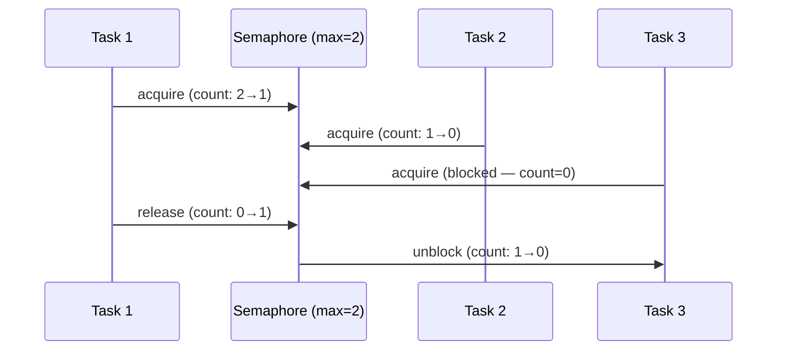

# Pattern: Semaphore / Concurrency có giới hạn

<DifficultyBadge />

## Mô tả một câu

Giới hạn số thao tác đồng thời bằng cách duy trì một bộ đếm — acquire trước khi làm, release sau, block khi đạt giới hạn.

<DemoBadge />

## Tương tự thực tế

Một bãi đỗ xe có biển báo sức chứa. Biển báo hiển thị còn bao nhiêu chỗ. Xe vào (giảm số đếm) và rời đi (tăng nó lên). Khi nó hiển thị 0, xe đến phải chờ ở cổng.

## Ý tưởng cốt lõi

Semaphore là một bộ đếm với hai thao tác nguyên tử: `acquire` (giảm, block nếu bằng 0) và `release` (tăng). Nó kiểm soát có bao nhiêu task đồng thời được truy cập một tài nguyên chung.



| Thuộc tính | Giá trị |
|----------|-------|
| acquire | O(1) nếu còn permit; block nếu count = 0 |
| release | O(1) — tăng bộ đếm, đánh thức một waiter |
| Tính công bằng | Phụ thuộc triển khai (FIFO hoặc tuỳ ý) |
| Bộ nhớ | O(1) cho bộ đếm + O(số waiter) cho task bị block |

**Thử ngay** — acquire các permit và xem worker xếp hàng khi semaphore đầy:

<SemaphoreViz />

## Bằng chứng production

| Dự án | Nguồn | Cách dùng |
|---------|--------|-------|
| Nhân Linux | [semaphore.h#L15-L55](https://github.com/torvalds/linux/blob/acb7500801e98639f6d8c2d796ed9f64cba83d3a/include/linux/semaphore.h#L15-L55) | `struct semaphore` — counting semaphore của kernel với `down()` (acquire) và `up()` (release). Dùng cho kiểm soát truy cập driver thiết bị, giới hạn thao tác I/O đồng thời. |
| Stdlib Go | [semaphore.go#L28-L107](https://github.com/golang/sync/blob/5071ed6a9f1617117556b66384f765c934de3698/semaphore/semaphore.go#L28-L107) | Struct `Weighted` (L28-L33) với `size`, `cur`, `mu`, `waiters`. `Acquire` (L38-L107) block đến khi đủ trọng số hoặc context bị huỷ. `errgroup` dùng nội bộ để giới hạn concurrency goroutine. |

## Triển khai

::: code-group

```typescript [TypeScript]
class Semaphore {
  private queue: (() => void)[] = [];
  private count: number;

  constructor(private max: number) {
    this.count = max;
  }

  async acquire(): Promise<void> {
    if (this.count > 0) {
      this.count--;
      return;
    }
    return new Promise<void>((resolve) => this.queue.push(resolve));
  }

  release(): void {
    const next = this.queue.shift();
    if (next) {
      next();
    } else {
      this.count++;
    }
  }

  get available(): number {
    return this.count;
  }
}

async function withSemaphore<T>(sem: Semaphore, fn: () => Promise<T>): Promise<T> {
  await sem.acquire();
  try { return await fn(); }
  finally { sem.release(); }
}
```

```rust [Rust]
use std::sync::{Arc, Mutex, Condvar};

pub struct Semaphore {
    count: Mutex<usize>,
    cvar: Condvar,
}

impl Semaphore {
    pub fn new(max: usize) -> Self {
        Semaphore { count: Mutex::new(max), cvar: Condvar::new() }
    }

    pub fn acquire(&self) {
        let mut count = self.count.lock().unwrap();
        while *count == 0 { count = self.cvar.wait(count).unwrap(); }
        *count -= 1;
    }

    pub fn release(&self) {
        *self.count.lock().unwrap() += 1;
        self.cvar.notify_one();
    }
}
```

```go [Go]
// Go theo idiom: buffered channel làm semaphore
func process(s string) { /* work */ }

func processWithLimit(items []string, maxConcurrent int) {
	sem := make(chan struct{}, maxConcurrent)
	var wg sync.WaitGroup

	for _, item := range items {
		wg.Add(1)
		sem <- struct{}{} // acquire
		go func(s string) {
			defer wg.Done()
			defer func() { <-sem }() // release
			process(s)
		}(item)
	}
	wg.Wait()
}
```

```python [Python]
import asyncio

async def fetch_with_limit(urls: list[str], max_concurrent: int = 5):
    sem = asyncio.Semaphore(max_concurrent)
    async def fetch_one(url: str):
        async with sem:  # acquire + release qua context manager
            return await do_fetch(url)
    return await asyncio.gather(*(fetch_one(u) for u in urls))
```

:::

## Bài tập

| Cấp độ | Bài tập | File |
|-------|----------|------|
| Cơ bản | Triển khai counting semaphore với acquire/release | `exercises/typescript/semaphore/01-basic.test.ts` |
| Trung bình | Connection pool được bảo vệ bằng semaphore | `exercises/typescript/semaphore/02-intermediate.test.ts` |

Chạy bài tập: `pnpm test:exercises` (TypeScript) · `cargo test` (Rust) · `go test ./...` (Go) · `pytest` (Python)

File bài tập: Rust `exercises/rust/src/semaphore/mod.rs` · Go `exercises/go/semaphore/semaphore_test.go` · Python `exercises/python/semaphore/test_semaphore.py`

## Khi nào nên dùng

- **Rate limit** — giới hạn cuộc gọi API đồng thời, kết nối database
- **Pool tài nguyên** — kiểm soát truy cập một số tài nguyên cố định
- **Backpressure** — tránh làm quá tải service downstream
- **Throttling** — giới hạn I/O file đồng thời, request mạng

## Khi nào KHÔNG nên dùng

- **Loại trừ tương hỗ** — nếu cần truy cập độc quyền (max=1), dùng mutex/lock thay thế
- **Bộ đếm đơn giản** — nếu không cần block, dùng atomic counter
- **Luồng dựa trên queue** — nếu thứ tự quan trọng, dùng bounded queue

## Thêm các ứng dụng production

- [Java Semaphore](https://github.com/openjdk/jdk/blob/4b3ec455c85314d051800a8f46dd8f5c93881e3a/src/java.base/share/classes/java/util/concurrent/Semaphore.java) — counting semaphore công bằng/không công bằng
- [Python threading.Semaphore](https://github.com/python/cpython/blob/ff64d8de66ab7f8e56b5d410796a7d76c955280c/Lib/threading.py) — semaphore dựa trên condition variable
- [Nginx](https://github.com/nginx/nginx) — worker connection
- [PostgreSQL](https://github.com/postgres/postgres) — `max_connections`

## Pattern liên quan

| Pattern | Quan hệ |
|---------|-------------|
| [Rate Limiter (Token Bucket)](/patterns/rate-limiter/) | Rate limiter kiểm soát throughput theo thời gian; semaphore kiểm soát số truy cập đồng thời |
| [Backpressure](/patterns/backpressure/) | Semaphore hiện thực backpressure bằng cách block khi đạt giới hạn |
| [Object Pool](/patterns/object-pool/) | Kích thước pool thực chất là một semaphore — acquire một object, release khi xong |

## Câu hỏi thử thách

::: details Câu 1: Semaphore với max=1 hành xử như mutex. Vậy tại sao có lúc bạn vẫn dùng mutex thay vì semaphore(1)?
**Trả lời:** Mutex có ngữ nghĩa quyền sở hữu — chỉ thread đã acquire mới được release — điều đó tránh release nhầm bởi thread khác và cho phép kế thừa ưu tiên.

Semaphore là một bộ đếm vô danh: bất kỳ thread nào cũng có thể gọi `release()` bất kể ai đã gọi `acquire()`. Điều đó nghĩa là một bug khi thread B vô tình release semaphore của thread A sẽ không bị phát hiện. Mutex theo dõi chủ sở hữu, nên unlock bởi không-phải-chủ là lỗi (hoặc panic). Ngoài ra, quyền sở hữu mutex cho phép kế thừa ưu tiên: nếu một thread ưu tiên cao đang chờ mutex do thread ưu tiên thấp giữ, OS có thể tạm thời tăng ưu tiên người giữ. Semaphore không làm được vì không có "người giữ".
:::

::: details Câu 2: Ba task ưu tiên cao và một task ưu tiên thấp chia sẻ semaphore(1). Task ưu tiên thấp acquire semaphore, rồi một task ưu tiên trung bình preempt nó. Các task ưu tiên cao giờ bị block. Đây gọi là gì và làm sao giải quyết?
**Trả lời:** Đây là priority inversion (đảo ngược ưu tiên) — task ưu tiên cao bị block gián tiếp bởi task ưu tiên trung bình đã preempt người giữ khoá ưu tiên thấp.

Ví dụ kinh điển là bug Mars Pathfinder. Task ưu tiên trung bình chạy mãi vì không cần semaphore, cản trở task ưu tiên thấp hoàn thành và release semaphore. Giải pháp: (1) kế thừa ưu tiên — tạm tăng người giữ khoá lên ưu tiên cao nhất của waiter, (2) ưu tiên trần — gán cho semaphore một ưu tiên trần bằng ưu tiên cao nhất của task dùng nó, (3) tránh giữ semaphore qua các điểm preempt.
:::

::: details Câu 3: Bạn dùng semaphore(10) để giới hạn kết nối database đồng thời. Khi tải cao, bạn thấy kết nối được tạo và huỷ liên tục. Có gì sai với thiết kế này?
**Trả lời:** Semaphore chỉ giới hạn concurrency, không phải tái sử dụng. Bạn cần connection pool (pattern object pool) kết hợp với semaphore, không chỉ riêng semaphore.

Semaphore cho phép tới 10 task tiến hành nhưng không quản lý các kết nối. Mỗi task tạo kết nối mới, dùng và huỷ — semaphore chỉ chốt cửa số task làm việc này đồng thời. Connection pool giữ 10 kết nối tạo sẵn và cho mượn. Pool dùng nội bộ một semaphore (hoặc cơ chế block tương đương) để bắt người gọi chờ khi tất cả kết nối đang được mượn. Semaphore là primitive concurrency; pool là manager tài nguyên.
:::

::: details Câu 4: Go dùng buffered channel làm semaphore (`sem := make(chan struct{}, N)`). Cách này có ưu thế gì so với triển khai semaphore truyền thống?
**Trả lời:** Nó kết hợp tự nhiên với câu lệnh `select` của Go, cho phép timeout, huỷ và acquire nhiều tài nguyên mà không cần thêm API.

Với semaphore dựa trên channel, bạn có thể viết `select { case sem <- struct{}{}: /* acquired */ case <-ctx.Done(): /* cancelled */ }` — kết hợp acquire với huỷ context trong một cấu trúc. Semaphore truyền thống cần method `TryAcquire` hoặc `AcquireWithTimeout` riêng. Cách dựa trên channel cũng được lợi từ scheduler runtime Go: goroutine bị block trên thao tác channel được park hiệu quả mà không tốn thread OS. Đánh đổi là channel có overhead nhỉnh hơn chút so với bộ đếm dựa trên mutex cho trường hợp đơn giản.
:::
