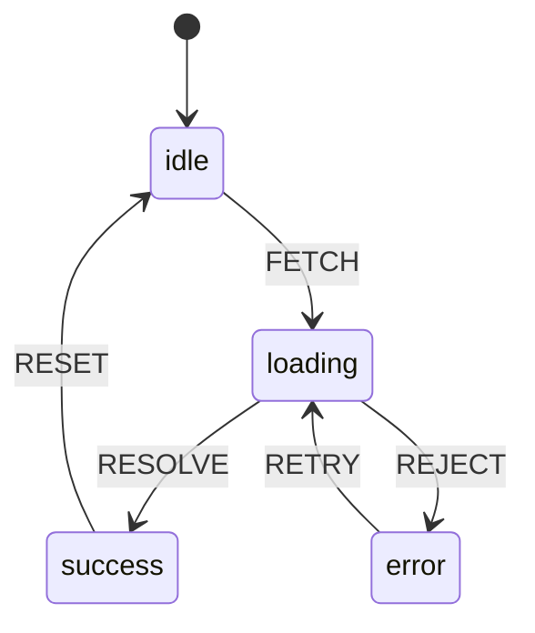

# Pattern: State Machine

<DifficultyBadge />

## Mô tả một câu

Mô hình vòng đời entity thành tập trạng thái với chuyển tiếp rõ ràng, làm state bất hợp lệ không biểu diễn được và mọi thay đổi state có thể audit.

<DemoBadge />

## Tương tự thực tế

Máy bán hàng tự động. Nó có trạng thái xác định rõ: idle, đã nhận xu, đang nhả hàng. Bạn không thể nhả hàng mà không nhận xu, và không thể nhận xu khi đang nhả. Mỗi cú nhấn nút chỉ hợp lệ ở trạng thái nhất định.

## Ý tưởng cốt lõi

State machine định nghĩa tập hữu hạn trạng thái mà entity có thể ở, và các chuyển tiếp giữa chúng. Tại bất kỳ điểm nào, entity ở chính xác một trạng thái. Chuyển tiếp được kích hoạt bởi event và có thể có điều kiện guard.



Sức mạnh: **chuyển tiếp bất khả không tồn tại**. Bạn không thể đi từ `success` sang `error` vì không chuyển tiếp nào như vậy được định nghĩa. Compiler (hoặc runtime) thực thi điều này.

| Thuộc tính | Giá trị |
|----------|-------|
| Chuyển tiếp | O(1) — tra cứu trong bảng state×event |
| Trạng thái hiện tại | O(1) — một biến |
| Event hợp lệ | Liệt kê được theo state — cho phép kiểm tra đầy đủ |
| Bộ nhớ | O(số trạng thái × số event) cho bảng chuyển tiếp |

**Thử ngay** — click event để kích hoạt chuyển tiếp và quan sát event nào hợp lệ ở mỗi state:

<StateMachineViz />

## Bằng chứng production

| Dự án | Nguồn | Cách dùng |
|---------|--------|-------|
| XState | [StateMachine.ts#L58-L120](https://github.com/statelyai/xstate/blob/9d9b9f1439b773979c5120a793215f5aa4568d8f/packages/core/src/StateMachine.ts#L58-L120) | Class `StateMachine` — `transition()` lấy state hiện tại + event, đánh giá điều kiện guard, trả config state tiếp theo. Hỗ trợ state phân cấp qua property `states` lồng với vùng song song và node history. |
| Nhân Linux | [tcp_input.c#L4865-L4920](https://github.com/torvalds/linux/blob/acb7500801e98639f6d8c2d796ed9f64cba83d3a/net/ipv4/tcp_input.c#L4865-L4920) | State machine kết nối TCP — khối `switch (sk->sk_state)` triển khai chuyển trạng thái TCP (LISTEN → SYN_SENT → ESTABLISHED → FIN_WAIT, v.v.) mà mọi kết nối internet dùng. |

## Triển khai

::: code-group

```typescript [TypeScript]
type StateConfig<S extends string, E extends string> = {
  [state in S]: {
    on: Partial<Record<E, S>>;
  };
};

class StateMachine<S extends string, E extends string> {
  private current: S;

  constructor(
    private config: StateConfig<S, E>,
    initial: S,
  ) {
    this.current = initial;
  }

  get state(): S {
    return this.current;
  }

  send(event: E): S {
    const transitions = this.config[this.current].on;
    const next = transitions[event];
    if (next !== undefined) {
      this.current = next;
    }
    return this.current;
  }

  can(event: E): boolean {
    return this.config[this.current].on[event] !== undefined;
  }
}
```

```rust [Rust]
use std::collections::HashMap;

pub struct StateMachine {
    current: String,
    transitions: HashMap<(String, String), String>,
}

impl StateMachine {
    pub fn new(initial: &str) -> Self {
        StateMachine {
            current: initial.to_string(),
            transitions: HashMap::new(),
        }
    }

    pub fn add_transition(&mut self, from: &str, event: &str, to: &str) {
        self.transitions.insert(
            (from.to_string(), event.to_string()),
            to.to_string(),
        );
    }

    pub fn send(&mut self, event: &str) -> &str {
        let key = (self.current.clone(), event.to_string());
        if let Some(next) = self.transitions.get(&key) {
            self.current = next.clone();
        }
        &self.current
    }

    pub fn state(&self) -> &str {
        &self.current
    }
}
```

```go [Go]
type StateMachine struct {
	current     string
	transitions map[string]map[string]string // state -> event -> next
}

func New(initial string) *StateMachine {
	return &StateMachine{
		current:     initial,
		transitions: make(map[string]map[string]string),
	}
}

func (sm *StateMachine) AddTransition(from, event, to string) {
	if sm.transitions[from] == nil {
		sm.transitions[from] = make(map[string]string)
	}
	sm.transitions[from][event] = to
}

func (sm *StateMachine) Send(event string) string {
	if next, ok := sm.transitions[sm.current][event]; ok {
		sm.current = next
	}
	return sm.current
}

func (sm *StateMachine) State() string { return sm.current }
```

```python [Python]
class StateMachine:
    def __init__(self, config: dict, initial: str):
        self._config = config
        self._current = initial

    @property
    def state(self) -> str:
        return self._current

    def send(self, event: str) -> str:
        transitions = self._config.get(self._current, {}).get("on", {})
        if event in transitions:
            self._current = transitions[event]
        return self._current

    def can(self, event: str) -> bool:
        return event in self._config.get(self._current, {}).get("on", {})

# Cách dùng
traffic_light = StateMachine({
    "green":  {"on": {"TIMER": "yellow"}},
    "yellow": {"on": {"TIMER": "red"}},
    "red":    {"on": {"TIMER": "green"}},
}, initial="green")

traffic_light.send("TIMER")  # "yellow"
traffic_light.send("TIMER")  # "red"
traffic_light.send("TIMER")  # "green"
```

:::

## Bài tập

| Cấp độ | Bài tập | File |
|-------|----------|------|
| Cơ bản | Triển khai state machine với send/can | `exercises/typescript/state-machine/01-basic.test.ts` |
| Trung bình | Controller đèn giao thông với chuyển tiếp theo thời gian | `exercises/typescript/state-machine/02-intermediate.test.ts` |

Chạy bài tập: `pnpm test:exercises` (TypeScript) · `cargo test` (Rust) · `go test ./...` (Go) · `pytest` (Python)

File bài tập: Rust `exercises/rust/src/state_machine/mod.rs` · Go `exercises/go/state_machine/state_machine_test.go` · Python `exercises/python/state_machine/test_state_machine.py`

## Khi nào nên dùng

- **Triển khai giao thức** — chuyển trạng thái TCP, HTTP, WebSocket
- **Quản lý luồng UI** — form nhiều bước, luồng xác thực, modal
- **Logic game** — trạng thái nhân vật (idle, đi, tấn công, chết)
- **Engine workflow** — chuỗi phê duyệt, pipeline deploy
- **Phân tích cú pháp** — tokenizer, engine regex, decoder giao thức

## Khi nào KHÔNG nên dùng

- **Toggle boolean đơn giản** — `true`/`false` không cần state machine
- **Trạng thái không giới hạn** — nếu không gian state liên tục (vị trí, điểm), dùng biến thường
- **Không có chuyển tiếp bất hợp lệ** — nếu mọi state có thể chuyển sang state khác bất kỳ, bạn không cần ràng buộc
- **Bùng nổ tổ hợp** — 5 toggle độc lập = 32 state; mô hình quan tâm trực giao thành máy song song hoặc dùng statechart

## Thêm các ứng dụng production

- [RE2](https://github.com/google/re2/blob/972a15cedd008d846f1a39b2e88ce48d7f166cbd/re2/nfa.cc) — engine regex nền NFA dùng thuật toán Thompson
- Trạng thái stream HTTP/2 ([RFC 7540](https://datatracker.ietf.org/doc/html/rfc7540))
- [Kubernetes](https://github.com/kubernetes/kubernetes/blob/586cc904093af4fe7492e564908a796f0b107f97/pkg/kubelet/lifecycle/handlers.go) — chuyển trạng thái vòng đời pod
- [Godot Engine](https://github.com/godotengine/godot/blob/ec67cbe92628bdaf979b10594359ba6f02cf8838/scene/animation/animation_tree.cpp) — state machine animation cho nhân vật game

## Pattern liên quan

| Pattern | Quan hệ |
|---------|-------------|
| [Actor Model](/patterns/actor-model/) | Actor thường dùng state machine để quản lý hành vi nội bộ |
| [Circuit Breaker](/patterns/circuit-breaker/) | Circuit breaker là state machine kinh điển: closed -> open -> half-open |
| [Visitor](/patterns/visitor/) | Visitor có thể dispatch khác nhau dựa trên state hiện tại của state machine |

## Câu hỏi thử thách

::: details Câu 1: Form có 4 bước, mỗi bước có sub-state "valid" và "invalid", cộng state "submitting" và "submitted". Đó là 4 × 2 + 2 = 10 state. Nếu thêm chiều "dirty/clean", gấp đôi thành 20. Tránh bùng nổ state thế nào?
**Trả lời:** Dùng state machine song song (trực giao) — một cho bước form, một cho status validation, một cho theo dõi dirty — thay vì một máy phẳng với mọi tổ hợp.

Đây chính xác là điều statechart (mở rộng FSM của Harel) giải quyết. Mỗi quan tâm chạy như vùng độc lập: máy bước xử lý `NEXT`/`BACK`, máy validation xử lý `VALIDATE`/`INVALIDATE`, máy dirty xử lý `CHANGE`/`SAVE`. Chúng kết hợp không nhân lên. XState hỗ trợ điều này qua `type: 'parallel'`. Tổng state là 4 + 2 + 2 = 8 thay vì 4 × 2 × 2 = 16.
:::

::: details Câu 2: Trong ví dụ đèn giao thông, bạn muốn đèn đỏ giữ 60 giây nhưng đèn vàng chỉ 5 giây. Logic thời gian này thuộc đâu — trong state machine hay ngoài?
**Trả lời:** Thời gian sống ngoài máy như nguồn event; máy chỉ định nghĩa chuyển tiếp nào hợp lệ.

State machine không phải scheduler — nó định nghĩa *điều gì* có thể xảy ra, không phải *khi nào*. Timer bên ngoài bắn event `TIMER` sau delay phù hợp. Máy nhận event và chuyển. Sự tách biệt này quan trọng: cùng định nghĩa máy hoạt động dù timer thật (production), tức thì (test), hay thủ công (debug). Đặt delay trong chuyển tiếp ghép máy với thời gian, làm khó test và suy luận.
:::

::: details Câu 3: Bạn thêm điều kiện guard: "chỉ chuyển từ `loading` sang `success` nếu response có status 200." Chuyện gì nếu không guard nào khớp — event có bị bỏ âm thầm không?
**Trả lời:** Có, trong hầu hết triển khai event bị bỏ qua âm thầm và máy giữ state hiện tại.

Đây là theo thiết kế — event không xử lý không phải lỗi trong ngữ nghĩa state machine. Nếu không chuyển tiếp nào khớp (vì không guard nào pass), máy giữ ổn định. An toàn hơn ném exception, vì event thường đến bất đồng bộ và có thể không liên quan đến state hiện tại. Nếu cần xử lý "không chuyển tiếp khớp" tường minh, mô hình hoá thành chuyển tiếp catch-all sang state lỗi, hoặc dùng hook `onEvent` để log event chưa xử lý.
:::

::: details Câu 4: TCP có 11 state và ~25 chuyển tiếp. Bạn có thể thay state machine bằng chuỗi check `if/else` trên cờ boolean như `isConnected`, `isSynSent`, `isFinWait` không?
**Trả lời:** Về kỹ thuật có, nhưng bạn mất bảo đảm state bất khả không biểu diễn được — cờ boolean cho phép tổ hợp bất hợp lệ như `isConnected && isFinWait`.

Với 11 boolean bạn có 2^11 = 2048 tổ hợp khả dĩ, trong đó chỉ 11 hợp lệ. Mỗi `if/else` phải bảo vệ chống 2037 state bất hợp lệ. State machine làm điều này không thể do thiết kế: entity luôn ở chính xác một state, và chỉ chuyển tiếp đã định nghĩa mới có thể đổi nó. Spec TCP tự nó được định nghĩa thành sơ đồ trạng thái, không phải logic boolean, vì biểu diễn state machine chứng minh được đúng còn cách boolean chứng minh được mong manh.
:::
